# 第一章 绪论

## 1.1 引言

图像处理(Image Processing)服务于人类的视觉系统，而视觉作为人类最重要的感觉器官，对我们的意义是十分重大的，所以，视觉数据的记录和处理十分重要，经过漫长的发展，人类对视觉信号的处理方式由原始的间接记录演化成了由电子器件主导的直接记录，通过感光器件，我们可以得到记录光强的若干信息，对这些信息进行处理，也就是对视觉信息进行分析和再构，其重要性不言而喻。  
我们知道，本质上人类所有活动的都依赖于信息的操作，正如当巴贝奇在发散地研究各个领域、想要制作计算机器来尝试一些东西的时候，他真正的研究主题实际上信息，是信息的通信、编码、处理等[1]。这一点在现代社会显得尤为清晰。而图像处理就是对图像信息的操作，它一般处于图像信息输入和输出之间，本质上是对输入信息进行各种各样的滤波，来转换其信息所处的空间，从而达到强调、提取信息等等目的。  
传统的图像处理方法是模拟和光学的，在精确的现代记录方式出现之前，人们用自己的双手和画笔进行着图像处理，那个时代，任何图像信息再被输入之前就已经经过一次处理了，不过那个时候我们往往把这些处理称为“艺术加工”，当然，一幅图像是否具备着相对于自然完全的“真实性”并不重要，因为“真实”本就是一个玄学的概念，最重要的是我们想要获得什么，正如贡布里希在《艺术与错觉》一书中所言，“艺术家同样无法转录他所见到的东西，他所能做的只是把他所见翻译成他的绘画手段的表现形式罢了。”[2]。事实上，图像处理就是有着这样的一个目的——去得到相对于原始图像的、我们想要的东西。  
然而对于这些历史上的处理方式有一个比较重要的问题，就是绝大多数人基本不可能对同一个原图像进行机械而重复的操作，这是绘画这种处理方式本身的门槛所决定的，所以图像处理技术一直没有从艺术领域踏入工业领域，因为实际上它并不具备一般意义上广泛的生产力，但随着技术的飞快进步，尤其是CCD和CMOS这种感光元件以及存储器的出现，让我们获得了记录和复制同一副图像的能力，一旦一件事物被加上了可以复制的属性，它的成本的降低几乎是必然的，所以我们拥有了更多的自由去做一些实验，加上电子技术的进一步发展，数字图像处理技术诞生了，比起传统的处理方式，它大大提高了研发和生产的效率，可以完成的操作是传统方式望尘莫及的。

## 1.2 数字图像处理

数字图像处理，即为使用计算机对量化和数字化后的图像数据进行处理，数字图像的定义是：“一个存储着数值的二维数组”，这意味着图像被映射到了一个二维空间内，由若干坐标和坐标信息来表示图像本身的信息，每一个这样的坐标点就被称为“点”，“点”一般作为图像的基本操作单元。
有了被存储在数据单元内的图像数据，便可以对图像进行各种操作，操作的基础是各种数学运算，比如加减乘除卷积等等，利用这些操作可以实现[3]：

>1.  图像增强：改善图像的主观质量，比如降噪、对比度调整、色彩校正等等。
2.  图象复原：对已经发生退化的图像进行修正，分析退化的原因进行逆运算，从而将图像恢复到应有的状态。
3.  图象重建：将图像数据重组，比如缩放、旋转、色彩空间转换等。
4.  图像分析：使得计算机可以从图像中获取知识，经常表现为某种形式的测量。
5.  模式识别：基于测量的模式进行物体识别，比如人脸识别等等。  

计算机视觉便是建立在以上基础操作的一种学科，研究出一系列模型来处理图像，最终给出人们需求的结果。  
传统的机器视觉是基于软件的，理论上任何一种图像处理算法都可以在一个单独的处理器上实现，区别是越复杂的算法，需要消耗的时间越多，这对于追求效率的人类显然是不可接受的，所以越来越多的并行架构出现，比如空间并行和逻辑并行，对于这样的系统，软件的方案就不再是完美的了，软件适合高层的图像处理操作，比如与某些智能操作，而操作级的处理则需要另辟蹊径，FPGA的出现则提供了这样的一种途径。

## 1.3 图像处理的FPGA实现

FPGA(Field Programmable Gate Array ,现场可编程逻辑阵列)属于VLSI(Very Large Scale Integration， 超大规模集成电路)的一种[4]，在和其他专用定制的ASIC不同，FPGA属于在设计成本和最终性能之间的一个平衡产物，它是一种包含可反复使用字段的小规模逻辑模块和元件的可编程器件。由于不需要考虑一次性工程成本，所以它的设计成本和上市成本要比传统ASIC低得多，但由于缺少了一些额外的IC后端流程，所以它的性能和功耗一般无法与专用ASIC相提并论，但即便是如此，对于以软件处理为主导的领域，它的性能仍然是一个巨大的优势，图像处理就是这样的一个领域。  
FPGA本质上是一个通用电路，它利用厂商预设的逻辑单元、存储资源和布线资源构成的数字电路来实现一些算法操作，由于开发FPGA本质上是搭建数字电路，FPGA实际上拥有着先天的并行性，这对于图像处理是非常契合的，因为对于大多图像处理操作，每一个像素点，乃至每一个结构元素都是互相独立的，使用FPGA可以对任意处理模块进行复制，从而达到一个周期处理一张图像的理论效果。  
不仅如此，FPGA还十分是和流水化操作，保证每个周期都有一个输出，并且这种输出是连续而不间断的，同时，即便不是流水化操作，FPGA也可以通过自己设计的协议完成请求响应的等工作模式。总而言之，FPGA是十分灵活的。  
许多算法已经被证实过可以使用FPGA进行实现，比如一些点操作、形态学操作等等，同时得到了良好的效果。  

## 1.4 SoC平台-ZYNQ

SoC(System on Chip，片上系统)是指一个将计算机或者其他电子系统集成到单一芯片中的集成电路，也就是说，在单一芯片中放置一个CPU，随后提供它的BSP(Board Support Package，板级支持包)，让这个芯片支持软件开发，这种设计常常被用在嵌入式软件领域，众多的微控制器就是其中的一种典型实现。  
这里要探讨的是SoC和FPGA的结合，Xilinx很早就做出过PowerPC硬核和FPGA结合的架构(Virtex-4, 5系列)，但最后由于需求等问题无疾而终，之后又出现了Altera的Nios和Xilinx的Microblaze软核系统，它们利用一部分的逻辑资源构建一个CPU，并提供基本的BSP进行开发，虽然支持面广，但资源和性能仍然不如硬核架构。  
ZYNQ架构是Xilinx最新推出的一种SoC+FPGA的架构，采用7系列的FPGA和ARM硬核的结构，将系统部分称为“PS”端，逻辑部分称为“PL”端，两端通过AXI总线进行交互，并提供了对开发者友好的全套、一体化设计环境，很大程度上解决了性能和资源问题。  
利用ZYNQ平台，我们可以很方便地使用PS部分对PL部分进行配置和数据交互，这为软件算法的硬件加速提供了GPU外的另一种便利的可能，比如可以将两个矩阵送给PL端计算，返回给PS端，由于Xilinx提供了完善的AXI总线模块模板，让这个开发过程变得非常简单。  

## 1.5 本文研究目的和实现内容

基于以上原因，我选择实现一个FPGA的图像处理库，这个库将会包含许多基础的图像处理操作，每一个操作都分为流水线和请求响应两个模式，并拥有各自的软件仿真、HDL功能仿真和板上测试，并计算PSNR进行可信度分析。  
每一个操作都会被封装成Xilinx的Vivado设计套件中的IP核，并利用图形化设计界面进行板上测试工程的搭建。  
对于语言的选择，由于VerilogHDL比起VHDL更适合算法描述，而图像处理比起系统架构更多的是算法问题，所以选择使用VerilogHDL进行模块的设计。  
测试平台利用业界普遍用于测试的SystemVerilogHDL进行搭建，功能仿真使用Modelsim软件进行。  
软件仿真则选择简单强大的Python和PIL库实现。  
除此之外，还会简单地展示如何在ZYNQ平台上实现PS和PL端的交互，实现SoC系统和FPGA的高效协作。  
FPGA-Imaging-Library(FPGA的图像处理库)属于自由软件，以LGPL(GNU Lesser General Public License)[5]许可发布。  

# 第二章 设计与架构

由于所有的图像处理模块从属于同一个系列，并且需要兼容流水线和请求响应两种模式，所以需要一个标准的接口，这个接口用来连接各个模块，接口设计的标准是要使得每个模块之间的耦合最松，同时又不需要每一个处理结果都要开一个单独的帧缓存、以造成资源的浪费。不仅如此，在还需要考虑到模块自身的可定制(重用性)和软件可控性。同时由于要提供给用户使用，必须要提供一套完整的软件和实测流程。  
本章将会说明如何去设计这样的一套接口，如何实现模块的标准化，以及提供给用户的仿真、实测和使用流程。  

## 2.1 分类

在设计之前，首先要完成的是分类，由于图像处理种类繁多，所以考察这些不同的种类，并提取共同之处对于设计和架构是十分必要的，针对于FPGA的图像处理操作的分类工作已经在Donald G.Bailey的专著中[3]有非常完整的结论，这里加以提取和重构，已实现的图像处理主要的操作分为如下几类：  

>1. Point :对每一个像素进行的操作，它意味着所有这种类型的IP核在一个操作周期内都只能够对一个点进行操作，所以这里将会有甚多的基础操作，像是灰度化、阈值化、对比度变换等等。
2. Generator: 这是一个特殊的分类，它包含一些用于生成数据结构或者控制内存的IP核，比如行缓存生成，帧控制等等。
3. LocaFilter: 基于窗口的操作，也就是局部滤波器，窗口是一种特殊的数据结构，这种数据结构将图片的一部分分割了出来。这个分类中的IP核经常用于模糊和锐化这些目的，比如均值滤波器，排序滤波器等等。
4. Geometry: 如其名所示，这个分类下的IP核被用于几何变换，和其他分类不同，这个分类操作的对象是坐标而不是色彩，比如平移、缩放、旋转等仿射变换。
5. Detection: 边缘检测，比如Harris角点检测等等。
6. Histogram: 创建直方图，并从中获取一些有用的信息。  

***

## 2.2 接口设计

根据这些操作的功能和要求，可以将接口设计分为两个部分——基础端口和扩展端口。  

### 2.2.1 基础端口
基础端口，也就是所有模块的接口中，至少包含的一些端口，这些端口被设计为如下形式：  

>1. clk: 时钟信号，用于提供同步时钟。  
2. rst_n: 全局复位信号，用于复位和初始化。  
3. in_enable: 输入数据使能，用于控制输入数据流。
4. in_data: 输入数据流，提供处理的数据源。  
5. out_ready: 输出数据有效，作为操作结束的标志。  
6. out_data: 输出数据流，送出处理后的数据。  

这些端口保证了每个模块的基本功能，图示如图2-1。  

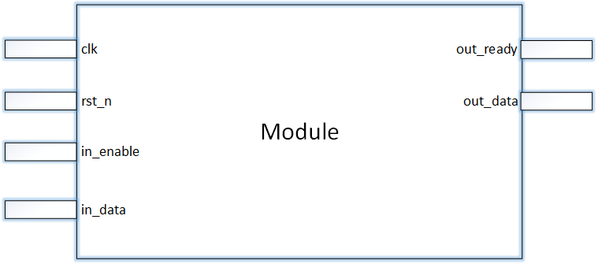  
图2-1 基础接口示意  

  
模块的运作方式如下：  
首先进行全局的复位，对模块进行初始化，而后输入数据随着输入数据使能信号输入模块，在同步时钟的若干个周期后准备好输出数据，使能输出数据有效信号，通知外部电路取出数据。  

### 2.2.2 扩展端口

由于每个模块自身的独特性，基础端口提供的功能往往不足以满足模块的实现，所以这时候需要加入扩展端口来满足需求，扩展端口一般被设计为以下形式：  

>1.  x: 不定端口，取决于模块自身的要求，比如对于阈值化模块，这个参数就是阈值。  
2. in_count_x: 输入坐标的x分量，通常用于几何变换。  
3. in_count_y: 输入坐标的y分量，通常用于几何变换。
4. out_count_x: 输出坐标的x分量，通常用于几何变换。
5. out_count_y: 输出坐标的y分量，通常用于几何变换。
6. frame_addr: 通常用于帧控制，提供某一个输出数据的地址。  

这些端口和基础端口合并起来，便可以满足每一个模块的需求，如图2-2所示。  

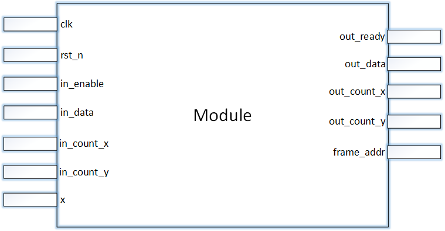  
图2-2 完整接口示意  

  
至此，接口的硬件部分便设计完毕。  

### 2.2.3 接口协议

接口的硬件部分定义结束后，还必须定义其协议部分。由于每一个模块同时存在流水线模式和请求响应模式，同时为了兼容已有的接口标准，达到最简化的设计目的，我让两种模式遵循了同一套接口标准，不同的仅仅是在两种模式下接口的行为方式。  

#### 2.2.3.1 流水线模式

流水线模式时，在输入使能in_enable有效的情况下，从第一次输出数据有效标志out_ready有效开始，输出数据out_data便会源源不断地送出，每一个周期都会送出一个有效数据。在这种模式下，从第一个数据有效开始，输出便是连贯的，如图2-3所示，时序图均采用wavedrom绘制。 

 
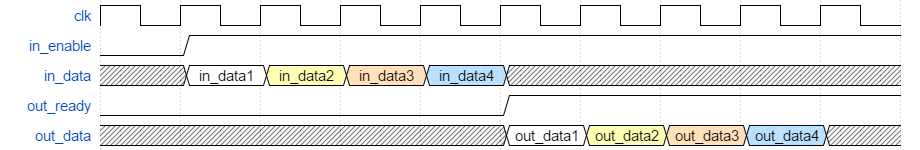  
图2-3 流水线模式时序  

  
这种模式一般用于需要连续数据流的应用中，由于采用了流水线做缓冲，所以一开始的若干个周期延迟在实际运用中是不需要关心的，也故理论上可以插入任意级流水来达到最高的Fmax(工作频率)。  

#### 2.2.3.2 请求响应模式

在这个模式下，in_enable和out_ready两个标志信号被当做请求信号req和响应信号ack，输入数据in_data随着每一次in_enable的上升沿被送入模块进行处理，处理完成后out_ready有效来通知外部电路取走数据，直到下次in_enable的上升沿到来为止，输出数据的状态都不会发生改变，如图2-4所示。  

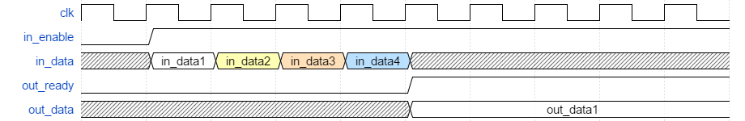  
图2-4 请求响应模式时序  

  
这种模式一般用于一些特殊的模块，比如直方图操作下的模块，对于这些模块，流水化的操作是没有意义的。此外，这种模式还可以被用于和软件的交互中，因为软件很难做到同步数据流的模式。  
 
综上，最终模块的接口工作模式如图2-5。  

  
图2-5 接口工作模式  

  

***

## 2.3 可定制IP核设计

明确了每一个模块的接口以及其协议之后，便可以考虑IP核的设计了。IP核(intellectual property core，知识产权核)是指由某一方开发者提供的形式为逻辑单元、芯片设计的可重用模块，使用IP核能够为设计减少开发周期，并且达到比较好的效果。  
对于图像处理操作，一个IP核应当用于良好的可重用性和软件可控性，可重用性本质上就是一个IP提供了若干种工作模式，用户可以根据参数对IP核进行不同的配置，使得IP核在不同配置下被综合成不同的模式。而软件可控性，这里指的是可以通过AXI总线使得SoC部分可以对IP核进行一定的控制，比如在流水线模式下可以提供一些配置参数，在请求响应模式下可以直接进行数据交互。  

### 2.3.1 可重用性设计

在VerilogHDL中，可重用性一般是通过parameter语句和generate语句实现的，generate语句在VerilogHDL1995标准[6]里是没有的，但在VerilogHDL2001标准[7]中，向VHDL学习中它加入了这个语句，现在几乎所有的综合工具都支持这个语句。  
parameter语句常用于配置静态参数，来决定模块的工作方式，generate语句则根据parameter语句设定的参数来告诉综合工具哪一部分需要被综合，比如以下代码：  

    :::verilog
    // 0 for pipeline, 1 for req-ack
    parameter work_mode = 0;
    parameter color_width = 8;
    input[color_width - 1 : 0] in_data;
    ......
    generate
        if(work_mode == 0) beign
            ......
        end else beign
            ......
        end
    endgenerate
    ......

根据color_width来确定输入数据的位宽，根据work_mode来确定要综合的部分。此外，generate语句还可以被用来实现逻辑复制，这为流水线的设计减少了不少工作量。  

### 2.3.2 IP核设计

一般情况下，一个单独或者一个系列具有层次的HDL文件便可以被看成一个IP核，这种IP核通用性最强，但从使用效率的角度却不如针对每一个厂商的开发套件专用的封装，本项目使用Vivado作为开发工具，使用的是Vivado的封装工具。  
Vivado的IP封装工具在基本的IP封装上加了一层GUI，用于和用户进行直接的交互，一个设计封装好的IP核如图2-5所示：  

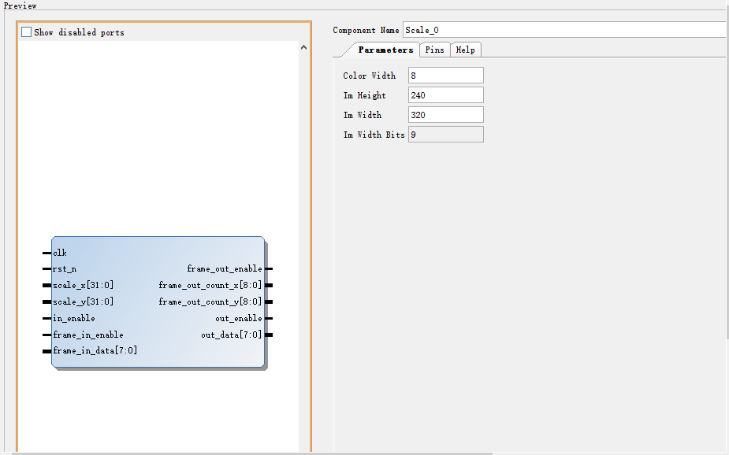  
图2-6 Vivado封装的IP核  

  
通过这个IP工具，我们可以给模块的参数添加任意形式的约束，由于它支持expr表达式[8]，所以我们甚至可以通过某一个参数的取值来自动确定另一个参数的取值，避免了用户自行计算的这一个步骤，例如，我们想要通过im_width这两个参数来确定im_width_bits(图像宽度的位宽)时，可以利用下面的语句来完成 ；  

    :::expr
    if {[expr log($im_width)/log(2)] > [expr int(log($im_width)/log(2))] } {
        set ${im_width_bits} [expr int(log($im_width)/log(2)) + 1]
    } else {
        set ${im_width_bits} [expr int(log($im_width)/log(2))]
    }

封装后的IP核有资源文件，一个用于记录IP结构的xml文件和一个控制GUI的tcl文件，以及可能存在的一个服务于expr表达式的gtcl文件构成，这些文件使用相对路径，所以可以很方便地将IP核转移到任何位置。  

## 2.4 目录结构，测试与发布

由于这个图像处理库遵循同一套规范，并且面向用户，所以需要一个规范化的设计结构，这个结构被要求提供一套完整的：  
可配置的可选测试样例 -> 软件仿真 -> 功能仿真 -> PSNR计算分析 -> 板上测试。  

### 2.4.1 目录结构

由于以上原因，一套完善的目录结构是必要的，这不仅对于用户而言，也是对于开发的便利和严谨性而言，我将目录设计成了如图2-7的形式。  

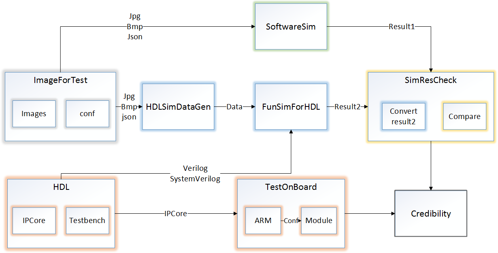  
图2-7 目录结构 

每一个目录的作用如下：  

>1. HDL: FPGA工程以及被打包好的IP核被放置在这个文件夹内，它们由Vivado建立。  
2. ImegForTest: 一个用于存储图片的文件夹，你可以将你想要进行测试的图像放在这里，只有"jpg"和"bmp"格式的文件被支持，不仅如此，一个名为"conf.json"的文件被用来配置仿真参数。  
3. SoftwareSim: 软件仿真的python源文件在这里，它们能够以软件的方法向你展示这个模块的功能。  
仿真结果将会被放置在"SimResCheck"文件夹内。  
4. HDLSimDataGen: 这里有一个python的源文件，它是用来创建"dat"文件的，这种文件被作为HDL功能仿真时图像数据的来源。  
dat文件将会被放置在"FunSimForHDL"文件夹内。  
5. FunSimForHDL: HDL功能仿真将在这里进行。  
6. SimResCheck: 一个名为"covert.py"的python源文件将HDL功能仿真的结果转换为图像，此外，软件仿真的结果也会被放置在这里，另一个名为"compare.py"的源文件用于将所有的软件仿真结果和HDL功能仿真结果进行比对，然后生成一份报告，用于评估IPCore的质量。  
7. DocGen: 自己编写的针对HDL的注释->文档解析器，用于快速生成一个当前项目的文档模板。  

### 2.4.2 测试流程

测试分为软件仿真、功能仿真、PSNR计算和板上测试。  

#### 2.4.2.1 软件测试

我根据每一个模块的特性提供了一些用户可选的仿真参数，这些参数通过一个"conf.json"文件被配置，并作用于每一个张测试图像。这些参数和图像随后被用于软件仿真的程序读入，并生成软件仿真的结果，软件仿真程序遵循一个标准，其函数结构如下：  

    :::python
    def name_format(root, name, ex, conf):
    def transform(im, conf):
    def debug(im, conf):

name_format函数接受的参数为所有图像的文件路径、文件名、扩展名，以及用户设定的配置文件，返回一个字符串，这个字符串将作为处理后图像的文件名。  
transform函数接受一个Image对象的指针与用户设定的配置文件，返回一个Image对像的指针，这个对象即为经过这个模块处理后的图像。  
debug函数接受的参数和transform函数一致，但返回的是一个字符串，这个字符串应当包含这个模块处理后的图像的像素数据，用于调试。  

#### 2.4.2.2 HDL功能仿真

功能仿真用于HDL文件的功能测试，其基本流程是：  
将图像和配置转换为dat文件 -> 搭建Test bench并读入文本进行仿真 -> 输出结果到res文件 —> 转换为图像。    
将图像转换为dat文件的过程是由python完成的，这个程序同样遵循一个标准：  

    :::python
    def name_format(root, name, ex, conf):
    def conf_format(im, conf):
    def color_format(mode, color):
    def create_dat(im, conf):

name_format函数接受的参数为所有图像的文件路径、文件名、扩展名，以及用户设定的配置文件，返回一个字符串，这个字符串将作为处理后图像的文件名。  
conf_format函数接受一个Image对象的指针与用户设定的配置文件，返回写在目标dat文件起始位置的字符串，这个字符串可以视作与Test bench传递模块参数的接口，它作用于整张图像。  
color_format函数接受一个图像的模式和一个像素的色彩值，返回的是一个格式化后的色彩值，格式化的格式根据模块的需求和图像模式而定，模式通常为RGB、灰度等。  
create_dat函数接受一个Image对象的指针和用户设定的配置文件，它返回的是当前图像被转换后的dat文件所需要写入的所有内容。  
 
有了数据的来源，需要考虑的便是Test bench的搭建，Test bench，即测试平台，是HDL验证领域所必须搭建的，这对于模块的功能判断和调试是十分有必要的，我使用SystemVerilogHDL来搭建测试平台，SV灵活强大，抽象能力强，几乎是业界搭建测试平台的标准，对于测试平台，虽然对于不同的模块难以完全标准化，我仍然设立了一套基本的标准：  

    :::systemverilog
    interface TBInterface (input bit clk, input bit rst_n);
    task init_file();
    task init_signal();
    task work_pipeline();
    task work_regack();

TBInterface是一个接口，用于构造仿真需要的接口，这里使用接口并不是为了在设计的时候模糊接口完整的定义，因为它并不与verilog兼容，这样做的好处仅仅是让结构看起来更清晰，比如在实例化的时候可以这样去做：  

    :::systemverilog
    TBInterface #(3, 8) RGBPipline(clk, rst_n);
    Test Test1(RGBPipline.clk, RGBPipline.rst_n......

接口后是四个task(任务)。  
init_file在每一张新的图像输入的时候被调用，一般用于将图像的宽高写入res文件，并且读取用户定义的配置参数，使其作用于整张图像。  
init_signal用于在每张图像被处理前进行一些信号初始化工作，比如rst_n这个复位信号就可以在这个流程中完成模块的复位操作。  
work_pipeline是工作流程，用于指定这个模块在流水线模式下如何被测试，以及将要输出怎样的数据。  
work_regack同上，唯一的区别在于这个task用于请求响应模式下的测试。  
 
仿真完成后得到的是一系列的res文件，这些文件中有处理结束后的图像数据，接下来将这些数据利用一个python脚本进行转换，便可以得到HDL功能仿真的结果。  

#### 2.4.2.3 PSNR计算分析

有了软件仿真和功能仿真的结果，便可以对模块实际运作的质量进行一个评估，这里选用PSNR进行评估，PSNR的计算公式如式2-1。  
$$PSNR = 10\log10(\frac{MAX^2} {MSE})\ \ \ \ \ \ \ \ (2-1)$$    
 
其中，MSE是原图像与处理图像之间的均方误差，MAX是图像在当前位宽下的最大值，这里用软件仿真的结果作为原图像，HDL功能仿真的结果作为处理图像。  
PIL库提供了计算MSE的函数，加上math库中的log函数即可完成计算：  

    :::python
    diffs = ImageChops.difference(Image.open(f_pair[0]), Image.open(f_pair[1]))
    stat = ImageStat.Stat(diffs)
    rms = sum(stat.rms) / len(stat.rms)
    psnr = 20.0 * math.log10(255.0 / rms) if rms != 0 else 1000*1000

PSNR值的单位为dB，理论上，PSNR值越大失真越少，代表图像处理的质量越高，一般情况下PSNR > 30dB即为人眼可以容忍的范围。  

### 2.4.3 板上测试

一些板上测试工程会被提供，它们由Vivado的图形化设计界面构建，使用xilinx提供的Zybo开发板，并使用Ov7670摄像头模块作为图像来源，使用VGA作为图像输出，同时建立一个AXI总线的IP核来完成简单的通过软件对模块的配置。  

### 2.4.4 发布

项目拥有自己的发布网站，发布网站使用Pelican作为框架，用html、css和js开发，并搭建在VPS上，最终发布于fil.dtysky.moe。  

# 第三章 算法实现

明确了设计和架构，便可以进行算法的实现。本章将会说明如何实现图像处理的算法，以及如何运用它们。  

## 3.1 算术系统

图像处理中会用到一些基本的数学运算，这些运算构成一个算术系统，对于FPGA而言，如何在资源和运行频率之间保持平衡是一个基本的考量。本节将会说明如何在FPGA中实现符号数、定点数和函数的一些运算。  

### 3.1.1 Verilog的符号系统

在VerilogHDL2001的标准[7]中，符号系统被加入，在使用时只需要加一个"signed"标志便可以将某一个变量标记成符号数，例如：  

    :::verilog
    reg signed[7 : 0] num;

这表示定义了一个八位的寄存器型符号数num。  
在Verilog中，符号数是以如表3-1-1的形式存在的，这也是目前DSP中最流行的符号系统。可见，所有的正数以原码形式保存，而负数则以2的补码的形式存在，2的补码的公式定义如式3-1-1。  

$$X = -2^{N-1} + \sum_{n=0}^{N-2}x_n 2^n\ \ \ \ \ \ \ \ (3-1-1)$$

其在Verilog中的求得方式如下：  

    :::verilog
    comp = {true_sign, ~true_num + 1}

其中comp表示补码,true_sign表示原码的符号位，true_num表示原码的数据位，可见，2的补码实质上就是在保留符号位的前提下，对数据位的每一位取反后整体加1。  

<table border="1" cellspacing="0">
<tr>
<th>Decimal Value</th>
<th>Signed Representation</th>
</tr>
<tr>
<td>3</td>
<td>3'b011</td>
</tr>
<tr>
<td>2</td>
<td>3'b010</td>
</tr>
<tr>
<td>1</td>
<td>3'b001</td>
</tr>
<tr>
<td>0</td>
<td>3'b000</td>
</tr>
<tr>
<td>-1</td>
<td>3'b111</td>
</tr>
<tr>
<td>-2</td>
<td>3'b110</td>
</tr>
<tr>
<td>-3</td>
<td>3'b101</td>
</tr>
<tr>
<td>-4</td>
<td>3'b100</td>
</tr>
</table>
表3-1-1 3bits的符号数

在实际使用中，考虑到与软件系统的兼容性，由于软件系统底层的符号系统一般也是使用2的补码对负数进行处理，所以所有具有符号数输入的模块都要求采用补码形式，对于原码，我提供了一个原码转换补码的模块，模块实现如下：  

    :::verilog
    module True2Comp(
        true,
        complement);
        parameter data_channel = 1;
        parameter data_width = 17;
        input[data_channel * data_width - 1 : 0] true;
        output[data_channel * data_width - 1 : 0] complement;
        genvar i;
        generate
            `define h (i + 1) * data_width - 1
            `define l i * data_width
            for (i = 0; i < data_channel; i = i + 1) begin
                assign complement[`h : `l] = true[`h] == 0 ? 
                    true[`h : `l] : {1'b1, ~true[`h - 1 : `l] + 1};
            end
            `undef h
            `undef l
        endgenerate
    endmodule

此核为T2C核，T2C核的原理是——如果输入是正数，返回原码，否则对每一位进行取反，然后整体加1。T2C核可以完成任何位任何通道的原码到补码的转换。  
Verilog中符号数的计算包含加法和乘法，减法使用相反数的加法代替，除法则需要专用电路实现，在简单应用中往往采用移位或者查找表来实现，这里不做讨论。在图像处理中，符号数的运算会涉及溢出问题，由于可以设置足够的保护位来防止运算本身的溢出，所以唯一需要考虑的溢出就是图像意义下的溢出，比如色彩为数为8的时候，255就是一个溢出上限，而由于一般状况下色彩和坐标都应当正值，所以0一般都作为一个溢出下限，所以这个时候需要一套舍入系统来完成结果的舍入，这一系统将在3.1.3中讨论。  

### 3.1.2 定点数系统

在FPGA的图像处理所需要的算术系统中，另一个重要的系统是定点数系统，它的存在可以让FPGA进行小数运算，这对于图像增强或者几何变换等操作是必要的。一般而言，可以把定点数系统看做是整数系统的一个扩展，或者说将整数系统看做定点数系统的一个特例。在定点数系统中，我们人为地在某两个数字之间插入一个小数点的标志，来分割整数部分和小数部分，如表3-1-2所示。它和整数系统唯一不同的地方在于，整数系统的这个小数点永远处于最低位的右侧。同时，定点数所表示的数值与一致，均为式3-1-2的形式，包括符号定点数的计算公式也是与式3-1-1一致的，但n的范围则由原来的
\([0, \infty]\)
，扩展到了
\([-\infty, \infty]\)
，所以表3-1-2表示的实际上是3.5。   
$$X = \sum x_n2^n\ \ \ \ \ \ \ \ (3-1-2)$$

<table border="1" cellspacing="0">
<tr>
<th>Integral part</th>
<th>Point</th>
<th>Fractional part</th>
</tr>
<tr>
<td>
<table border="1" cellspacing="0" frame="void">
<tr>
<td>0</td>
<td>1</td>
<td>0</td>
<td>1</td>
</tr>
</table>
</td>
<td>.</td>
<td>
<table border="1" cellspacing="0" frame="void">
<tr>
<td>1</td>
<td>0</td>
<td>0</td>
<td>0</td>
</tr>
</table>
</td>
</tr>
</table>
表3-1-2 4bits.4bits的定点数

定点数的运算和整数运算过程基本一致，不同的是我们需要根据小数运算的规则对结果进行分割，来确立整数位和小数位，比如对于乘法，就需要将原先两个乘数的小数位的位宽相加，作为结果的小数位位宽，如表3-1-3。 

<table border="1" cellspacing="0">
<tr>
<th>Src1</th>
<td> </td>
<td> </td>
<td>0</td>
<td>1</td>
<td>.</td>
<td>1</td>
<td>0</td>
<td> </td>
<td> </td>
</tr>
<tr>
<th>Src2</th>
<td> </td>
<td> </td>
<td>0</td>
<td>1</td>
<td>.</td>
<td>1</td>
<td>0</td>
<td> </td>
<td> </td>
</tr>
<tr>
<th>Res</th>
<td>0</td>
<td>0</td>
<td>1</td>
<td>0</td>
<td>.</td>
<td>0</td>
<td>1</td>
<td>0</td>
<td>0</td>
</tr>
</table>
表3-1-3 定点数的乘法

### 3.1.3 舍入系统

由于图像处理所操作的数据基本都是有范围限制的整数，所以一个舍入系统是必要的，这个系统的作用在于对溢出的数据进行合理的截断，以及将小数舍入的整数。在这个项目中，我选择的是就近舍入，即将舍入到最近的数字，这也是软件算术系统中所广泛使用的。比如，对于一个16bits，定点位为8的定点数，其舍入规则如式3-1-3所示。  

$$Res=\left\{\begin{aligned} 0 && Src < 0 \\255 & & Src>255\\ x + 1 & & Src = x.(5-9)\ \& \ x>0 \\x - 1 & & Src = x.(0-4)\ \& \ x>0 \\x - 1 & & Src = x.(5-9)\ \& \ x<0 \\x + 1 & & Src = x.(0-4)\ \& \ x<0 \ \end{aligned}\right.\ \ \ \ \ \ \ \ (3-1-3)$$
  

对于溢出，一个简单的边界检查便可以达到目的，而对于定点数的小数向整数的舍入，则需要先将定点数转换为原码，而后进行截断，再转换为补码，而后根据原来的补码进行最终的舍入，下面的FR核完成了这个功能：  

    :::verilog
    module FixedRound(
        clk,
        fixed_num,
        round
        );
        parameter num_width = 42;
        parameter fixed_pos = 16;
        input clk;
        input signed [num_width - 1 : 0] fixed_num;
        output signed [num_width - fixed_pos - 1 : 0] round;
        reg signed [num_width - 1 : 0] num_true;
        reg signed [num_width - fixed_pos - 1 : 0] num_comp, tmp_comp;
        reg signed [num_width - fixed_pos - 1 : 0] reg_round;
        assign round = reg_round;
        always @(posedge clk) begin
            num_orig <= fixed_num[num_width - 1] == 0 ? fixed_num : 
                {fixed_num[num_width - 1], ~(fixed_num[num_width - 2 : 0] - 1)};
            num_comp <= num_orig[num_width - 1] == 0 ? num_orig[num_width - 1 : fixed_pos] : 
                {num_orig[num_width - 1], ~num_orig[num_width - 2 : fixed_pos] + 1};
            tmp_comp <= num_comp;
            //Why not use num_comp[25] to judge? : if 0
            case(num_orig[num_width - 1])
                0 : reg_round <= tmp_comp[fixed_pos - 1] == 0 ? num_comp : num_comp + 1;
                1 : reg_round <= tmp_comp[fixed_pos - 1] == 0 ? num_comp : num_comp - 1;
                default : /* default */;
            endcase
        end
    endmodule

FR核的原理是，定点符号数fixed_num首先被转换为了原码num_true，而后将小数部分进行了整体的截断，之后再转换为了补码num_comp，最后根据num_true的符号位和fixed_num定点位后的第一位一位，即小数点后的第一位的值来确定舍入方式。如果这一位是1，则代表在十进制中，被舍入数的小数点后第一位大于5，否则小于5，之后根据四舍五入法则进行舍入即可。  

### 3.1.4 函数

图像处理中会用到一些函数，最为常见的就是三角函数，在一些几何变换中这些函数非常有用，对于一些实现方式而言，函数的计算可以交由软件进行，在FPGA部分则不需要关心传来参数的具体意义，直接计算即可，这种做法的好处是泛用性强，但不够直观，所以当需要一定的直观性的时候，就需要一种方式来让FPGA直接得出这些函数的值。例如，如果想用FPGA求得三角函数的值，最常见的做法就是建立一个LUT(Lookup Table，查找表)，这相当于建立了一个经验公式，来快速地获得限定范围内函数的值，以下代码便定义了一个sin函数的0-359度的查找表，表的键值对由python脚本计算：  

    :::verilog
    module SinLUT(angle, value);
        input[8 : 0] angle;
        output[17 : 0] value;
        reg[17 : 0] reg_value;
        assign value = reg_value;
        always@(*) begin
            case(angle)
                0 : reg_value <= 18'b000000000000000000;
                1 : reg_value <= 18'b000000010001110111;
                2 : reg_value <= 18'b000000100011101111;
                3 : reg_value <= 18'b000000110101100101;
                ......
                359 : reg_value <= 18'b100000010001110111;
                default: reg_value <= 0;
            endcase
        end
    endmodule

## 3.2 生成器-帧控制

帧缓存是FPGA图像处理的一个基本单元，它缓存一张完整的图像，而一张完整的图像是所有图像处理的基础，它为一切操作提供数据源，所以它的泛用性是很高的。一般FPGA中的帧缓存都是用RAM(Random Access Memory，随机存储器)来实现的，这些RAM可以常用的可以分为SRAM(Static Random Access Memory，静态随机存储器)和SDRAM(Synchronous Dynamic Random Access Memory，同步动态随机存储器)两种，前者控制简单，效率高，后者则控制较为复杂。这一节将会探讨如何设计一个FramController核(以下简称FC核)对以Xilinx的FPGA中的RAM资源为基础的帧缓存进行控制。 

### 3.2.1 原理

一般FPGA器件中的片内RAM分为两种，BlockRAM（块存储器，以下称BRAM）和DistributeRAM（分布式存储器，以下称DRAM）[9]，两者本质上都是SRAM。不同的是前者是一些被集中在一些区域的专用存储器，后者是利用器件内的LUT构成的RAM。一般而言，BRAM的资源比较丰富，并且速度比较快，但由于其自身的特性，这些RAM被分为36K和18K两种形式，使用BRAM的单位是18Kb的倍数，所以在很多情况下会造成资源的浪费，另一方面，由于这些RAM的位置是固定的，所以在布局布线上可能会造成更多的延迟。而分布式RAM则正好相反，由于使用的是LUT，所以资源比较少，但比较灵活，不容易造成浪费。  
对于帧缓存，考虑其一般比较大并且读写要求比较高，采用BRAM比较合适，但即使是BRAM，对于一些比较大的图像也是难以胜任的，中低端的FPGA器件的片内BRAM是比较少的，比如对于用于测试的xlg7Z010clg400，片内RAM只有256kb[10]。这时只能够采用SDRAM进行扩展，但考虑到本项目主要论述的是图像处理的算法，所以不加以讨论。  
在Vivado中，RAM的配置被分为许多种[11]，比如Single Port RAM(单口RAM，只有一个读写数据的端口)，Simple Dual Port RAM(简单双口RAM，两个端口，但是只有一个端口可以写入)，True Dual Port RAM(真双口RAM，两个端口都可以写入)等，对于帧缓存，一般采用的是Simple Dual Port RAM，这种配置方式下的RAM读写时序如图3-2-1[11]所示。  

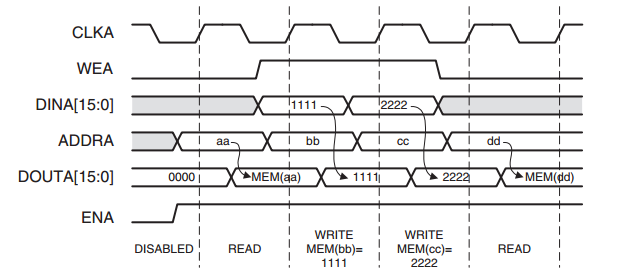  
图3-2-1 RAM读写时序

  
可见，对于写操作，只需要使得地址和数据同步送入RAM相应端口即可，而对于读操作，则需要有一定的延迟，这个延迟是根据配置时选择插入的寄存器来决定的，对于不同的应用插入的级数不同，Vivado中可以最多插入三个寄存器来形成三级流水线，如图3-2-2[11]所示。  

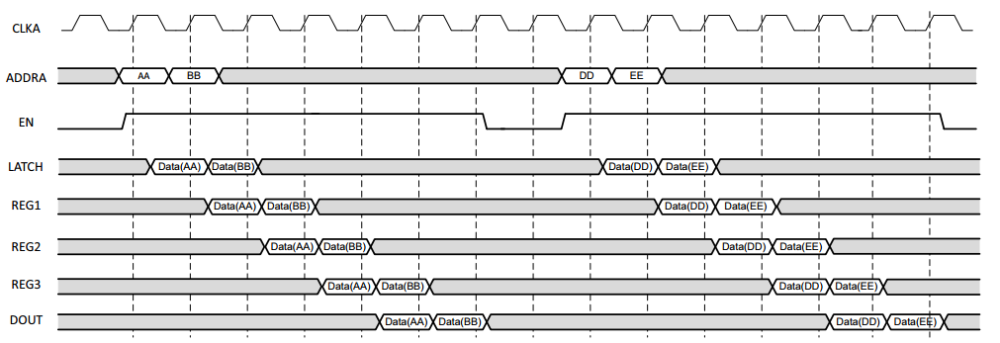  
图3-2-2 三级流水线下的读操作

  

### 3.2.2 设计

根据原理并综合第2章的接口标准，实现一个针对Xilinx器件的BRAM控制器，即这里的FC核需要的配置参数和端口分别如表3-2-1和表3-2-2所示。  

<table border="1" cellspacing="0">
<tr>
<th>名字</th>
<th>类型</th>
<th>范围</th>
<th>默认值</th>
<th>说明</th>
</tr>
<tr>
<td>work_mode</td>
<td>无符号</td>
<td>0为流水线模式，1为请求响应模式</td>
<td>0</td>
<td>模块的工作模式。</td>
</tr>
<tr>
<td>wr_mode</td>
<td>无符号</td>
<td>0为写，1为读。</td>
<td>0</td>
<td>模块的读写模式。</td>
</tr>
<tr>
<td>data_width</td>
<td>无符号</td>
<td>无</td>
<td>8</td>
<td>数据位宽。</td>
</tr>
<tr>
<td>im_width</td>
<td>无符号</td>
<td>1 - 4096</td>
<td>320</td>
<td>图像宽度。</td>
</tr>
<tr>
<td>im_height</td>
<td>无符号</td>
<td>1 - 4096</td>
<td>240</td>
<td>图像高度。</td>
</tr>
<tr>
<td>addr_width</td>
<td>无符号</td>
<td>取决于图像的宽度和高度。</td>
<td>17</td>
<td>存储帧缓存的RAM的地址位宽。</td>
</tr>
<tr>
<td>ram_read_latency</td>
<td>无符号</td>
<td>0 - 15，取决于RAM。</td>
<td>2</td>
<td>RAM的读延迟，在Xilin器件中，典型为2。</td>
</tr>
<tr>
<td>row_init</td>
<td>无符号</td>
<td>取决于输入的行偏移。</td>
<td>0</td>
<td>你想要写入的第一行的偏移，取决于应用，比如窗口。</td>
</tr>
</table>
表3-2-1 配置参数

  
 

<table border="1" cellspacing="0">
<tr>
<th>名字</th>
<th>端口</th>
<th>类型</th>
<th>范围</th>
<th>默认值</th>
<th>说明</th>
</tr>
<tr>
<td>clk</td>
<td>输入</td>
<td>无符号</td>
<td>无</td>
<td>无</td>
<td>Clock.</td>
</tr>
<tr>
<td>rst_n</td>
<td>输入</td>
<td>无符号</td>
<td>无</td>
<td>无</td>
<td>复位，低有效。</td>
</tr>
<tr>
<td>in_enable</td>
<td>输入</td>
<td>无符号</td>
<td>无</td>
<td>无</td>
<td>输入数据使能，在流水线模式下，它是另一个复位信号，在请求响应模式下，只有在它有效的时候in\_data才会被真正地改变。</td>
</tr>
<tr>
<td>in_data</td>
<td>输入</td>
<td>无符号</td>
<td>color_width - 1 : 0</td>
<td>无</td>
<td>输入数据，必须和in\_enable同步输入。</td>
</tr>
<tr>
<td>out_ready</td>
<td>output</td>
<td>无符号</td>
<td>无</td>
<td>无</td>
<td>输出数据有效，在两种模式下，这个信号都会在out\_data可以被读取的时候有效。</td>
</tr>
<tr>
<td>out_data</td>
<td>output</td>
<td>无符号</td>
<td>color_width - 1 : 0</td>
<td>无</td>
<td>输出数据，将会和out\_ready同步输出。</td>
</tr>
<tr>
<td>ram_addr</td>
<td>output</td>
<td>无符号</td>
<td>addr_width - 1 : 0</td>
<td>无</td>
<td>输出到RAM的地址。</td>
</tr>
</table>
表3-2-2 端口

### 3.2.3 实现

根据配置参数和端口的设计便可以实现一个FC核，此核主要由一个地址输出计数器、一个读使能延时计数器和复位系统构成，由于工作模式有流水线和请求响应两种，读写模式也有两种，所以总共有四种模式，这些模式的实现方式如下：  

#### 3.2.3.1 流水线模式写

保证地址和数据同步流水化输出，在复位时二者皆输出为0，实现如下：  
in\_enable或rst\_n为低时，out\_ready输出为0，即输出无效，此时地址计数器不工作；否则输出有效，计数器在每个clk的上升沿加1，直到加满根据用户设定的宽和高算出来的地址最大值，开始下一次循环，波形如图3-2-3。  

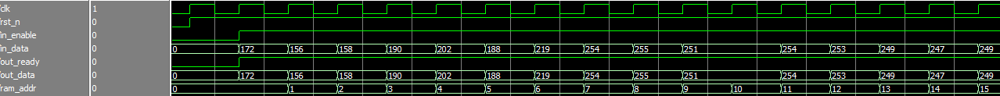  
图3-2-3 流水线模式写入时序

  

#### 3.2.3.2 流水线模式读

基本同3.2.3.1，但在工作模式时，读使能计数器首先有效，在地址输入后的ram\_read\_latency个周期后，读使能计数器锁定，并输出第一个有效值，之后每个周期都会输出一个有效值，波形如图3-2-4。  

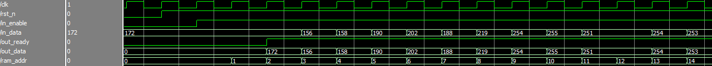  
图3-2-4 流水线模式读出时序

  

#### 3.2.3.3 请求响应模式写

地址和数据同步输出，一次请求一次响应输出，复位时输出为0，实现如下：  
基本同3.2.3.1，但地址计数器只有在in\_enable的上升沿才会加1，波形如图3-2-5。  

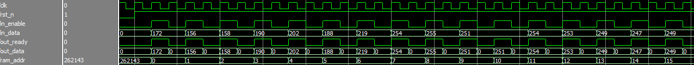  
图3-2-5 请求响应模式写入时序

  

#### 3.2.3.4 请求响应模式读

基本同3.2.3.2，但变为一次请求一次响应输出，地址计数器只有在in\_enable的上升沿才会加1，波形如图3-2-6。  

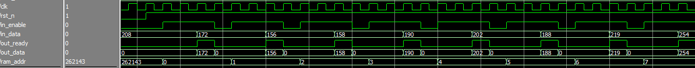  
图3-2-6 请求响应模式写入时序

  

#### 3.2.3.5 IP核GUI

完成功能后对FC核进行了封装，封装如图3-2-7，work\_mode和wr\_mode被设计为键值对的模式，方便用户理解和选择，其它参数都根据实际状况加上了范围限定，addr\_width使用expr表达式交由软件自行计算。  

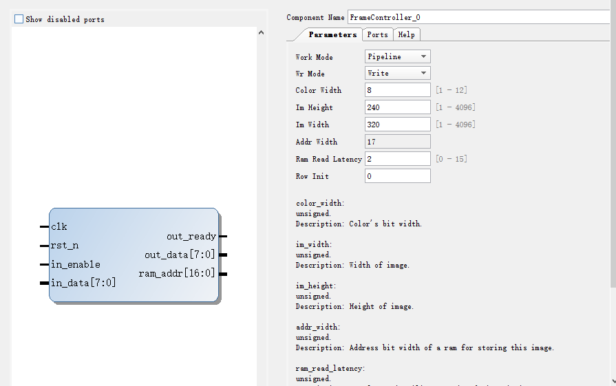  
图3-2-7 FC核的GUI

  

### 3.2.4 仿真

FC核没有软件仿真，并且综合考虑到BRAM在仿真时的配置不便和仿真效率，HDL功能仿真只支持512x512像素和灰度模式下的图像，我选取了三张这样的图像，分别对它们进行了每一种模式进行了测试，每一张图像的测试流程如下： 

>流水线模式写RAM的仿真模型 -> 流水线模式读RAM的仿真模型 -> 存入\*-pipeline-hdlfun.\*内 -> 请求响应模式写RAM的仿真模型 -> 请求响应模式读RAM的仿真模型 -> 存入\*-reqack-hdlfun.\*内。  

由于没有软件仿真，所以将原图像作为了软件仿真的结果，用来进行PSNR的计算，仿真结果如图3-2-8所示，保存为bmp格式是为了防止压缩时带来的差异影响到PSNR的计算。  

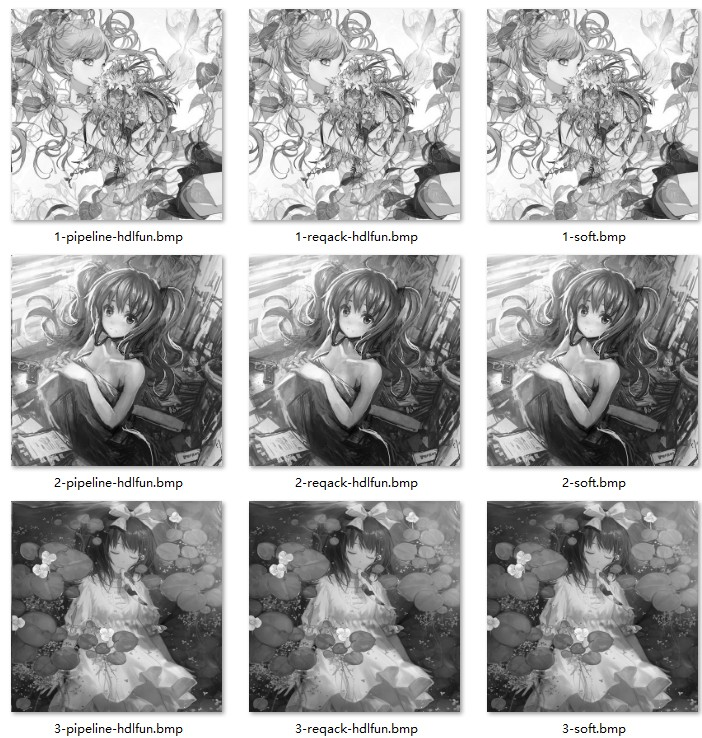  
图3-2-8 仿真结果，左侧为请求响应模式下的HDL功能仿真结果，中间为流水线模式下的HDL功能仿真结果，右侧为软件仿真结果

  

### 3.2.5 资源和时序

由于四种模式的基本构成大致相同，所以只对第一种模式进行分析，根据Vivado生成的报表，主要资源耗费如表3-2-3。

<table border="1" cellspacing="0">
<tr>
<th>Slice LUTs*</th>
<th>Slice Registers</th>
</tr>
<tr>
<td>38</td>
<td>17</td>
</tr>
</table>
表3-2-3 主要资源耗费

 
根据时序报告，最大的Data Path Delay(数据路径延迟)为1.921ns，即：  

>FMax = 520.56MHz  

由于数据路径延迟和应用的最终约束设置强相关，所以仅供参考。

### 3.2.6 分析与结论

根据仿真结果计算PSNR，得到的数据如表3-2-4。  

<table border="1" cellspacing="0">
<tr>
<th>1</th>
<th>2</th>
<th>3</th>
<th>Total</th>
</tr>
<tr>
<td>1000000.00</td>
<td>1000000.00</td>
<td>1000000.00</td>
<td>1000000.00</td>
</tr>
</table>
表3-2-4 PSNR

PSNR均值为极大值，可见FC核可以完美完成帧缓存的控制，同时资源利用率很低，可以达到很高的FMax，超过了BRAMFMax的极限，设计成功。

## 3.3 点操作-灰度化

灰度化是最基本的图像操作之一，它的目的是把一个具有RGB三个灰度通道的图像转换为只具有一个灰度通道的图像，这样做的目的主要是减少后期操作的运算量，因为对于许多应用而言，例如边缘检测、角点识别等，一个灰度通道就已经提供了足够的信息量，甚至在很多情况下，多通道的灰度图会在提高计算复杂度的同时降低运算效果。灰度化属于点操作，一个像素的输出只取决于一个像素的输入，输出像素是输入像素的一个映射，本节将会探讨如何用FPGA实现图像的灰度化。 

### 3.3.1 原理

灰度化的算法有许多种，最直观的如式3-3-1，即将去三个通道的平均值作为灰度化的结果，这个算法虽然符合一般的逻辑规律，但却不符合人类的视觉，业界通用的灰度化算法如式3-3-2，这个算法在ITU-R(ITU Radiocommunication Sector，国际电信联盟无线电通信组)的ITU BT.601建议书[12]中被定义。根据彩色电视系统的传输要求，色彩信号被分为亮度信号Y和色差信号R-Y、G-Y与B-Y，实际传输时只需要传输亮度信号和任意两个色差信号即可。实际上，亮度信号是根据人类的视觉心理原理计算的，它体现了各个基色的亮度总和。  

$$Y = \frac{Red + Green + Blue}3\ \ \ \ \ \ \ \ (3-3-1)$$  
$$Y = Red * 0.299 + Green* 0.587 + Blue * 0.114\ \ \ \ \ \ \ \ (3-3-2)$$  

所以一次灰度化运算要执行三次乘法和两次加法，其中每一次乘法都是一个固定系数的小数和一个整数的乘法，加法的位数根据每一个通道的色彩位宽而定，由于本项目中色彩位宽被限定为1-12，考虑到FPGA的特性，在一次灰度化运算中，最多可能需要执行三次定点数乘法和两次12位的无符号加法运算。

### 3.3.2 设计

根据原理可知，除了需要考虑第2章的接口标准外，还需要使用三个乘法器和两个加法器，乘法器必须使用厂商提供的专用IP核实现，同时为了最高的FMax，一个周期内实现两次12位的加法是不被允许的，所以我将两次加法进行了拆分，设置了缓冲寄存器。不仅如此，考虑到实际应用场合的复杂，完全设定好的乘法器并不能够满足要求，所以我选择将乘法器的配置权交给用户，设定一个配置参数来让用户在配置好乘法器后修改流水线级数，以匹配乘法器的配置，综上，实现一个Graying核(以下简称GY核)需要配置参数、端口以及子模块分别如表3-3-1、表3-3-2和表3-3-3所示。  

<table border="1" cellspacing="0">
<tr>
<th>名字</th>
<th>类型</th>
<th>范围</th>
<th>默认值</th>
<th>说明</th>
</tr>
<tr>
<td>work_mode</td>
<td>无符号</td>
<td>0为流水线模式，1为请求响应模式</td>
<td>0</td>
<td>模块的工作模式。</td>
</tr>
<tr>
<td>color_width</td>
<td>无符号</td>
<td>1 - 12</td>
<td>8</td>
<td>色彩位宽。</td>
</tr>
<tr>
<td>mul_delay</td>
<td>无符号</td>
<td>取决于乘法器的配置。</td>
<td>3</td>
<td>乘法器延迟</td>
</tr>
</table>
表3-3-1 配置参数

  
 

<table border="1" cellspacing="0">
<tr>
<th>名字</th>
<th>端口</th>
<th>类型</th>
<th>范围</th>
<th>默认值</th>
<th>说明</th>
</tr>
<tr>
<td>clk</td>
<td>输入</td>
<td>无符号</td>
<td>无</td>
<td>无</td>
<td>Clock.</td>
</tr>
<tr>
<td>rst_n</td>
<td>输入</td>
<td>无符号</td>
<td>无</td>
<td>无</td>
<td>复位，低有效。</td>
</tr>
<tr>
<td>in_enable</td>
<td>输入</td>
<td>无符号</td>
<td>无</td>
<td>无</td>
<td>输入数据使能，在流水线模式下，它是另一个复位信号，在请求响应模式下，只有在它有效的时候in\_data才会被真正地改变。</td>
</tr>
<tr>
<td>in_data</td>
<td>输入</td>
<td>无符号</td>
<td>color_width - 1 : 0</td>
<td>无</td>
<td>输入数据，必须和in\_enable同步输入。</td>
</tr>
<tr>
<td>out_ready</td>
<td>output</td>
<td>无符号</td>
<td>无</td>
<td>无</td>
<td>输出数据有效，在两种模式下，这个信号都会在out\_data可以被读取的时候有效。</td>
</tr>
<tr>
<td>out_data</td>
<td>output</td>
<td>无符号</td>
<td>color_width - 1 : 0</td>
<td>无</td>
<td>输出数据，将会和out\_ready同步输出。</td>
</tr>
</table>
表3-3-2 端口

  
 

<table border="1" cellspacing="0">
<tr>
<th>名字</th>
<th>类型</th>
<th>说明</th>
</tr>
<tr>
<td>MulRed</td>
<td>MultiplierRedx0d299</td>
<td>12位无符号数和0.299的定点乘法器，被用于红色通道的计算。你可以自己配置这个乘法器，然后更改"mul_delay"，但所有的乘法器必须拥有相同的流水线级数，并不能更改端口的配置！</td>
</tr>
<tr>
<td>MulGreen</td>
<td>MultiplierGreenx0d587</td>
<td>12位无符号数和0.587的定点乘法器，被用于绿色通道的计算。你可以自己配置这个乘法器，然后更改"mul_delay"，但所有的乘法器必须拥有相同的流水线级数，并不能更改端口的配置！</td>
</tr>
<tr>
<td>MulBlue</td>
<td>MultiplierBluex0d114</td>
<td>12位无符号数和0.113的定点乘法器，被用于蓝色通道的计算。你可以自己配置这个乘法器，然后更改"mul_delay"，但所有的乘法器必须拥有相同的流水线级数，并不能更改端口的配置！</td>
</tr>
</table>
表3-3-3 子模块

### 3.3.3 实现

根据3.3.2的设计便可以实现一个GY核，此核主要由一个三个执行定参数定点数的乘法器、一个输出使能延时计数器、复位系统和两次12位的无符号数加法构成。乘法器使用厂商提供的乘法器IP核，这里使用的是Vivado中的乘法器IP核，这个IP核可以被配置为许多种模式[13]，对于定参数的乘法，它的实现方式可以被配置为Distributed Memory(分布式存储器),Block Memory(块存储器)以及Dedicated Multiplier(专用乘法器)，前两者相当于建立一个查找表，用查表的方式来计算乘法，其需求的最佳流水线级数比较小，但逻辑延迟比较大，后者相反，这个可以根据用户自身的需求而定，本节默认配置为专用乘法器实现，以得到理论上最大的FMax。同时，为了达到资源和精度之间的平衡，GY核将使用24位的定点数来近似表示每一个参数，例如对于0.299，它的定点数为：  

>0.299 ≈ 0.010011001000101101000011 =  0.298999965...  

可见完全满足要求，同时，为了达到最高的FMax，并考虑到此GY核对舍入方式不敏感，所以这里的舍入没有采用FR核(见3.1)，而是采用向下舍入的方式，直接将定点后的小数位截断，这等同于软件仿真中的int(x)强制类型转换。  
而对于加法，由于要达到最高的FMax，在考察了Xilinx专用加法器的流水线后，发现12位无符号加法的最佳流水线级数为1级，所以直接采用自己设计的一级流水线和加法运算符即可实现，实现两次加法总共需要两级流水线，消耗两个周期。  
综上，流水线和请求响应两种模式的实现方式如下：  

#### 3.3.3.1 流水线模式

保证地址和数据同步流水化输出，在复位时二者皆输出为0，实现如下：  
in\_enable或rst\_n为低时，输出使能延迟计数器不工作，out\_ready输出为0，即输出无效，系统不工作；否则计数器工作，直到指定延迟周期(默认为5个周期)后，输出有效，并且每一个clk的上升沿都会送入一个数据in\_data进行处理，第一个输出数据有效之后，每一个周期都将送出一个有效数据，波形如图3-3-1。  

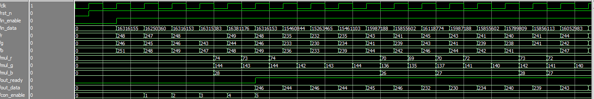  
图3-3-1 流水线模式时序

  

#### 3.3.3.2 请求响应模式

基本同3.3.3.1，但输入数据in\_data只有在in\_enbale的上升沿才会被送入处理，波形如图3-3-2。  

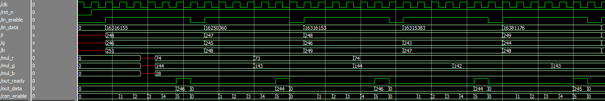  
图3-3-2 请求响应模式时序

  

#### 3.3.3.3 IP核GUI

完成功能后对GY核进行了封装，封装如图3-3-3，work\_mode被设计为键值对的模式，方便用户理解和选择，其它参数都根据实际状况加上了范围限定。  

  
图3-3-3 GY核的GUI

  

### 3.3.4 仿真

GY核只对RGB图像有意义，所以我选取了三张RGB模式的图像，分别对它们进行了流水线和请求响应模式的测试，原始图像如图3-3-4，每一张图像的测试流程如下： 

>流水线模式 -> 存入\*-pipeline-hdlfun.\*内 -> 请求响应模式 -> 存入\*-reqack-hdlfun.\*内。  

 
  
图3-3-4 原始测试图像

  

使用HDL功能仿真和软件仿真的结果进行PSNR的计算，仿真结果如图3-3-5所示。  

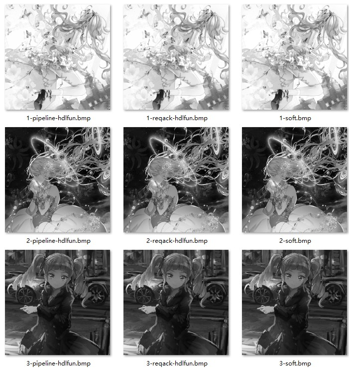  
图3-3-5 仿真结果，左侧为请求响应模式下的HDL功能仿真结果，中间为流水线模式下的HDL功能仿真结果，右侧为软件仿真结果

  

### 3.3.5 资源和时序

由于两种模式的基本构成大致相同，所以只对第一种模式进行分析，并且由于这里的乘法器配置采用的是专用乘法器，所以资源消耗和其他模式可能差距较大，仅供参考。根据Vivado生成的报表，主要资源耗费如表3-3-4。

<table border="1" cellspacing="0">
<tr>
<th>Slice LUTs*</th>
<th>Slice Registers</th>
<th>DSPs</th>
</tr>
<tr>
<td>28</td>
<td>26</td>
<td>3</td>
</tr>
</table>
表3-3-3 主要资源耗费

 
根据时序报告，最大的Data Path Delay(数据路径延迟)为2.265ns，即：  

>FMax = 441.50MHz  

即说明，GY核在流水线模式下，理论上在处理1080p全高清图像时可以达到212帧。  
由于数据路径延迟和应用的最终约束设置强相关，所以仅供参考。

### 3.3.6 分析与结论

根据仿真结果计算PSNR，得到的数据如表3-3-4。  

<table border="1" cellspacing="0">
<tr>
<th>1</th>
<th>2</th>
<th>3</th>
<th>Total</th>
</tr>
<tr>
<td>46.73</td>
<td>46.96</td>
<td>46.83</td>
<td>46.84</td>
</tr>
</table>
表3-3-4 PSNR

PSNR均值为46.84，可见GY核完全满足图像处理的要求，在配置灵活性高的情况下可以达到很高的FMax，设计成功。

## 3.4 点操作-阈值化

阈值化是另一个基本操作，和灰度化一样，它简单地将图像像素分为两类，主要目的是简化后续的计算成本，以及节省存储空间，不过更为彻底。阈值化有二值阈值化，也有多值阈值化，但运用最多的还是二值阈值化，即“二值化”，经过二值化处理后的图像只有两个值——黑色和白色，这样便可以用最小的代价来表示整幅图像的形态特征。阈值化往往被用作某些操作的预处理，比如某些形态学操作(腐蚀，膨胀)就是基于二值图像的。阈值化的阈值可以有许多种来源，可以为线性的，也可以为非线性的，由此可以区分为自动阈值化、局部阈值化等等，但本节只讨论最基本的全局阈值化算法。  

### 3.4.1 原理

所有的全局阈值化算法都有一个共同的特点，即整张图像都使用同一个阈值，这样做的基本策略是将图像中的每一个像素都与一个固定的阈值进行比较，然后根据比较的结果确定输出。一般的全局阈值化算法原理如式3-4-1，当某个像素的值I大于确定的阈值th时，输出结果Q为1，否则为0。  

$$Q=\begin{cases} 0 && I <= th \\1 & & I > th \ \end{cases}.\ \ \ \ \ \ \ \ (3-4-1)$$
 

这样做有一个明显的缺点，就是会造成一些“误分类”，即将一些像素分类到我们所不期望的一侧去，这可以通过调整阈值来确定，但这并不总是有效的。由此，便产生了像是了局部阈值化这样的算法来解决这个问题，但这类算法往往要求比较复杂的前置过程，除了这类算法之外，在一些状况下还有一种简单的算法——等高线阈值化[3]。  
等高线阈值化的原理如式3-4-2，它要求两个阈值th1和th2，处于二者之间的像素被分类到1，否则为0。之所以称为等高线阈值化，是因为在像素值变化缓慢的图像中，像素的选择就像地图上的等高线一样。一般在选取同样合理的阈值的状况下，等高线阈值化能够比一般的全局阈值化保留更丰富的边界信息，在一些要求情况下也可以直接将其作为边界检测子来使用。  
 

$$Q=\begin{cases} 0 && I <= th1 \\1 & & th1 < I <=  th2  \\ 0 & & I > th2 \ \end{cases}.\ \ \ \ \ \ \ \ (3-4-2)$$
  

可见，阈值化运算并不涉及数值计算，只有简单的比较和分类，所以理论上可以直接采用组合逻辑实现。

### 3.4.2 设计

根据原理可知，由于逻辑比较简单清晰，所以只需要考虑第2章的接口标准外即可，并且可以直接使用组合逻辑实现，但考虑到一个单独的模块采用组合逻辑可能会造成与其他模块组合逻辑的串联，这样会增加整体的路径延迟，降低FMax，故本库中即使是一些简单的操作也会至少使用加一级缓冲，采用一级流水线进行实现。综上，实现一个Threshold核(以下简称TH核)需要配置参数、端口分别如表3-4-1和表3-4-2所示。  

<table border="1" cellspacing="0">
<tr>
<th>名字</th>
<th>类型</th>
<th>范围</th>
<th>默认值</th>
<th>说明</th>
</tr>
<tr>
<td>work_mode</td>
<td>无符号</td>
<td>0为流水线模式，1为请求响应模式</td>
<td>0</td>
<td>模块的工作模式。</td>
</tr>
<tr>
<td>color_width</td>
<td>无符号</td>
<td>1 - 12</td>
<td>8</td>
<td>色彩位宽。</td>
</tr>
</table>
表3-4-1 配置参数

  
 

<table border="1" cellspacing="0">
<tr>
<th>名字</th>
<th>端口</th>
<th>类型</th>
<th>范围</th>
<th>默认值</th>
<th>说明</th>
</tr>
<tr>
<td>clk</td>
<td>输入</td>
<td>无符号</td>
<td>无</td>
<td>无</td>
<td>Clock.</td>
</tr>
<tr>
<td>rst_n</td>
<td>输入</td>
<td>无符号</td>
<td>无</td>
<td>无</td>
<td>复位，低有效。</td>
</tr>
<tr>
<td>th_mode</td>
<td>input</td>
<td>无符号</td>
<td>0为基本全局阈值化，1为等高线阈值化</td>
<td>无</td>
<td>操作方法。</td>
</tr>
<tr>
<td>th1</td>
<td>input</td>
<td>无符号</td>
<td>color_width - 1 : 0</td>
<td>无</td>
<td>阈值1，用于两种模式。</td>
</tr>
<tr>
<td>th2</td>
<td>input</td>
<td>无符号</td>
<td>color_width - 1 : 0</td>
<td>无</td>
<td>阈值2，只能用于等高线阈值化模式。</td>
</tr>
<tr>
<td>in_enable</td>
<td>输入</td>
<td>无符号</td>
<td>无</td>
<td>无</td>
<td>输入数据使能，在流水线模式下，它是另一个复位信号，在请求响应模式下，只有在它有效的时候in\_data才会被真正地改变。</td>
</tr>
<tr>
<td>in_data</td>
<td>输入</td>
<td>无符号</td>
<td>color_width - 1 : 0</td>
<td>无</td>
<td>输入数据，必须和in\_enable同步输入。</td>
</tr>
<tr>
<td>out_ready</td>
<td>output</td>
<td>无符号</td>
<td>无</td>
<td>无</td>
<td>输出数据有效，在两种模式下，这个信号都会在out\_data可以被读取的时候有效。</td>
</tr>
<tr>
<td>out_data</td>
<td>output</td>
<td>无符号</td>
<td>color_width - 1 : 0</td>
<td>无</td>
<td>输出数据，将会和out\_ready同步输出。</td>
</tr>
</table>
表3-4-2 端口

  

### 3.4.3 实现

根据3.4.2的设计便可以实现一个TH核，流水线和请求响应两种模式的实现方式如下：  

#### 3.4.3.1 流水线模式

保证地址和数据同步流水化输出，在复位时二者皆输出为0，实现如下：  
in\_enable或rst\_n为低时，out\_ready输出为0，即输出无效，系统不工作；否则系统根据th\_mode、th1和th2的值进行工作，一个周期后输出第一个数据，并且每一个clk的上升沿都会送入一个数据in\_data进行处理，第一个输出数据有效之后，每一个周期都将送出一个有效数据，波形如图3-4-1。  

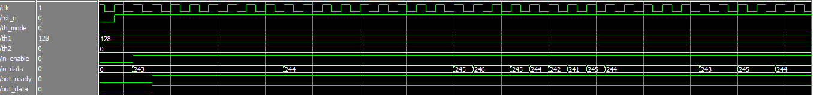  
图3-4-1 流水线模式时序

  

#### 3.4.3.2 请求响应模式

基本同3.4.3.1，但输入数据in\_data只有在in\_enbale的上升沿才会被送入处理，波形如图3-4-2。  

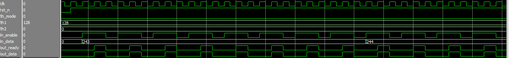  
图3-4-2 请求响应模式时序

  

#### 3.4.3.3 IP核GUI

完成功能后对TH核进行了封装，封装如图3-4-3，work\_mode被设计为键值对的模式，方便用户理解和选择，其它参数都根据实际状况加上了范围限定。  

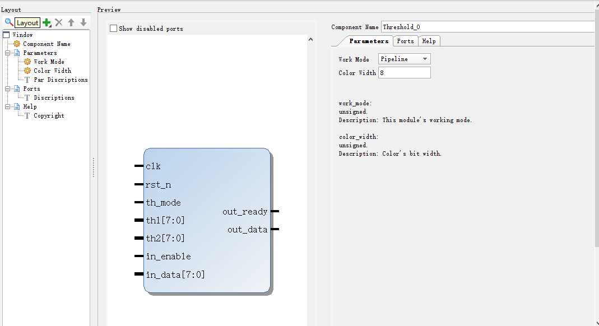  
图3-4-3 TH核的GUI

  

### 3.4.4 仿真

TH核只对灰度图像有意义，所以我选取了两张灰度模式的图像，并分别设置了两套参数(理论上可以设置任意套参数)，对一般全局阈值化和等高线阈值化的模式进行配置，参数如表3-4-3。  

  
 

<table border="1" cellspacing="0">
<tr>
<th>mode</th>
<th>th1</th>
<th>th2</th>
</tr>
<tr>
<td>Base</td>
<td>128</td>
<td>0</td>
</tr>
<tr>
<td>Contour</td>
<td>50</td>
<td>200</td>
</tr>
</table>
表3-4-3 仿真参数

其中Base模式为一般全局阈值化，而Contour为等高线阈值化，对每种参数进行流水线和请求响应模式的测试，原始图像如图3-4-4，每一张图像的测试流程如下： 

>流水线模式conf1 -> 存入\*-conf1-pipeline-hdlfun.\*内 -> 请求响应模式conf1 -> 存入\*-conf1-reqack-hdlfun.\*内 -> 流水线模式conf2 -> 存入\*-conf2-pipeline-hdlfun.\*内 -> 请求响应模式conf2 -> 存入\*-conf2-reqack-hdlfun.\*内。  

 
  
图3-4-4 原始测试图像

  

使用HDL功能仿真和软件仿真的结果进行PSNR的计算，仿真结果如图3-4-5所示。  

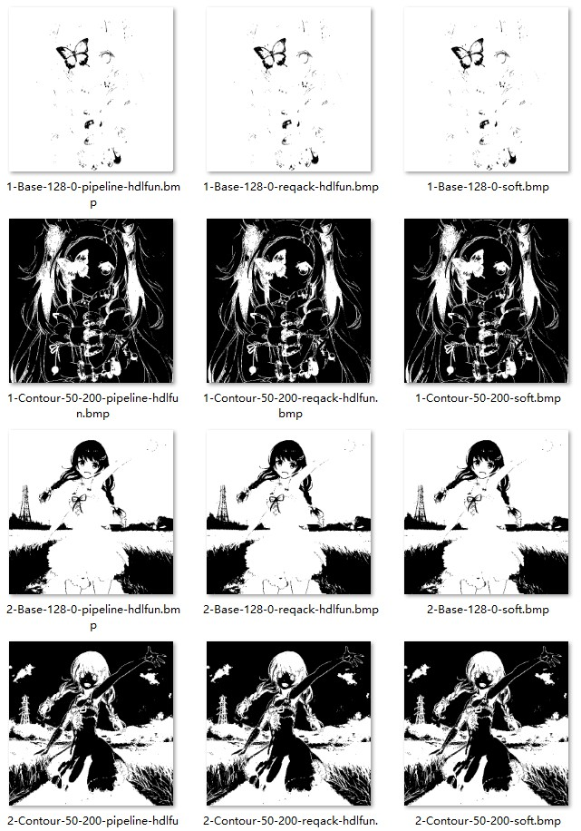  
图3-4-5 仿真结果，左侧为请求响应模式下的HDL功能仿真结果，中间为流水线模式下的HDL功能仿真结果，右侧为软件仿真结果

  

### 3.4.5 资源和时序

由于两种模式的基本构成大致相同，所以只对第一种模式进行分析，根据Vivado生成的报表，主要资源耗费如表3-4-4。

<table border="1" cellspacing="0">
<tr>
<th>Slice LUTs*</th>
<th>Slice Registers</th>
</tr>
<tr>
<td>11</td>
<td>2</td>
</tr>
</table>
表3-4-4 主要资源耗费

 
根据时序报告，最大的Data Path Delay(数据路径延迟)为2.671ns，即：  

>FMax = 374.39MHz  

即说明，TH核在流水线模式下，理论上在处理1080p全高清图像时可以达到180帧。  
由于数据路径延迟和应用的最终约束设置强相关，所以仅供参考。

### 3.4.6 分析与结论

首先分析基本全局阈值化和等高线阈值化的效果，如图3-4-6和3-4-7所示，在给定参数的情况下，等高线阈值化对于边缘的保留的确更为完整，分类更为有效。  

 
  
图3-4-6 一般全局阈值化结果

  

 
  
图3-4-7 等高线阈值化结果

  

根据仿真结果计算PSNR，得到的数据如表3-4-5。  

<table border="1" cellspacing="0">
<tr>
<th>1-Base-128-0</th>
<th>1-Contour-50-200</th>
<th>2-Base-128-0</th>
<th>2-Contour-50-200</th>
<th>Total</th>
</tr>
<tr>
<td>1000000.00</td>
<td>1000000.00</td>
<td>1000000.00</td>
<td>1000000.00</td>
<td>1000000.00</td>
</tr>
</table>
表3-4-5 PSNR

PSNR均值为极大值，可见TH核和软件处理完全等效，同时可以达到不错的FMax，设计成功。

## 3.5 点操作-对比度变换

对比度变换属于图像增强的一种，图像增强，即增强图像中有用的信息，其目的是是改变图像的视觉效果，针对应用刻意强调图像整体或局部特征，是一个失真的过程。对比度变换是最基础的图像增强运算之一，由于人眼不仅仅是根据色彩的绝对值，还会根据某个区域和其周边的一个对比来得到整体的感受，这个“对比”量化后即为对比度。对比度变换的方式有很多，但差异基本都是变换系数所造成的，系数为常数的变换为线性变换，否则为非线性变换，本节将讨论如何实现线性的对比度变换。

### 3.5.1 原理

任何对比度变换都是通过调整变换系数实现的[3]，对比度变换的原理公式如式3-5-1，其中I为输入，Q为输出，ct_scale为变换系数，可见其本质实际上是映射函数的斜率，当变换系数大于1时，对比度增强，否则对比度降低。对于线性变换，这个变换系数为常数，即对于所有的输入色彩，所执行的运算都是一致的，这种变换的结果是整张图像所有的像素都被等效变换。  

$$Q=ct\_scale * I\ \ \ \ \ \ \ \ (3-5-1)$$
 

可见，对比度变换需要乘法运算，同时由于对比度变换不仅仅适用于灰度图像，还适用于多通道的彩色图像，并且所有通道的变换形式都是一致的。所以需要提供一个配置接口，用以确定输入图像所含的通道数量，并通过通道数量来对基本的单通道变换复制进行最终变换的实现。  

### 3.5.2 设计

根据原理可知，除了第2章的接口标准外，实现一个ContrastTransform核(以下简称CT核)还需要若干乘法器、输出使能计数器和复位系统，乘法器的数量由输入色彩的通道数量决定，并且每一个通道的运算都是一致的，这个运算有溢出的可能，所以在实现时要考虑对输出作出裁剪，当乘法的结果超出了当前色彩位宽所能表示的最大值时，比如对于8位色彩为255，则裁剪到255，裁剪过程理论上是一个“大于”的比较过程，但考虑到FPGA在实现“大于”和“小于”运算综合后是加法器实现的，会造成一定的性能影响，所以这里采用“等于”运算来替代。例如，对于8位和8位的无符号乘法，要将输出裁剪为8位，则如式3-5-2，其中Res为16位的相乘结果，Q为最终输出，Res的高八位看作是溢出位，将这高八位组成一个新的无符号数，大于0时则可以判定为溢出。  

$$Q=\begin{cases} Res[7 : 0] && Res[15 : 8] = 0 \\255 & & Res[15 : 8] \neq 0 \ \end{cases}.\ \ \ \ \ \ \ \ (3-5-2)$$
 

综上，最终需要的配置参数、端口和子模块分别如表3-5-1、表3-5-2与表3-5-3所示。  

<table border="1" cellspacing="0">
<tr>
<th>名字</th>
<th>类型</th>
<th>范围</th>
<th>默认值</th>
<th>说明</th>
</tr>
<tr>
<td>work_mode</td>
<td>无符号</td>
<td>0为流水线模式，1为请求响应模式</td>
<td>0</td>
<td>模块的工作模式。</td>
</tr>
<tr>
<td>color_channels</td>
<td>无符号</td>
<td>无</td>
<td>3</td>
<td>色彩通道数量，1为灰度，3为RGB等等。</td>
</tr>
<tr>
<td>color_width</td>
<td>无符号</td>
<td>1 - 12</td>
<td>8</td>
<td>色彩位宽。</td>
</tr>
<tr>
<td>mul_delay</td>
<td>无符号</td>
<td>取决于乘法器的配置。</td>
<td>3</td>
<td>乘法器输出延迟（流水线级数）。</td>
</tr>
</table>
表3-5-1 配置参数

  
 

<table border="1" cellspacing="0">
<tr>
<th>名字</th>
<th>端口</th>
<th>类型</th>
<th>范围</th>
<th>默认值</th>
<th>说明</th>
</tr>
<tr>
<td>clk</td>
<td>输入</td>
<td>无符号</td>
<td>无</td>
<td>无</td>
<td>Clock.</td>
</tr>
<tr>
<td>rst_n</td>
<td>输入</td>
<td>无符号</td>
<td>无</td>
<td>无</td>
<td>复位，低有效。</td>
</tr>
<tr>
<td>ct_scale</td>
<td>input</td>
<td>无符号</td>
<td>23 : 0</td>
<td>无</td>
<td>对比度变换系数，定点数，12bits.12bis。</td>
</tr>
<tr>
<td>in_enable</td>
<td>输入</td>
<td>无符号</td>
<td>无</td>
<td>无</td>
<td>输入数据使能，在流水线模式下，它是另一个复位信号，在请求响应模式下，只有在它有效的时候in_data才会被真正地改变。</td>
</tr>
<tr>
<td>in_data</td>
<td>输入</td>
<td>无符号</td>
<td>color_width - 1 : 0</td>
<td>无</td>
<td>输入数据，必须和in_enable同步输入。</td>
</tr>
<tr>
<td>out_ready</td>
<td>output</td>
<td>无符号</td>
<td>无</td>
<td>无</td>
<td>输出数据有效，在两种模式下，这个信号都会在out_data可以被读取的时候有效。</td>
</tr>
<tr>
<td>out_data</td>
<td>output</td>
<td>无符号</td>
<td>color_width - 1 : 0</td>
<td>无</td>
<td>输出数据，将会和out_ready同步输出。</td>
</tr>
</table>
表3-5-2 端口

  
 

<table border="1" cellspacing="0">
<tr>
<th>名字</th>
<th>类型</th>
<th>说明</th>
</tr>
<tr>
<td>MulRed</td>
<td>MultiplierRedx0d299</td>
<td>12位无符号数和24位无符号数的乘法器，被用于定点数的乘法。你可以自己配置这个乘法器，然后更改"mul_delay"，但所有的乘法器必须拥有相同的流水线级数，并且不能更改端口的配置！</td>
</tr>
</table>
表3-3-3 子模块

### 3.5.3 实现

根据3.5.2的设计便可以实现一个CT核，流水线和请求响应两种模式的实现方式如下：  

#### 3.5.3.1 流水线模式

保证地址和数据同步流水化输出，在复位时二者皆输出为0，实现如下：  
in_enable或rst_n为低时，out_ready输出为0，即输出无效，系统不工作；否则系统根据ct_scale进行工作，计数器在乘法器延迟加1个周期(默认为4)后使能输出有效，第一个数据被输出，并且每一个clk的上升沿都会送入一个数据in_data进行处理，第一个输出数据有效之后，每一个周期都将送出一个有效数据，波形如图3-5-1。  

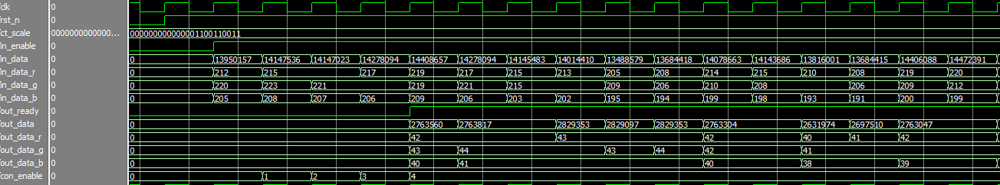  
图3-5-1 流水线模式时序

  

#### 3.5.3.2 请求响应模式

基本同3.5.3.1，但输入数据in_data只有在in_enbale的上升沿才会被送入处理，波形如图3-5-2。  

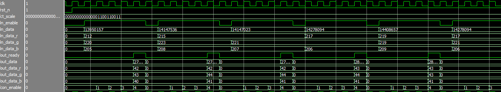  
图3-5-2 请求响应模式时序

  

#### 3.5.3.3 IP核GUI

完成功能后对CT核进行了封装，封装如图3-5-3，work_mode被设计为键值对的模式，方便用户理解和选择，其它参数都根据实际状况加上了范围限定。  

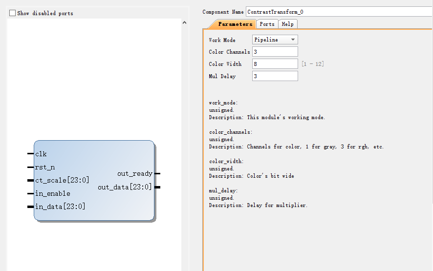  
图3-5-3 CT核的GUI

  

### 3.5.4 仿真

CT核对于二值操作没有意义，所以我选取了一张图像的RGB模式和灰度模式作为仿真源，并分别设置了两套参数(理论上可以设置任意套参数)，参数的选取原则是不可由有限二进制定点数表示，以此来得到最坏情况下的PSNR，参数如表3-5-4。  

<table border="1" cellspacing="0">
<tr>
<th>ct_scale</th>
</tr>
<tr>
<td>0.2</td>
</tr>
<tr>
<td>3.3</td>
</tr>
</table>
表3-5-4 仿真参数

对每种参数进行流水线和请求响应模式的测试，原始图像如图3-5-4，每一张图像的测试流程如下： 

>流水线模式conf1 -> 存入\*-conf1-pipeline-hdlfun.\*内 -> 请求响应模式conf1 -> 存入\*-conf1-reqack-hdlfun.\*内 -> 流水线模式conf2 -> 存入\*-conf2-pipeline-hdlfun.\*内 -> 请求响应模式conf2 -> 存入\*-conf2-reqack-hdlfun.\*内。  

 
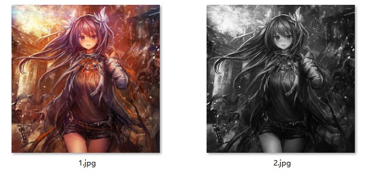  
图3-5-4 原始测试图像

  

使用HDL功能仿真和软件仿真的结果进行PSNR的计算，仿真结果如图3-5-5所示。  

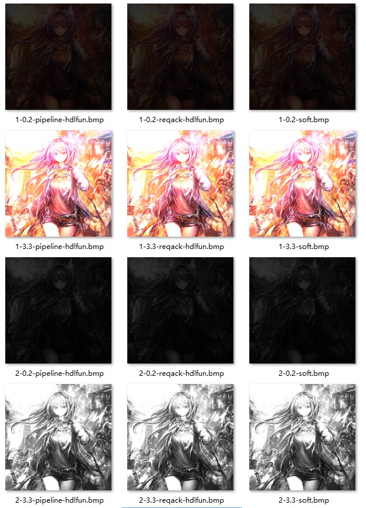  
图3-5-5 仿真结果，左侧为请求响应模式下的HDL功能仿真结果，中间为流水线模式下的HDL功能仿真结果，右侧为软件仿真结果

  

### 3.5.5 资源和时序

由于两种模式的基本构成大致相同，所以只对第一种模式进行分析，根据Vivado生成的报表，主要资源耗费如表3-5-5。

<table border="1" cellspacing="0">
<tr>
<th>Slice LUTs*</th>
<th>Slice Registers</th>
<th>DSP</th>
</tr>
<tr>
<td>38</td>
<td>27</td>
<td>3</td>
</tr>
</table>
表3-5-5 主要资源耗费

 
根据时序报告，最大的Data Path Delay(数据路径延迟)为2.746ns，即：  

>FMax = 364.16MHz  

即说明，CT核在流水线模式下，理论上在处理1080p全高清图像时可以达到175帧。  
由于数据路径延迟和应用的最终约束设置强相关，所以仅供参考。

### 3.5.6 分析与结论

根据仿真结果计算PSNR，得到的数据如表3-5-6。  

<table border="1" cellspacing="0">
<tr>
<th>1-0.2</th>
<th>1-3.3</th>
<th>2-0.2</th>
<th>2-3.3</th>
<th>Total</th>
</tr>
<tr>
<td>55.11</td>
<td>61.09</td>
<td>55.09</td>
<td>59.53</td>
<td>57.70</td>
</tr>
</table>
表3-5-6 PSNR

PSNR均值为57.70，可见CT核满足处理要求，同时可以达到不错的FMax，设计成功。

## 3.6 点操作-亮度换变

亮度变换同样是最基础的图像增强运算之一，通过3.3的论述可知，亮度实际上是像素的各个通道色彩分量的一个线性函数，故可以通过更改每个通道的色彩值来进行亮度的变换。所以，亮度变换就是对图像中每一个像素的色彩进行增加或者减少的线性变换，与对比度变相相同，亮度变换的方式也有很多，差异也基本都是变换系数所造成的，系数为常数的变换为线性变换，否则为非线性变换，本节将讨论如何实现线性的亮度变换。

### 3.6.1 原理

任何亮度变换都是通过调整变换系数实现的[3]，其变换的原理公式如式3-6-1，其中I为输入，Q为输出，lm_gain为变换系数，为有符号数，可见其本质实际上是映射函数的截距，当变换系数大于0时，亮度增强，否则对比亮度降低。对于线性变换，这个变换系数为常数，即对于所有的输入色彩，所执行的运算都是一致的，这种变换的结果是整张图像所有的像素都被等效变换。  

$$Q=I + lm\_gain\ \ \ \ \ \ \ \ (3-6-1)$$
 

可见，对比度变换需要加法运算，同时由于对比度变换不仅仅适用于灰度图像，还适用于多通道的彩色图像，并且所有通道的变换形式都是一致的。所以需要提供一个配置接口，用以确定输入图像所含的通道数量，并通过通道数量来对基本的单通道变换复制进行最终变换的实现。  

### 3.6.2 设计

根据原理可知，除了第2章的接口标准外，实现一个LightnessTransform核(以下简称LT核)还需要有符号加法、输出使能计数器和复位系统，执行加法的次数的数量由输入色彩的通道数量决定，并且每一个通道的运算都是一致的，这个运算有溢出的可能，所以在实现时要考虑对输出作出裁剪，当加法的结果为负数或者超出了当前色彩位宽所能表示的最大值时，比如对于8位色彩为255，则裁剪到0或255。例如，对于9位和9位的有符号加法，要将输出裁剪到允许的输出范围内，则如式3-6-2，其中Res为10位的相加结果，Q为最终输出，Res的最高位为符号位，次高位看作是溢出位，符号位决定是否裁剪到0，溢出位决定是否裁剪到255。  

$$Q=\begin{cases} 0 && Res[9] = 1 \\Res[7 : 0] && Res[9] = 0 \ \&\ Res[8] = 0 \\255 & & Res[9] = 0 \ \&\ Res[8] = 1 \ \end{cases}.\ \ \ \ \ \ \ \ (3-6-2)$$
 

综上，最终需要的配置参数和端口分别如表3-6-1、表3-6-2所示。  

<table border="1" cellspacing="0">
<tr>
<th>名字</th>
<th>类型</th>
<th>范围</th>
<th>默认值</th>
<th>说明</th>
</tr>
<tr>
<td>work_mode</td>
<td>无符号</td>
<td>0为流水线模式，1为请求响应模式</td>
<td>0</td>
<td>模块的工作模式。</td>
</tr>
<tr>
<td>color_channels</td>
<td>无符号</td>
<td>无</td>
<td>3</td>
<td>色彩通道数量，1为灰度，3为RGB等等。</td>
</tr>
<tr>
<td>color_width</td>
<td>无符号</td>
<td>1 - 12</td>
<td>8</td>
<td>色彩位宽。</td>
</tr>
</table>
表3-6-1 配置参数

  
 

<table border="1" cellspacing="0">
<tr>
<th>名字</th>
<th>端口</th>
<th>类型</th>
<th>范围</th>
<th>默认值</th>
<th>说明</th>
</tr>
<tr>
<td>clk</td>
<td>输入</td>
<td>无符号</td>
<td>无</td>
<td>无</td>
<td>Clock.</td>
</tr>
<tr>
<td>rst_n</td>
<td>输入</td>
<td>无符号</td>
<td>无</td>
<td>无</td>
<td>复位，低有效。</td>
</tr>
<tr>
<td>lm_gain</td>
<td>input</td>
<td>有符号</td>
<td>color_width : 0</td>
<td>无</td>
<td>亮度变换系数，有符号数，当大于零时，它的值必须是原码，小于零时则必须是补码。</td>
</tr>
<tr>
<td>in_enable</td>
<td>输入</td>
<td>无符号</td>
<td>无</td>
<td>无</td>
<td>输入数据使能，在流水线模式下，它是另一个复位信号，在请求响应模式下，只有在它有效的时候in_data才会被真正地改变。</td>
</tr>
<tr>
<td>in_data</td>
<td>输入</td>
<td>无符号</td>
<td>color_width - 1 : 0</td>
<td>无</td>
<td>输入数据，必须和in_enable同步输入。</td>
</tr>
<tr>
<td>out_ready</td>
<td>output</td>
<td>无符号</td>
<td>无</td>
<td>无</td>
<td>输出数据有效，在两种模式下，这个信号都会在out_data可以被读取的时候有效。</td>
</tr>
<tr>
<td>out_data</td>
<td>output</td>
<td>无符号</td>
<td>color_width - 1 : 0</td>
<td>无</td>
<td>输出数据，将会和out_ready同步输出。</td>
</tr>
</table>
表3-6-2 端口

  

### 3.6.3 实现

根据3.6.2的设计便可以实现一个LT核，流水线和请求响应两种模式的实现方式如下：  

#### 3.6.3.1 流水线模式

保证地址和数据同步流水化输出，在复位时二者皆输出为0，实现如下：  
in_enable或rst_n为低时，out_ready输出为0，即输出无效，系统不工作；否则系统根据lm_gain进行工作，计数器在2个周期后使能输出有效，第一个数据被输出，并且每一个clk的上升沿都会送入一个数据in_data进行处理，第一个输出数据有效之后，每一个周期都将送出一个有效数据，波形如图3-6-1。  

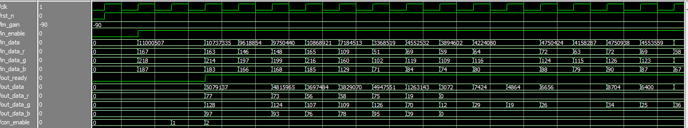  
图3-6-1 流水线模式时序

  

#### 3.6.3.2 请求响应模式

基本同3.6.3.1，但输入数据in_data只有在in_enbale的上升沿才会被送入处理，波形如图3-6-2。  

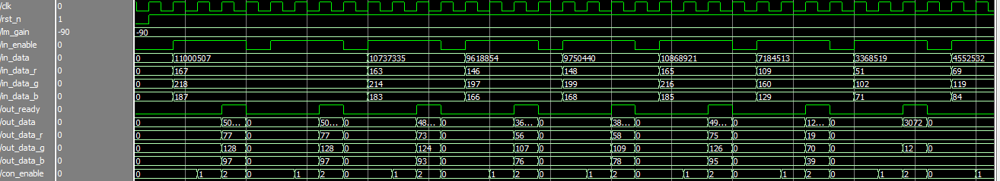  
图3-6-2 请求响应模式时序

  

#### 3.6.3.3 IP核GUI

完成功能后对LT核进行了封装，封装如图3-6-3，work_mode被设计为键值对的模式，方便用户理解和选择，其它参数都根据实际状况加上了范围限定。  

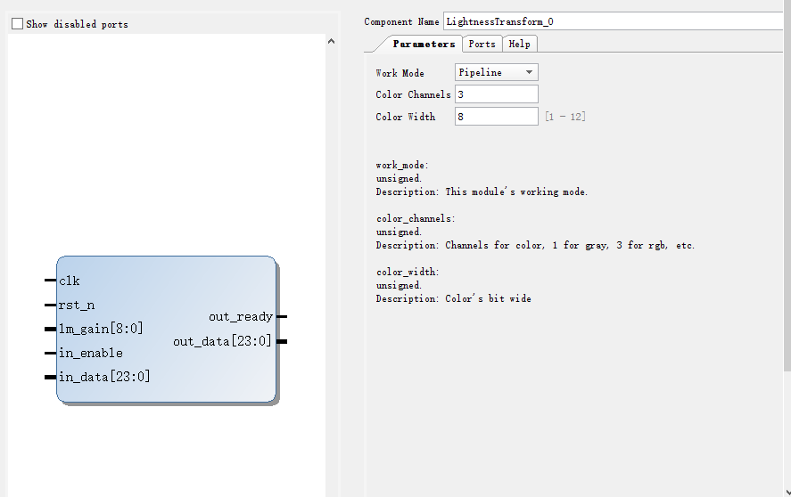  
图3-6-3 LT核的GUI

  

### 3.6.4 仿真

LT核对于二值操作没有意义，所以我选取了一张图像的RGB模式和灰度模式作为仿真源，并分别设置了两套参数(理论上可以设置任意套参数)，参数如表3-6-3。  

<table border="1" cellspacing="0">
<tr>
<th>lm_gain</th>
</tr>
<tr>
<td>-90</td>
</tr>
<tr>
<td>100</td>
</tr>
</table>
表3-3-4 仿真参数

对每种参数进行流水线和请求响应模式的测试，原始图像如图3-6-4，每一张图像的测试流程如下： 

>流水线模式conf1 -> 存入\*-conf1-pipeline-hdlfun.\*内 -> 请求响应模式conf1 -> 存入\*-conf1-reqack-hdlfun.\*内 -> 流水线模式conf2 -> 存入\*-conf2-pipeline-hdlfun.\*内 -> 请求响应模式conf2 -> 存入\*-conf2-reqack-hdlfun.\*内。  

 
  
图3-6-4 原始测试图像

  

使用HDL功能仿真和软件仿真的结果进行PSNR的计算，仿真结果如图3-6-5所示。  

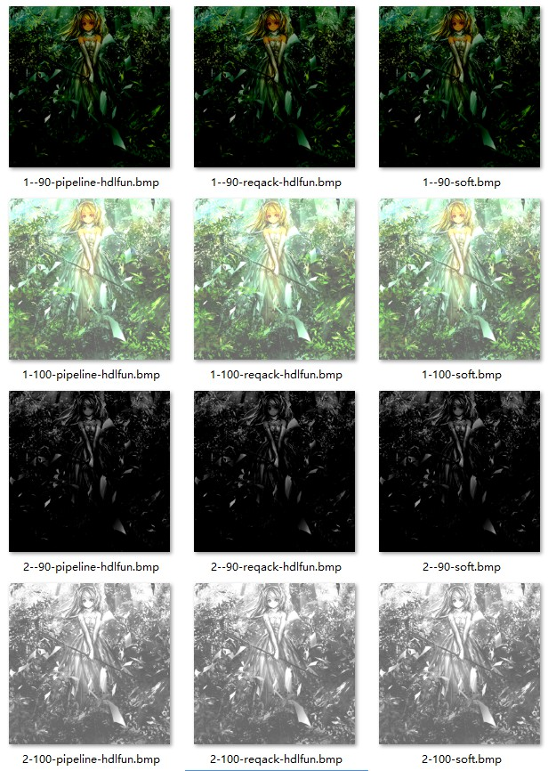  
图3-6-5 仿真结果，左侧为请求响应模式下的HDL功能仿真结果，中间为流水线模式下的HDL功能仿真结果，右侧为软件仿真结果

  

### 3.6.5 资源和时序

由于两种模式的基本构成大致相同，所以只对第一种模式进行分析，根据Vivado生成的报表，主要资源耗费如表3-6-4。

<table border="1" cellspacing="0">
<tr>
<th>Slice LUTs*</th>
<th>Slice Registers</th>
</tr>
<tr>
<td>67</td>
<td>57</td>
</tr>
</table>
表3-6-4 主要资源耗费

 
根据时序报告，最大的Data Path Delay(数据路径延迟)为2.533ns，即：  

>FMax = 394.78MHz  

即说明，LT核在流水线模式下，理论上在处理1080p全高清图像时可以达到190帧。  
由于数据路径延迟和应用的最终约束设置强相关，所以仅供参考。

### 3.6.6 分析与结论

根据仿真结果计算PSNR，得到的数据如表3-6-5。  

<table border="1" cellspacing="0">
<tr>
<th>1--90</th>
<th>1-100</th>
<th>2--90</th>
<th>2-100</th>
<th>Total</th>
</tr>
<tr>
<td>1000000.00</td>
<td>1000000.00</td>
<td>1000000.00</td>
<td>1000000.00</td>
<td>1000000.00</td>
</tr>
</table>
表3-6-5 PSNR

PSNR均值为极大值，可见LT核和软件方法完全等效，同时可以达到不错的FMax，设计成功。

## 3.7 点操作-色彩反转

色彩反转可以看做是变换系数为-1时的对比度变换和变换系数为色彩最大值的亮度变换之和，但考虑到在对比度变换时引入符号计算会增加额外的资源和时序消耗，并且一般情况下也不会有负向对比度变换的需求，所以单独将其提出作为一个模块。色彩反转常用于需要反转背景和主题元素的应用，例如解决某些眼障人群对一些色彩搭配不适，又例如在印刷工艺中的负片等，本节将会介绍如何实现一个色彩反转的IP核。

### 3.7.1 原理

色彩反转的基本原理公式如式3-7-1[3]，由于此变换同样适用于任何色彩通道数量和任何色彩位宽的图像，所以需要针对这两个参数来调整IP核的结构，此公式表示了一个像素中一个通道的色彩是如何被变换的，Q为输出，I为输入，N为色彩位宽，可见实现此运算需要一次减法。  

$$Q = (2^N - 1) - I\ \ \ \ \ \ \ \ (3-7-1)$$
 

但考虑到这种减法的特殊性，即用于减去I的被减数实际上是色彩位宽能够表示的无符号数的最大值，所以可以直接对输入I按位取反来得到输出Q，如式3-7-2，按位取反是简单快速的逻辑运算，理论上比减法的逻辑延时要小，并且实现也更为容易。

$$Q = \sim I\ \ \ \ \ \ \ \ (3-7-2)$$
 

可见，色彩反转需要若干次并行的取反运算，同时要根据色彩通道数量和色彩位宽做相应的适配。  

### 3.7.2 设计

根据原理可知，除了第2章的接口标准外，实现一个ColorReversal核(以下简称CR核)也需要根据输入参数做一些适配，但考虑到每一个通道、每一位的运算完全等价，所以不用考虑逻辑复制，直接对输入的每一位取反即可。综上，最终需要的配置参数和端口分别如表3-7-1、表3-7-2所示。  

<table border="1" cellspacing="0">
<tr>
<th>名字</th>
<th>类型</th>
<th>范围</th>
<th>默认值</th>
<th>说明</th>
</tr>
<tr>
<td>work_mode</td>
<td>无符号</td>
<td>0为流水线模式，1为请求响应模式</td>
<td>0</td>
<td>模块的工作模式。</td>
</tr>
<tr>
<td>color_channels</td>
<td>无符号</td>
<td>无</td>
<td>3</td>
<td>色彩通道数量，1为灰度，3为RGB等等。</td>
</tr>
<tr>
<td>color_width</td>
<td>无符号</td>
<td>1 - 12</td>
<td>8</td>
<td>色彩位宽。</td>
</tr>
</table>
表3-7-1 配置参数

  
 

<table border="1" cellspacing="0">
<tr>
<th>名字</th>
<th>端口</th>
<th>类型</th>
<th>范围</th>
<th>默认值</th>
<th>说明</th>
</tr>
<tr>
<td>clk</td>
<td>输入</td>
<td>无符号</td>
<td>无</td>
<td>无</td>
<td>Clock.</td>
</tr>
<tr>
<td>rst_n</td>
<td>输入</td>
<td>无符号</td>
<td>无</td>
<td>无</td>
<td>复位，低有效。</td>
</tr>
<tr>
<td>in_enable</td>
<td>输入</td>
<td>无符号</td>
<td>无</td>
<td>无</td>
<td>输入数据使能，在流水线模式下，它是另一个复位信号，在请求响应模式下，只有在它有效的时候in_data才会被真正地改变。</td>
</tr>
<tr>
<td>in_data</td>
<td>输入</td>
<td>无符号</td>
<td>color_width - 1 : 0</td>
<td>无</td>
<td>输入数据，必须和in_enable同步输入。</td>
</tr>
<tr>
<td>out_ready</td>
<td>output</td>
<td>无符号</td>
<td>无</td>
<td>无</td>
<td>输出数据有效，在两种模式下，这个信号都会在out_data可以被读取的时候有效。</td>
</tr>
<tr>
<td>out_data</td>
<td>output</td>
<td>无符号</td>
<td>color_width - 1 : 0</td>
<td>无</td>
<td>输出数据，将会和out_ready同步输出。</td>
</tr>
</table>
表3-7-2 端口

  

### 3.7.3 实现

根据3.7.2的设计便可以实现一个CR核，流水线和请求响应两种模式的实现方式如下：  

#### 3.7.3.1 流水线模式

保证地址和数据同步流水化输出，在复位时二者皆输出为0，实现如下：  
in_enable或rst_n为低时，out_ready输出为0，即输出无效，系统不工作；否则一个周期后第一个数据被输出，并且每一个clk的上升沿都会送入一个数据in_data进行处理，第一个输出数据有效之后，每一个周期都将送出一个有效数据，波形如图3-7-1。  

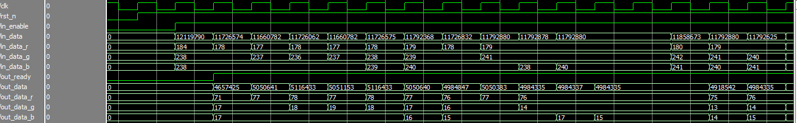  
图3-7-1 流水线模式时序

  

#### 3.7.3.2 请求响应模式

基本同3.7.3.1，但输入数据in_data只有在in_enbale的上升沿才会被送入处理，波形如图3-7-2。  

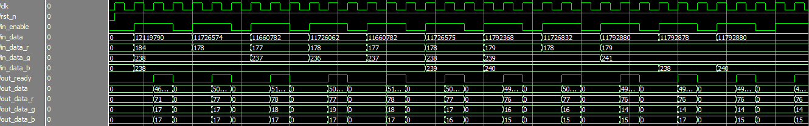  
图3-7-2 请求响应模式时序

  

#### 3.7.3.3 IP核GUI

完成功能后对CR核进行了封装，封装如图3-7-3。  

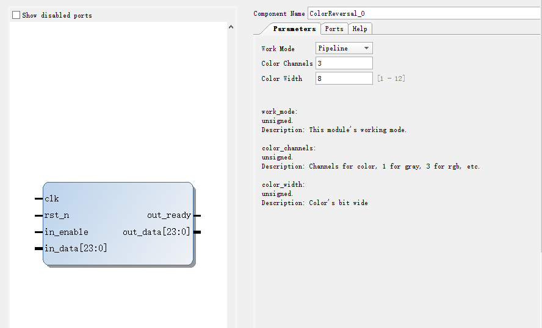  
图3-7-3 CR核的GUI

  

### 3.7.4 仿真

CR核对于所有图像输入都有意义，所以我选取了一张图像的RGB模式、灰度模式与二值模式(来源于局部二值化，在后面的章节将会介绍)作为仿真源，对每张图进行流水线和请求响应模式的测试，原始图像如图3-7-4，每一张图像的测试流程如下： 

>流水线模式conf -> 存入\*-conf1-pipeline-hdlfun.\*内 -> 请求响应模式conf -> 存入\*-conf-reqack-hdlfun.\*内。  

 
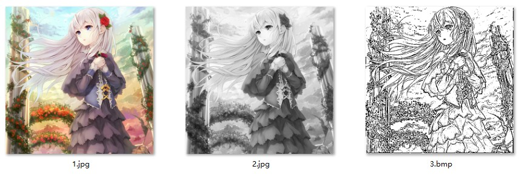  
图3-7-4 原始测试图像

  

使用HDL功能仿真和软件仿真的结果进行PSNR的计算，仿真结果如图3-7-5所示。  

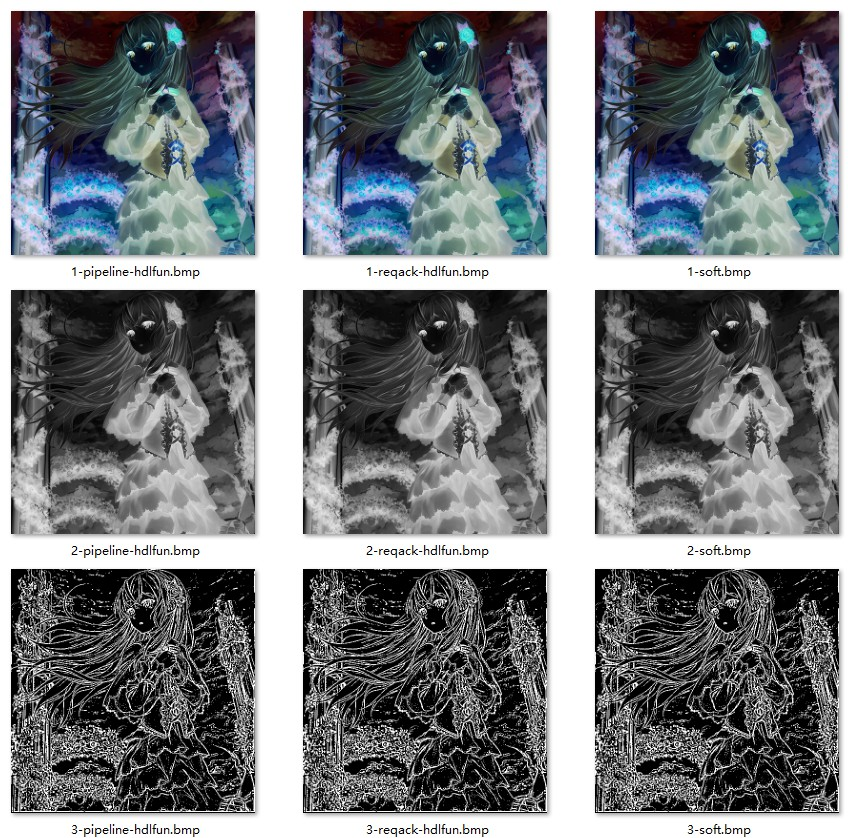  
图3-7-5 仿真结果，左侧为请求响应模式下的HDL功能仿真结果，中间为流水线模式下的HDL功能仿真结果，右侧为软件仿真结果

  

### 3.7.5 资源和时序

由于两种模式的基本构成大致相同，所以只对第一种模式进行分析，根据Vivado生成的报表，主要资源耗费如表3-7-3。

<table border="1" cellspacing="0">
<tr>
<th>Slice LUTs*</th>
<th>Slice Registers</th>
</tr>
<tr>
<td>49</td>
<td>25</td>
</tr>
</table>
表3-7-3 主要资源耗费

 
根据时序报告，最大的Data Path Delay(数据路径延迟)为2.298ns，即：  

>FMax = 435.16MHz  

即说明，CR核在流水线模式下，理论上在处理1080p全高清图像时可以达到210帧。  
由于数据路径延迟和应用的最终约束设置强相关，所以仅供参考。

### 3.7.6 分析与结论

根据仿真结果计算PSNR，得到的数据如表3-7-4。  

<table border="1" cellspacing="0">
<tr>
<th>1</th>
<th>2</th>
<th>3</th>
<th>Total</th>
</tr>
<tr>
<td>1000000.00</td>
<td>1000000.00</td>
<td>1000000.00</td>
<td>1000000.00</td>
</tr>
</table>
表3-7-4 PSNR

PSNR均值为极大值，可见LT核和软件方法完全等效，同时可以达到不错的FMax，设计成功。

## 3.8 生成器-行缓存生成器

行缓存是局部滤波操作的基础，它是生成窗口的前置条件。行缓存生成器的目的是截取图像的前N行，随后将其作为窗口数据的来源，设计一个行缓存生成器需要考虑到复用性和去耦合，以保证在有需求的情况下，一个行缓存能够被更多的后续模块利用。本节将会介绍如何实现一个行缓存生成器。

### 3.8.1 原理

如图3-8-1所示[3]，左侧是第一种窗口生成的方式，行缓存和窗口并行，右侧则是和窗口串行。在FPGA的实现中，无论是哪一种方式，行缓存中的每一行通常都是由一个和图像等宽的Fifo来构造的，而Fifo所消耗的存储器或者LUT资源比较多，所以考虑到实现的便利性、行缓存复用性和去耦合，本库选择了与窗口并行的方式。  

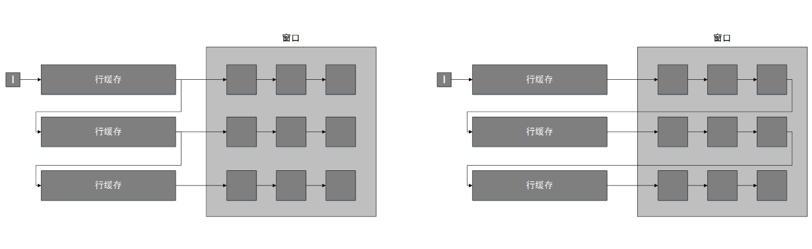  
图3-8-1 窗口生成形式

  

由于用到了Fifo，所以需要调用Xilinx官方的IP核，根据Fifo的数据手册[14]，可知其可以配置为为许多种模式，在这里最需要关心配置是读写时钟、Fifo宽度与Fifo深度。Fifo的读写时钟有两种模式，可以配置为读写同步和读写异步模式，同步模式是即读写共用一个时钟，这样可以达到理论上最大的FMax，同时符合本设计的流水化需求，所以这里选择同步读写模式。同步读写模式的读写时序分别如图3-8-2和3-8-3，可见写入是实时的，而读出则有一个周期的延迟，并且Fifo内部数据的计数值和可读出的数据是同步的，所以只需要在第N行的计数值达到要求后使能第N行的读有效信号，隔一个周期之后使能第N+1行的写有效信号，同时将第N行的输出数据和第N+1行的输入数据连接到一起(第一行数据的输入应当为模块的输入数据)，最后，将每一行的输出拼接起来作为整个模块输出即可。
 

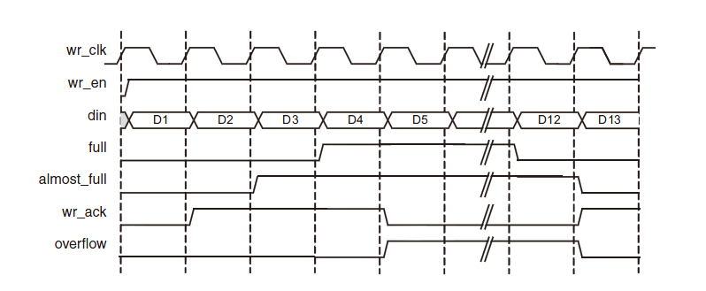  
图3-8-2 Fifo写时序

  

  
图3-8-3 Fifo读时序

  

### 3.8.2 设计

根据原理可知，RowsGenerator核(以下简称RG核)需要考虑Fifo宽度与Fifo深度。Fifo宽度根据应用场合(待处理图像的色彩位宽)变换较大，同时考虑到本库所允许的色彩位宽范围为1-12，并且在整个可能的项目中色彩位宽变幻的可能性较高，会因为IP重名而导致综合错误，所以我将其分为了四个阶段，并为每个阶段单独设置了一个Fifo，如表3-8-1，随后使用generate语句，让综合器自动根据当前色彩位宽选择实例化哪一个生成器，实现资源和泛用性的一个平衡。  

<table border="1" cellspacing="0">
<tr>
<th>色彩位宽</th>
<th>Fifo宽度</th>
</tr>
<tr>
<td>1</td>
<td>1</td>
</tr>
<tr>
<td>2, 3, 4</td>
<td>4</td>
</tr>
<tr>
<td>5, 6, 7, 8</td>
<td>8</td>
</tr>
<tr>
<td>9, 10, 11, 12</td>
<td>12</td>
</tr>
</table>
表3-8-1 色彩位宽与Fifo宽度

  

对于Fifo的深度，则是根据当前图像宽度确定的，同时对于Fifo的IP核，其深度必须为2的幂，考虑到在一个项目中图像宽度几乎不会改变，所以我将Fifo深度的配置权交给了用户，用户可以自己设置这个深度来达到自己的需求。除此之外，由于行缓存确实需要消耗存储器资源，但对于一般的应用消耗的又并不多，无法填满块RAM的一个最小单位18K，使用块RAM可能会造成不必要的浪费，所以默认配置为使用分布式RAM来节约资源，带来的负面影响是会降低FMax，但综合考虑下，这是值得的，如果确实有需要很高速的应用，用户可以自行选择配置为其他模式的实现。综上，一个RG核需要的配置参数、端口和子模块如表3-8-2、表3-8-3和表3-8-4。  

<table border="1" cellspacing="0">
<tr>
<th>名字</th>
<th>类型</th>
<th>范围</th>
<th>默认值</th>
<th>说明</th>
</tr>
<tr>
<td>rows_width</td>
<td>无符号</td>
<td>2 - 15</td>
<td>3</td>
<td>行缓存宽度。</td>
</tr>
<tr>
<td>im_width</td>
<td>无符号</td>
<td>1 - 4096</td>
<td>320</td>
<td>图像宽度。</td>
</tr>
<tr>
<td>color_width</td>
<td>无符号</td>
<td>1 - 12</td>
<td>8</td>
<td>色彩位宽。</td>
</tr>
<tr>
<td>im_width_bits</td>
<td>无符号</td>
<td>取决于图像宽度</td>
<td>9</td>
<td>图像宽度的位宽。</td>
</tr>
</table>
表3-8-2 配置参数

  
 

<table border="1" cellspacing="0">
<tr>
<th>名字</th>
<th>端口</th>
<th>类型</th>
<th>范围</th>
<th>默认值</th>
<th>说明</th>
</tr>
<tr>
<td>clk</td>
<td>输入</td>
<td>无符号</td>
<td>无</td>
<td>无</td>
<td>Clock.</td>
</tr>
<tr>
<td>rst_n</td>
<td>输入</td>
<td>无符号</td>
<td>无</td>
<td>无</td>
<td>复位，低有效。</td>
</tr>
<tr>
<td>in_enable</td>
<td>输入</td>
<td>无符号</td>
<td>无</td>
<td>无</td>
<td>输入数据使能，作为第一个fifo的写使能。</td>
</tr>
<tr>
<td>in_data</td>
<td>输入</td>
<td>无符号</td>
<td>color_width - 1 : 0</td>
<td>无</td>
<td>输入数据，必须和in_enable同步输入。</td>
</tr>
<tr>
<td>out_ready</td>
<td>output</td>
<td>无符号</td>
<td>无</td>
<td>无</td>
<td>输出数据有效，在两种模式下，这个信号都会在out_data可以被读取的时候有效。</td>
</tr>
<tr>
<td>out_data</td>
<td>output</td>
<td>无符号</td>
<td>color_width * rows_width - 1 : 0</td>
<td>无</td>
<td>输出数据，将会和out_ready同步输出。</td>
</tr>
</table>
表3-8-3 端口

  

<table border="1" cellspacing="0">
<tr>
<th>名字</th>
<th>类型</th>
<th>说明</th>
</tr>
<tr>
<td>Fifo</td>
<td>Fifo1xWidthRows</td>
<td>位宽为1并且深度为N的Fifo(1 < N < 4096)，用于构造色彩位宽为1的行缓存。 你可以自己对fifo进行配置，但是在一个项目中所有的同名的fifo必须拥有同样的配置。 同时你只能够更改写入深度和fifo实现的类型，它的读延迟必须为1！</td>
</tr>
<tr>
<td>Fifo</td>
<td>Fifo4xWidthRows</td>
<td>位宽为4并且深度为N的Fifo(1 < N < 4096)，用于构造色彩位宽为1的行缓存。 你可以自己对fifo进行配置，但是在一个项目中所有的同名的fifo必须拥有同样的配置。 同时你只能够更改写入深度和fifo实现的类型，它的读延迟必须为1！</td>
</tr>
<tr>
<td>Fifo</td>
<td>Fifo8xWidthRows</td>
<td>位宽为8并且深度为N的Fifo(1 < N < 4096)，用于构造色彩位宽为1的行缓存。 你可以自己对fifo进行配置，但是在一个项目中所有的同名的fifo必须拥有同样的配置。 同时你只能够更改写入深度和fifo实现的类型，它的读延迟必须为1！</td>
</tr>
<tr>
<td>Fifo</td>
<td>Fifo12xWidthRows</td>
<td>位宽为12并且深度为N的Fifo(1 < N < 4096)，用于构造色彩位宽为1的行缓存。 你可以自己对fifo进行配置，但是在一个项目中所有的同名的fifo必须拥有同样的配置。 同时你只能够更改写入深度和fifo实现的类型，它的读延迟必须为1！</td>
</tr>
</table>
表3-8-4 子模块

### 3.8.3 实现

根据3.8.2的设计便可以实现一个RG核，但考虑到如果这个RG核采用请求响应模式没有意义，用一般的AXI协议与其交互会使得效率低下且造成资源浪费，同时可能带来比较严重的时序问题，所以AXI版本的行缓存生成不在本节讨论，会用专门的AXI-Stream协议完成。故，此RG核仅有流水线模式。  

#### 3.8.3.1 流水线模式

保证地址和数据同步流水化输出，在复位时二者皆输出为0，实现如下：  
rst_n为低时，系统复位，输出无效；否则当in_enable使能时，第一个fifo开始填充，之后每一个clk的上升沿都会送入一个数据进行处理，当所有的fifo都被填充到图像宽度的深度时，输出有效，之后每一个周期都将送出一个有效数据，波形如图3-8-4。  

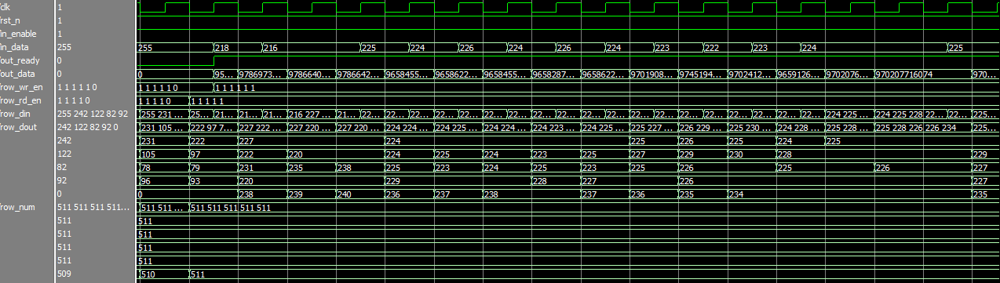  
图3-8-4 流水线模式时序

  

#### 3.8.3.2 IP核GUI

完成功能后对RG核进行了封装，封装如图3-8-5，im\_width\_bits根据自行im\_width自动计算。  

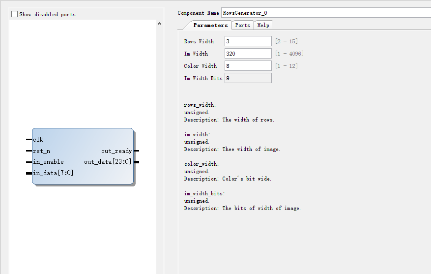  
图3-8-5 RG核的GUI

  

### 3.8.4 仿真

RG核虽然对于所有图像都有意义，但一般用于灰度和二值图像的处理，所以我选取了一张图像的灰度模式与二值模式(来源于局部二值化，在后面的章节将会介绍)作为仿真源，并且考虑到仿真压力，仅测试了宽度为3和5的行缓存，原始图像如图3-8-6。

 
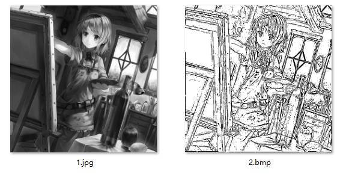  
图3-8-6 原始测试图像

  

使用HDL功能仿真和软件仿真的结果进行PSNR的计算，仿真结果如图3-8-7所示。  

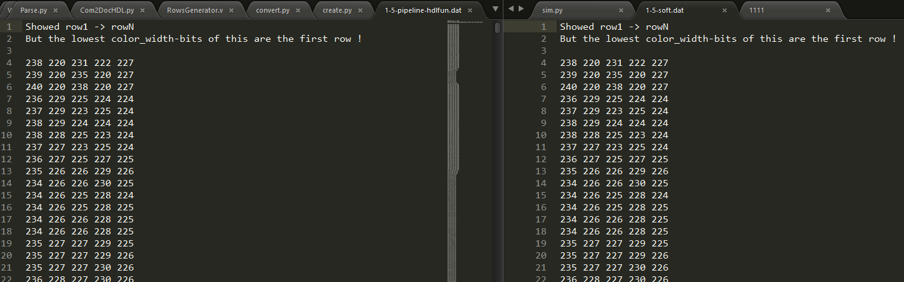  
图3-8-7 仿真结果之一，行缓存宽度为5，左侧为HDL功能仿真结果，右侧为软件仿真结果

  

### 3.8.5 资源和时序

由于最终实现和Fifo配置关系很大，这里只对512x512，色彩位宽为8，窗口大小为3，同时使用分布式RAM的状况，根据Vivado生成的报表，主要资源耗费如表3-8-5。

<table border="1" cellspacing="0">
<tr>
<th>Slice LUTs*</th>
<th>Slice Registers</th>
</tr>
<tr>
<td>610</td>
<td>237</td>
</tr>
</table>
表3-8-5 主要资源耗费

 

同时由于根据时序报告，在使用分布式RAM的情况下，最大的Data Path Delay(数据路径延迟)为3.514ns，即：  

>FMax = 284.57MHz  

即说明，RG核在流水线模式下，理论上在处理1080p全高清图像时可以达到137帧。  
由于数据路径延迟和应用的最终约束设置强相关，所以仅供参考。

### 3.8.6 分析与结论

由于RG核与一般的图像处理不同，所以不能采用PSNR来评估，只能对比软件仿真和硬件仿真每一行的文本，完全相同时则为正确(OK)，得到的数据如表3-8-5。  

<table border="1" cellspacing="0">
<tr>
<th>1-3</th>
<th>1-5</th>
<th>2-3</th>
<th>2-5</th>
<th>Total</th>
</tr>
<tr>
<td>OK</td>
<td>OK</td>
<td>OK</td>
<td>OK</td>
<td>OK</td>
</tr>
</table>
表3-8-5 文本对比

可见RG核有效，同时在使用分布式RAM的情况下也可以达到不错的FMax，设计成功。

## 3.9 生成器-窗口生成器

窗口生成器跟在行缓存生成器之后，负责将行缓存生成的每一列扩展成以某个像素为中心、以这个像素的邻域为填充的窗口，以供后续的模块进行处理。原则上，窗口的生成可以在每个局部滤波器模块的内部生成，但考虑到可能有若干个模块复用同一个窗口，综合复用性和资源成本的考量后，我选择用这样的一个生成器来作为行缓存和处理模块的连接层，本节将介绍如何构造一个窗口生成器。

### 3.9.1 原理

如图3-9-1中所示，窗口生成器接受包含若干行像素的一列，输出整个窗口的像素，并且窗口应当包含当前操作的中心像素以及其邻域像素。所以需要构造一个二维数组，数组的每一维都包含了一行，初始状态下窗口中的每个像素均为0，之后最左侧的一列不断接收外部数据，而每行的各个像素之间不断进行移位操作，以此来构造一个在图像上不断滑动的窗口。  

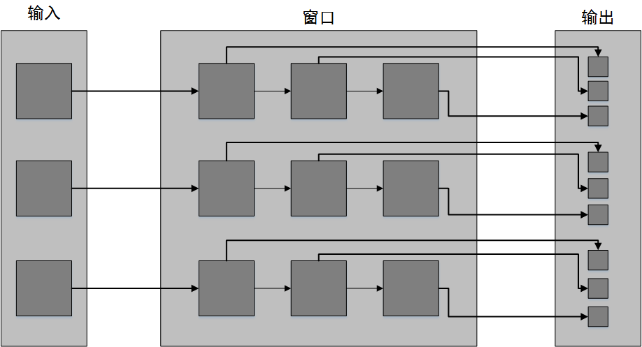  
图3-9-1 窗口的原理

  

### 3.9.2 设计

根据原理可知，WindowGenerator核(以下简称WG核)核心是一个二维数组每一维的像素之间的移位操作。考虑对于NxN的窗口，只有当第一个在图像上的像素作为窗口中心时才能够真正的输出，所以在N/2个周期之前，窗口的输出应该是无效的。但即使在无效的时候，窗口仍然需要外部输入数据来保证其继续被填充到有效，这和其他模块的设计不同，必须采用专用的设计来完成。考虑流水线模式，每一个周期模块接收外部送入的一列进行处理，由于移位是连续的，所以当第一个窗口填充完毕后输出有效，这和一般的流水线模式基本一致，而对于请求响应模式则不同，这种模式下输入数据受到输入使能的控制，移位是不连续的，所以当第一个窗口被填充完毕、窗口输出有效之前，必须有一个信号通知外部需要继续写入数据，我设计了一个端口input\_ack来传递这个信号。 
综上，一个WG核需要的配置参数和端口如表3-9-1与表3-9-2。

<table border="1" cellspacing="0">
<tr>
<th>名字</th>
<th>类型</th>
<th>范围</th>
<th>默认值</th>
<th>说明</th>
</tr>
<tr>
<td>work_mode</td>
<td>无符号</td>
<td>0为流水线模式，1为请求响应模式</td>
<td>0</td>
<td>工作模式</td>
</tr>
<tr>
<td>window_width</td>
<td>无符号</td>
<td>2 - 15</td>
<td>3</td>
<td>窗口的宽度和高度。</td>
</tr>
<tr>
<td>color_width</td>
<td>无符号</td>
<td>1 - 12</td>
<td>8</td>
<td>色彩位宽。</td>
</tr>
</table>
表3-9-1 配置参数

  
 

<table border="1" cellspacing="0">
<tr>
<th>名字</th>
<th>端口</th>
<th>类型</th>
<th>范围</th>
<th>默认值</th>
<th>说明</th>
</tr>
<tr>
<td>clk</td>
<td>输入</td>
<td>无符号</td>
<td>无</td>
<td>无</td>
<td>Clock.</td>
</tr>
<tr>
<td>rst_n</td>
<td>输入</td>
<td>无符号</td>
<td>无</td>
<td>无</td>
<td>复位，低有效。</td>
</tr>
<tr>
<td>in_enable</td>
<td>输入</td>
<td>无符号</td>
<td>无</td>
<td>无</td>
<td>输入数据使能，在流水线模式下，它是另一个复位信号，在请求响应模式下，只有在它有效的时候in_data才会被真正地改变。</td>
</tr>
<tr>
<td>in_data</td>
<td>输入</td>
<td>无符号</td>
<td>color_width * window_width - 1 : 0</td>
<td>无</td>
<td>输入数据，必须和in_enable同步输入。</td>
</tr>
<tr>
<td>out_ready</td>
<td>output</td>
<td>无符号</td>
<td>无</td>
<td>无</td>
<td>输出数据有效，在两种模式下，这个信号都会在out_data可以被读取的时候有效。</td>
</tr>
<tr>
<td>out_data</td>
<td>output</td>
<td>无符号</td>
<td>color_width * window_width * window_width - 1 : 0</td>
<td>无</td>
<td>输出数据，将会和out_ready同步输出。</td>
</tr>
<tr>
<td>input_ack</td>
<td>output</td>
<td>无符号</td>
<td>无</td>
<td>无</td>
<td>输入响应，仅仅被用于请求响应模式，这个端口将在输入数据被接受时给出一个响应。</td>
</tr>
</table>
表3-9-2 端口

  

### 3.9.3 实现

根据3.9.2的设计便可以实现一个WG核，流水线模式和请求响应模式实现如下。  

#### 3.9.3.1 流水线模式

保证地址和数据同步流水化输出，在复位时二者皆输出为0，实现如下：  
in_enable或rst_n为低时，系统复位，输出无效；否则窗口宽度加1个周期后第一个窗口被输出，并且每一个clk的上升沿都会送入一列进行处理，第一个窗口有效之后，每一个周期都将送出一个窗口，波形如图3-9-2。  

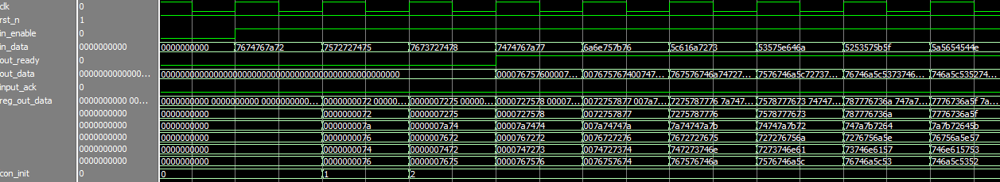  
图3-9-2 流水线模式时序

  

#### 3.9.3.2 请求响应模式

基本与3.9.3.1一致，但只有in\_enable的上升沿时才会有数据被输入，同时每一列输入后都会有一个input\_ack信号响应此次输入，来提示外部进行下一次的输入，波形如图3-9-3。  

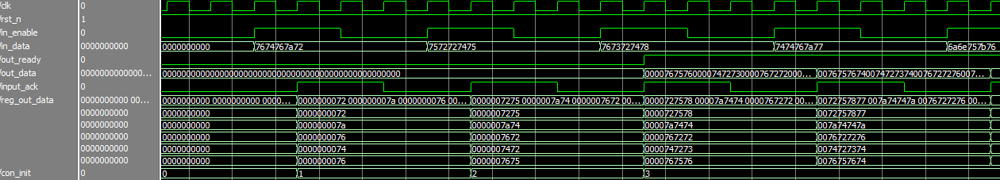  
图3-9-3 请求响应模式时序

  

#### 3.9.3.3 IP核GUI

完成功能后对WG核进行了封装，封装如图3-9-4。  

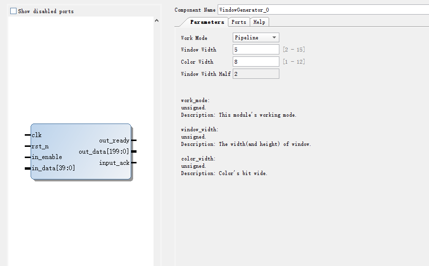  
图3-9-4 WG核的GUI

  

### 3.9.4 仿真

WG核虽然对于所有图像都有意义，但一般用于灰度和二值图像的处理，所以我选取了一张图像的灰度模式与二值模式(来源于局部二值化，在后面的章节将会介绍)作为仿真源，并且考虑到仿真压力，仅测试了宽度为3和5的窗口，原始图像如图3-9-5。

 
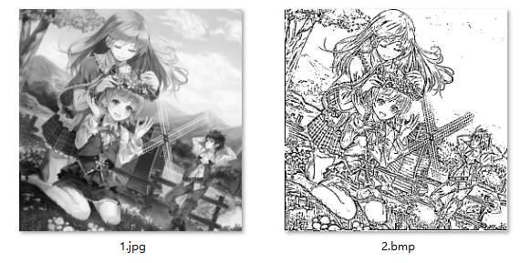  
图3-9-5 原始测试图像

  

使用HDL功能仿真和软件仿真的结果进行PSNR的计算，仿真结果如图3-9-6所示。  

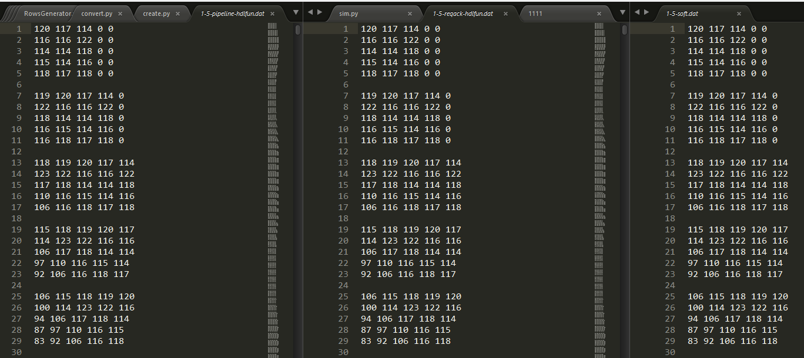  
图3-9-6 仿真结果之一，行缓存宽度为5，左侧为流水线模式下的HDL功能仿真结果，中间为请求响应模式下的HDL功能仿真结果，右侧为软件仿真结果

  

### 3.9.5 资源和时序

最终实现与窗口大小关系很大，这里只对512x512，色彩位宽为8，窗口大小为3时的情况进行分析，根据Vivado生成的报表，主要资源耗费如表3-9-3。

<table border="1" cellspacing="0">
<tr>
<th>Slice LUTs*</th>
<th>Slice Registers</th>
</tr>
<tr>
<td>73</td>
<td>74</td>
</tr>
</table>
表3-9-3 主要资源耗费

 

同时由于根据时序报告，最大的Data Path Delay(数据路径延迟)为2.325ns，即：  

>FMax = 430.10MHz  

即说明，WG核在流水线模式下，理论上在处理1080p全高清图像时可以达到207帧。  
由于数据路径延迟和应用的最终约束设置强相关，所以仅供参考。

### 3.9.6 分析与结论

由于WG核与一般的图像处理不同，所以不能采用PSNR来评估，只能对比软件仿真和硬件仿真每一行的文本，完全相同时则为正确(OK)，得到的数据如表3-9-4。  

<table border="1" cellspacing="0">
<tr>
<th>1-3</th>
<th>1-5</th>
<th>2-3</th>
<th>2-5</th>
<th>Total</th>
</tr>
<tr>
<td>OK</td>
<td>OK</td>
<td>OK</td>
<td>OK</td>
<td>OK</td>
</tr>
</table>
表3-9-4 文本对比

可见WG核有效，同时可以达到很高的FMax，设计成功。

## 3.10 局部滤波器-均值滤波器

均值滤波器是局部滤波器的一种，又称为平滑线性滤波器[15]，它通常用于去除图像中高斯噪声[16]，其具有对图像的模糊效果。均值滤波器有两种，一种是算术均值滤波器，一种是加权均值滤波器，前者可以看做是后者的特例，但考虑到加权均值滤波需要消耗大量乘法运算，并且除法运算难以避免，对FPGA并不友好，故这里只讨论算术均值滤波器的实现，本节将说明如何用FPGA实现一个均值滤波器。

### 3.10.1 原理

算术均值滤波器的基本原理见图3-10-1，这是一个3x3的均值滤波器，它对窗口中所有的像素求和，之后除以像素个数，最终得到的是整个窗口中像素的算术平均值，即式3-10-1所示，之后用这个均值来取代窗口的中心像素点。所以可知，一次均值运算需要若干次加法和一次除法，在FPGA中一个周期内实现这么多次加法对于FMax很不友好，所以需要考虑将其拆分，同时除法运算如果可以避免尽量避免，因为除法消耗的资源比较多，如果不使用DSP其对FMax的影响也会比较大。综上，本设计应当重点关注加法分段和除法替代的算法。  

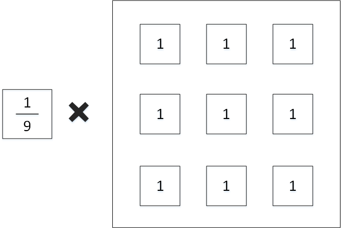  
图3-10-1 算术均值滤波器原理

  

$$Q=\frac{1}{n^2}\sum_{i=0}^{n^2}I_i\ \ \ \ \ \ \ \ (3-10-1)$$
 

#### 3.10.1.1 加法

将像素视为基本元素，一个窗口可以看作是从左上到右下的元素构成的一个列表。当N为偶数时，列表中的N个元素的一次求和运算，可以用若干级求和运算来代替，每一级求和运算由若干组的两个元素的求和运算组成，每一级的求和运算次数为$\frac{n}2$、$\frac{n}{2^2}$、$\frac{n}{2^3}$......直到某一级的运算次数为1，该级的这唯一的运算结果便是列表中所有元素的和，此时求和结束。当N为奇数时，只需要让列表中的最后一个元素参与到第一组加法中即可，图3-10-2演示了3x3的窗口的求和过程。  

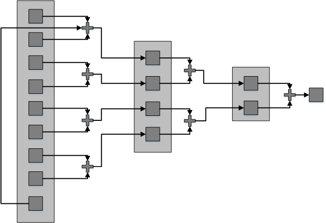  
图3-10-2 3x3窗口求和

  

可见，一个N个元素的列表求和需要分为的级数S如式3-10-2。  

$$Q=\log_2N\ \ \ \ \ \ \ \ (3-10-2)$$
 

#### 3.10.1.2 除法

由于本库限定窗口大小为2-15，个数不多，所以除法运算替代为若干次的移位相加操作是可以接受的。综合考虑到FPGA加法操作的延迟和运算消耗的周期，以三次移位两次加法为上限，同时为了防止最终的运算结果溢出，需要保证使用替代后的算法计算出来的结果不大于标准操作的结果，经过试验和删选，最终确定的替代算法如下：  

    :::verilog
    case (window_width)
        2 : reg_out_data <= sum_all >> 2;
        3 : reg_out_data <= (sum_all >> 4) + (sum_all >> 5) + (sum_all >> 6);
        4 : reg_out_data <= sum_all >> 4;
        5 : reg_out_data <= (sum_all >> 5) + (sum_all >> 7) + (sum_all >> 10);
        6 : reg_out_data <= (sum_all >> 6) + (sum_all >> 7) + (sum_all >> 8);
        7 : reg_out_data <= (sum_all >> 6) + (sum_all >> 8) + (sum_all >> 10);
        8 : reg_out_data <= sum_all >> 6;
        9 : reg_out_data <= (sum_all >> 7) + (sum_all >> 8) + (sum_all >> 11);
        10 : reg_out_data <= (sum_all >> 7) + (sum_all >> 9) + (sum_all >> 13);
        11 : reg_out_data <= (sum_all >> 7) + (sum_all >> 12) + (sum_all >> 13);
        12 : reg_out_data <= (sum_all >> 8) + (sum_all >> 9) + (sum_all >> 10);
        13 : reg_out_data <= (sum_all >> 8) + (sum_all >> 9) + (sum_all >> 14);
        14 : reg_out_data <= (sum_all >> 8) + (sum_all >> 10) + (sum_all >> 12);
        15 : reg_out_data <= (sum_all >> 8) + (sum_all >> 11);
        default : /* default */;
    endcase

使用Python进行软件测试，每个窗口大小所对应的误差为如表3-10-1。可见最大误差在2%左右，对于此应用可以接受。  

<table border="1" cellspacing="0">
<tr>
<th>窗口宽度</th>
<th>误差</th>
</tr>
<tr>
<td>2</td>
<td>0.00%</td>
</tr>
<tr>
<td>3</td>
<td>2.35%</td>
</tr>
<tr>
<td>4</td>
<td>0.00%</td>
</tr>
<tr>
<td>5</td>
<td>0.39%</td>
</tr>
<tr>
<td>6</td>
<td>2.35%</td>
</tr>
<tr>
<td>7</td>
<td>0.00%</td>
</tr>
<tr>
<td>8</td>
<td>0.00%</td>
</tr>
<tr>
<td>9</td>
<td>1.57%</td>
</tr>
<tr>
<td>10</td>
<td>1.57%</td>
</tr>
<tr>
<td>11</td>
<td>1.57%</td>
</tr>
<tr>
<td>12</td>
<td>2.35%</td>
</tr>
<tr>
<td>13</td>
<td>0.39%</td>
</tr>
<tr>
<td>14</td>
<td>0.00%</td>
</tr>
<tr>
<td>15</td>
<td>1.18%</td>
</tr>
</table>
表3-10-1 除法误差

### 3.10.2 设计

根据原理可知，MeanFilter核(以下简称MF核)核心是若干级的加法和最后的除法，加法的分级可以使用verilog中的generate语句来批量生成，生成的流水线级数依赖于根据窗口宽度计算得出的某个参数，我将此参数命名为sum\_stage。综上，一个MF核需要的配置参数和端口如表3-10-2与表3-10-3。  

<table border="1" cellspacing="0">
<tr>
<th>名字</th>
<th>类型</th>
<th>范围</th>
<th>默认值</th>
<th>说明</th>
</tr>
<tr>
<td>work_mode</td>
<td>无符号</td>
<td>0为流水线模式，1为请求响应模式</td>
<td>0</td>
<td>工作模式</td>
</tr>
<tr>
<td>window_width</td>
<td>无符号</td>
<td>2 - 15</td>
<td>3</td>
<td>窗口的宽度和高度。</td>
</tr>
<tr>
<td>color_width</td>
<td>无符号</td>
<td>1 - 12</td>
<td>8</td>
<td>色彩位宽。</td>
</tr>
<tr>
<td>sum_stage</td>
<td>无符号</td>
<td>取决于窗口宽度，为log2(window_width^2)。</td>
<td>3</td>
<td>加法级数。</td>
</tr>
</table>
表3-10-2 配置参数

  
 

<table border="1" cellspacing="0">
<tr>
<th>名字</th>
<th>端口</th>
<th>类型</th>
<th>范围</th>
<th>默认值</th>
<th>说明</th>
</tr>
<tr>
<td>clk</td>
<td>输入</td>
<td>无符号</td>
<td>无</td>
<td>无</td>
<td>Clock.</td>
</tr>
<tr>
<td>rst_n</td>
<td>输入</td>
<td>无符号</td>
<td>无</td>
<td>无</td>
<td>复位，低有效。</td>
</tr>
<tr>
<td>in_enable</td>
<td>输入</td>
<td>无符号</td>
<td>无</td>
<td>无</td>
<td>输入数据使能，在流水线模式下，它是另一个复位信号，在请求响应模式下，只有在它有效的时候in_data才会被真正地改变。</td>
</tr>
<tr>
<td>in_data</td>
<td>输入</td>
<td>无符号</td>
<td>color_width * window_width * window_width - 1 : 0</td>
<td>无</td>
<td>输入数据，必须和in_enable同步输入。</td>
</tr>
<tr>
<td>out_ready</td>
<td>output</td>
<td>无符号</td>
<td>无</td>
<td>无</td>
<td>输出数据有效，在两种模式下，这个信号都会在out_data可以被读取的时候有效。</td>
</tr>
<tr>
<td>out_data</td>
<td>output</td>
<td>无符号</td>
<td>color_width - 1 : 0</td>
<td>无</td>
<td>输出数据，将会和out_ready同步输出。</td>
</tr>
</table>
表3-10-3 端口

  

### 3.10.3 实现

根据3.10.2的设计便可以实现一个MF核，流水线模式和请求响应模式实现如下。  

#### 3.10.3.1 流水线模式

保证地址和数据同步流水化输出，在复位时二者皆输出为0，实现如下：  
in_enable或rst_n为低时，系统复位，输出无效；否则加法级数加2个周期后第一个结果被输出，并且每一个clk的上升沿都会送入一个窗口进行处理，第一个输出有效之后，每一个周期都将送出一个结果，波形如图3-10-3。  

  
图3-10-3 流水线模式时序

  

#### 3.10.3.2 请求响应模式

基本与3.10.3.1一致，但只有in\_enable的上升沿时才会有窗口被输入，波形如图3-10-3。  

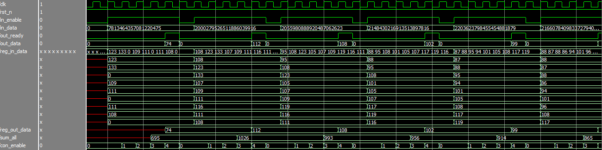  
图3-10-4 请求响应模式时序

  

#### 3.10.3.3 IP核GUI

完成功能后对MF核进行了封装，封装如图3-10-5。  

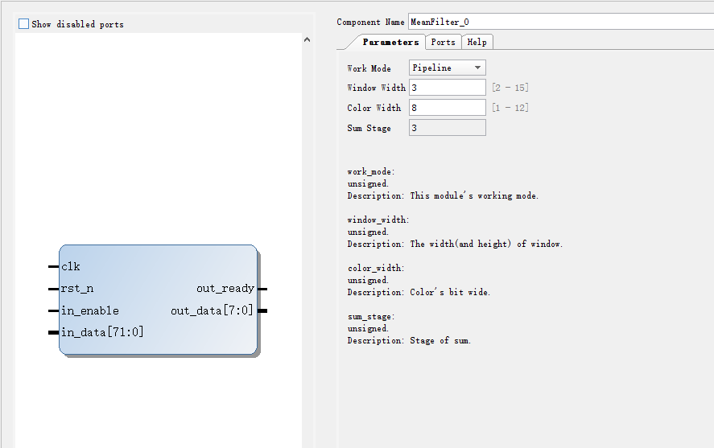  
图3-10-5 MF核的GUI

  

### 3.10.4 仿真

MF核虽然对于所有图像都有意义，但一般用于灰度图像的处理，所以我选取了两张灰度图像仿真源，并且考虑到仿真压力，仅测试了宽度为3和5的窗口，原始图像如图3-10-6。

 
  
图3-10-6 原始测试图像

  

使用HDL功能仿真和软件仿真的结果进行PSNR的计算，仿真结果如图3-10-7所示。  

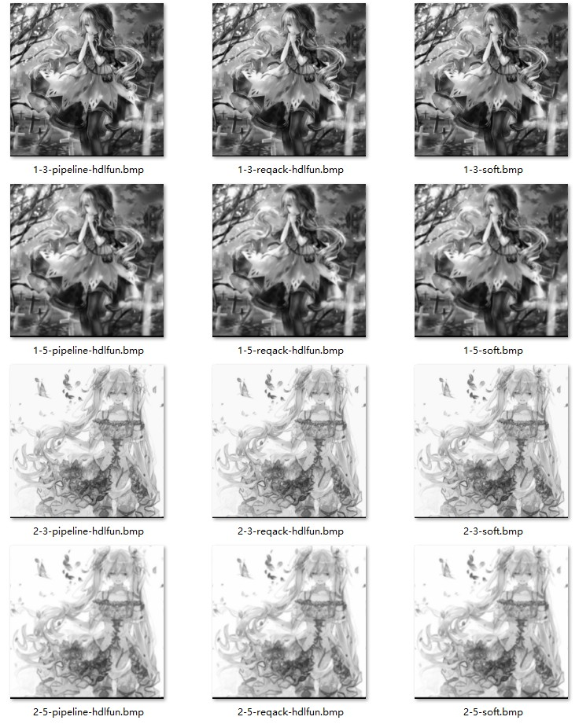  
图3-10-7 仿真结果，左侧为流水线模式下的HDL功能仿真结果，中间为请求响应模式下的HDL功能仿真结果，右侧为软件仿真结果

  

仿真结果的清晰图像如图3-10-8与3-10-9，可见均值滤波的确有模糊图像的效果，窗口越大越明显，同时需要注意由于使用了窗口，所以图像出现了缺行现象，在实际使用时可以在写入帧缓存时利用row\_init参数来配置初始写入行，当系统实际运行时，从第二张图像开始这个问题将会被自动弥补。

  
图3-10-8 3x3窗口的滤波结果

  

  
图3-10-9 5x5窗口的滤波结果

  

### 3.10.5 资源和时序

最终实现与窗口大小关系很大，色彩位宽为8，窗口大小为3时的情况进行分析，根据Vivado生成的报表，主要资源耗费如表3-10-4。

<table border="1" cellspacing="0">
<tr>
<th>Slice LUTs*</th>
<th>Slice Registers</th>
</tr>
<tr>
<td>83</td>
<td>78</td>
</tr>
</table>
表3-10-4 主要资源耗费

 

同时由于根据时序报告，最大的Data Path Delay(数据路径延迟)为2.085ns，即：  

>FMax = 479.61MHz  

即说明，MF核在流水线模式下，理论上在处理1080p全高清图像时可以达到231帧。  
由于数据路径延迟和应用的最终约束设置强相关，所以仅供参考。

### 3.10.6 分析与结论

PSNR如表3-10-5。  

<table border="1" cellspacing="0">
<tr>
<th>1-3</th>
<th>1-5</th>
<th>2-3</th>
<th>2-5</th>
<th>Total</th>
</tr>
<tr>
<td>1000000.00</td>
<td>1000000.00</td>
<td>1000000.00</td>
<td>1000000.00</td>
<td>1000000.00</td>
</tr>
</table>
表3-10-5 PSNR

PSNR均值为最大值，MF核与软件等效，同时可以达到很高的FMax，设计成功。

## 3.11 局部滤波器-排序滤波器

排序滤波器是一种非线性局部滤波器，它首先将窗口内的每个像素根据色彩的值进行排序，随后根据所给的序号得出最后的结果。排序滤波器的应用十分广泛，其中最常用的是中值滤波器，即为序号为窗口总大小的一半时的情况，此时滤波的结果是原窗口所有像素的中值，除此之外常用的还有极值滤波器，即得出窗口中的极大值或者极小值。排序滤波器常被用于去除椒盐噪声[16]，或者作为后续处理的预处理，相比于均值滤波，排序滤波器能够比较好得保留边界特征。本节将会介绍如何用FPGA实现排序滤波器。

### 3.11.1 原理

排序滤波器的基本原理见图3-11-1，将像素作为基本元素，一个窗口可以看做是一个列表，对于一个3x3的均值滤波器，列表大小为9。排序滤波器列表中所有的元素进行排序，随后根据序号“rank”得出结果，即式3-11-1所示，之后用这个结果来取代窗口的中心像素点。故可知，排序滤波器的核心在于给一个列表的所有元素进行排序。  

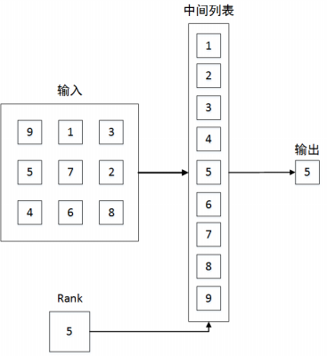  
图3-11-1 排序滤波器原理

  

$$Q=sorted(I)[rank]\ \ \ \ \ \ \ \ (3-11-1)$$
 

传统的软件排序算法有许多种，例如冒泡排序、插入排序、选择排序等[17]，这些算法有一个共同的特点是在最好的状况下时间复杂度为O(n)，同时根据不同状况需求的排序次数不定，对于FPGA而言这是不可接受的。用FPGA实现时，在流水线模式下，必须要保证排序次数对于拥有任何元素的列表都是确定的，并且由于直到第一个结果输出前每次都要保留整个列表的元素，如果排序周期过长，所造成的资源消耗是巨大的，所以必须找到一个周期确定并且非常快速的排序算法。  

#### 3.11.1.1 使用奇偶互换网络的冒泡排序

一种排序算法是使用奇偶互换网络的冒泡排序[3]，它在冒泡排序的基础上进行改进，如图3-11-2所示，这是一个大小为9的列表进行排序的结构，每个周期都进行若干次两两排序，并将首或者尾元素进行保留，在9个周期后得到结果，可见，这种排序结构可以保证对于任何周期的排序周期一定，但时间复杂度仍然为O(n)，这意味着对于n个元素的列表，需要经过n个周期才能得到排序的结果，并且需要消耗$n^2$个像素的寄存器资源，当n值变大时这个消耗往往是难以接受的。  

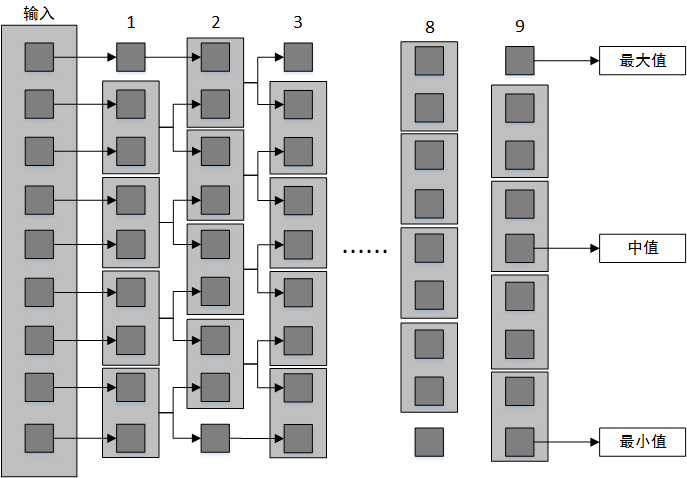  
图3-11-2 使用奇偶互换网络的冒泡排序

  

#### 3.11.1.2 基于3点比较器的排序

另一种适用于FPGA的排序算法是基于3点比较器的排序[18]，它的原理如图3-11-3所示，可见，这实际上是对3.11.1.1中算法的改进，对于大小为9的列表，它将排序周期从9减少到了3，大大提升了效率。但这种排序算法适用性太为狭窄，基本只可能用于3x3的窗口，考虑到本库的通用性，无法满足需求。  

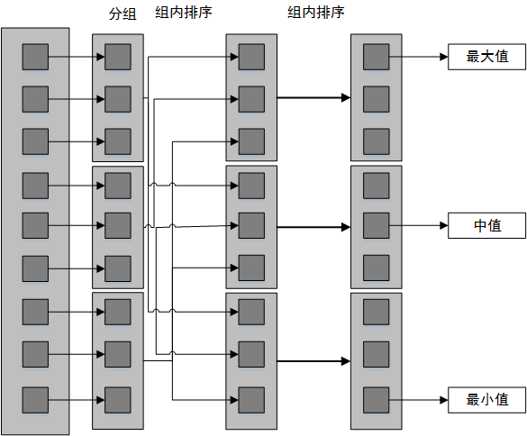  
图3-11-3 基于3点比较器的排序

  

#### 3.11.1.3 并行全比较排序

适用于本库的排序算法为并行全比较排序[19]，其基本原理如图3-11-4所示，首先为列表中的每个元素建立一个比较计数寄存器，在第一个周期将此元素和其他的元素进行并行比较，将比较的结果写入比较计数寄存器的对应位，之后对每一次寄存器中“1”的个数进行统计，统计得到的结果即为该元素经过排序后的序号。

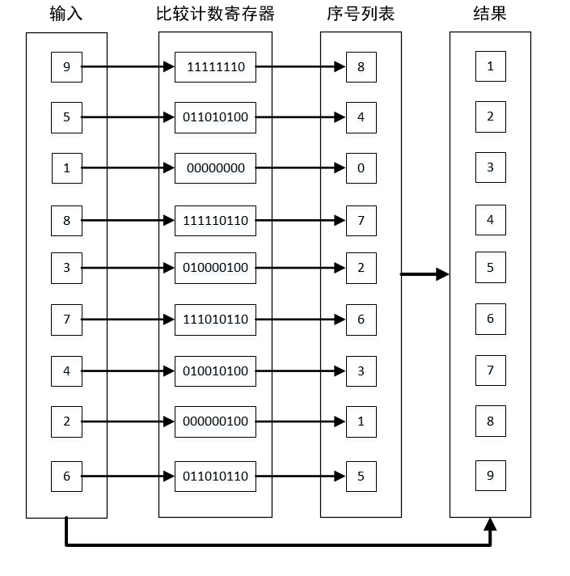  
图3-11-4 并行全比较排序

  

可见，此排序算法的核心是两次统计，第一次是某一元素和其他元素大小关系的统计，第二次是比其他元素大的情况的次数统计。第一次统计可以用一个二维数组来实现，但有一个边界的问题，就是如果出现相同的元素该如何处理[20]，这里的处理方式是原序号在前优先的原则，序号为0的元素和所有元素进行比较，根据比较结果修改比较计数寄存器0的第n位和比较计数寄存器n的第0位，而后序号为1的元素便不和序号为0的元素进行比较，只比教剩下的元素，将比较计数寄存器定义为二维数组big_flag，则代码如下：  

    :::verilog
    for (i = 0; i < `full_win_width; i = i + 1) begin
        always @(posedge clk)
            big_flag[i][i] <= 0;
    end
    for (i = 0; i < `full_win_width; i = i + 1) begin
        for (j = i + 1; j < `full_win_width; j = j + 1) begin
            always @(posedge clk) begin
                if(reg_in_data[i] >= reg_in_data[j]) begin
                    big_flag[i][j] <= 1;
                    big_flag[j][i] <= 0;
                end else begin 
                    big_flag[i][j] <= 0;
                    big_flag[j][i] <= 1;
                end
            end
        end
    end

第二个实质上是若干次的加法，加法的个数由列表的大小确定，考虑到每个相加的数据位数均为1，所以一个周期内的多次加法是可以被接受的，但由于FMax的权衡，仍然要进行同3.10中一样的加法分级拆分，在若干次试验之后，最终将这个次数定为了8次，即一个周期内可以进行八次加法，由此，加法的级数由公式3-11-2确定。  

综上，此排序的时间复杂度为O(log8(n)，加上第一次的统计时间，本模块最终的时间复杂度和空间复杂度如式3-11-3和3-11-4所示。  

$$O(n)=\lfloor{log_8(n - 1)}\rfloor + 2\ \ \ \ \ \ \ \ (3-11-2)$$
  

$$O(n)=n * (\lfloor{log8(n - 1)}\rfloor + 2) * ColorWidth\ \ \ \ \ \ \ \ (3-11-3)$$
  

### 3.11.2 设计

根据原理可知，RankFilter核(以下简称RF核)核心是两次统计，它们分别由二维数组和分级加法实现。加法的分级可以使用verilog中的generate语句来批量生成，生成的流水线级数依赖于根据窗口宽度计算得出的某个参数，我将此参数命名为sum\_stage。另外，还需要一个rank端口来确定输出的序号值。综上，一个RF核需要的配置参数和端口如表3-11-1与表3-11-2。  

<table border="1" cellspacing="0">
<tr>
<th>名字</th>
<th>类型</th>
<th>范围</th>
<th>默认值</th>
<th>说明</th>
</tr>
<tr>
<td>work_mode</td>
<td>无符号</td>
<td>0为流水线模式，1为请求响应模式</td>
<td>0</td>
<td>工作模式</td>
</tr>
<tr>
<td>window_width</td>
<td>无符号</td>
<td>2 - 15</td>
<td>3</td>
<td>窗口的宽度和高度。</td>
</tr>
<tr>
<td>color_width</td>
<td>无符号</td>
<td>1 - 12</td>
<td>8</td>
<td>色彩位宽。</td>
</tr>
<tr>
<td>sum_stage</td>
<td>无符号</td>
<td>取决于窗口宽度，为int(log8(window_width^2)) + 1。</td>
<td>3</td>
<td>加法级数。</td>
</tr>
<tr>
<td>full_win_bits</td>
<td>无符号</td>
<td>取决于窗口大小</td>
<td>4</td>
<td>窗口总大小的位宽。</td>
</tr>
</table>
表3-11-1 配置参数

  
 

<table border="1" cellspacing="0">
<tr>
<th>名字</th>
<th>端口</th>
<th>类型</th>
<th>范围</th>
<th>默认值</th>
<th>说明</th>
</tr>
<tr>
<td>clk</td>
<td>输入</td>
<td>无符号</td>
<td>无</td>
<td>无</td>
<td>Clock.</td>
</tr>
<tr>
<td>rst_n</td>
<td>输入</td>
<td>无符号</td>
<td>无</td>
<td>无</td>
<td>复位，低有效。</td>
</tr>
<tr>
<td>rank</td>
<td>输入</td>
<td>无符号</td>
<td>full_win_bits - 1 : 0</td>
<td>无</td>
<td>输出序号，如果是整个窗口大小的一半，模块工作为中值滤波器，等等。</td>
</tr>
<tr>
<td>in_enable</td>
<td>输入</td>
<td>无符号</td>
<td>无</td>
<td>无</td>
<td>输入数据使能，在流水线模式下，它是另一个复位信号，在请求响应模式下，只有在它有效的时候in_data才会被真正地改变。</td>
</tr>
<tr>
<td>in_data</td>
<td>输入</td>
<td>无符号</td>
<td>color_width * window_width * window_width - 1 : 0</td>
<td>无</td>
<td>输入数据，必须和in_enable同步输入。</td>
</tr>
<tr>
<td>out_ready</td>
<td>output</td>
<td>无符号</td>
<td>无</td>
<td>无</td>
<td>输出数据有效，在两种模式下，这个信号都会在out_data可以被读取的时候有效。</td>
</tr>
<tr>
<td>out_data</td>
<td>output</td>
<td>无符号</td>
<td>color_width - 1 : 0</td>
<td>无</td>
<td>输出数据，将会和out_ready同步输出。</td>
</tr>
</table>
表3-11-2 端口

  

### 3.11.3 实现

根据3.11.2的设计便可以实现一个RF核，流水线模式和请求响应模式实现如下。  

#### 3.11.3.1 流水线模式

保证地址和数据同步流水化输出，在复位时二者皆输出为0，实现如下：  
in_enable或rst_n为低时，系统复位，输出无效；否则加法级数加2个周期后第一个结果被输出，并且每一个clk的上升沿都会送入一个窗口进行处理，第一个输出有效之后，每一个周期都将送出一个结果，波形如图3-11-5。  

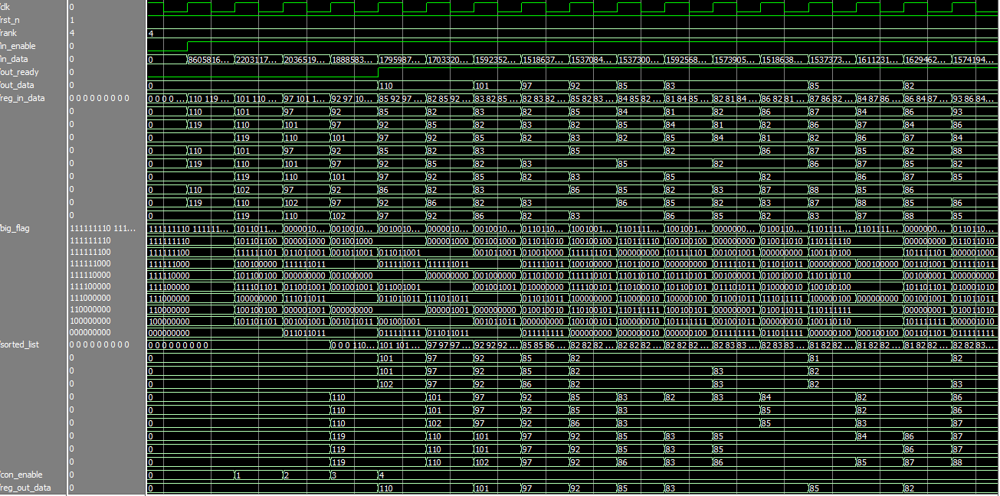  
图3-11-5 流水线模式时序

  

#### 3.11.3.2 请求响应模式

基本与3.11.3.1一致，但只有in\_enable的上升沿时才会有窗口被输入，波形如图3-11-6。  

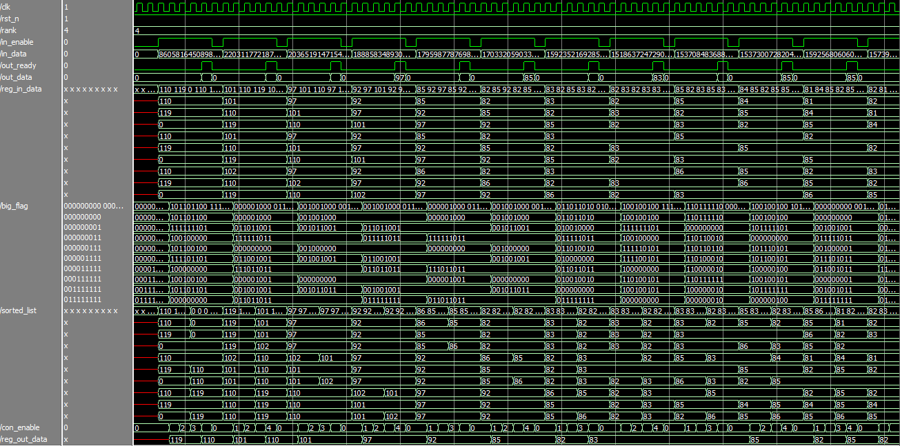  
图3-11-6 请求响应模式时序

  

#### 3.11.3.3 IP核GUI

完成功能后对RF核进行了封装，封装如图3-11-7。  

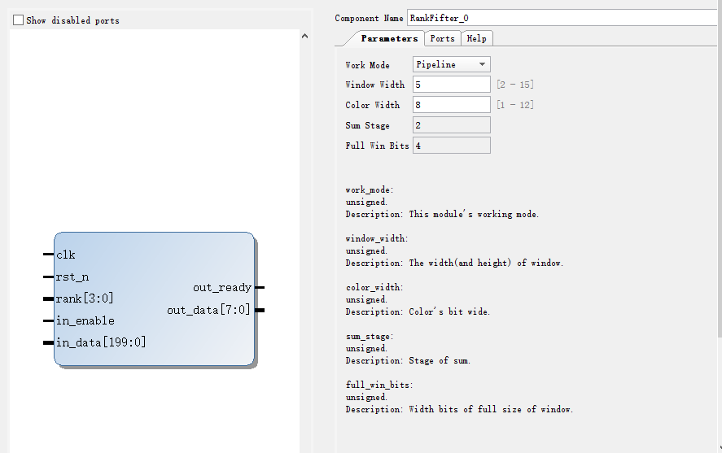  
图3-11-7 RF核的GUI

  

### 3.11.4 仿真

RF核虽然对于所有图像都有意义，但一般用于灰度图像的处理，所以我选取了两张灰度图像仿真源，并且考虑到仿真压力，仅测试了宽度为3和5的窗口，分别为中值和极大值的情况，原始图像如图3-11-8。

 
  
图3-11-8 原始测试图像

  

使用HDL功能仿真和软件仿真的结果进行PSNR的计算，仿真结果如图3-11-9所示。  

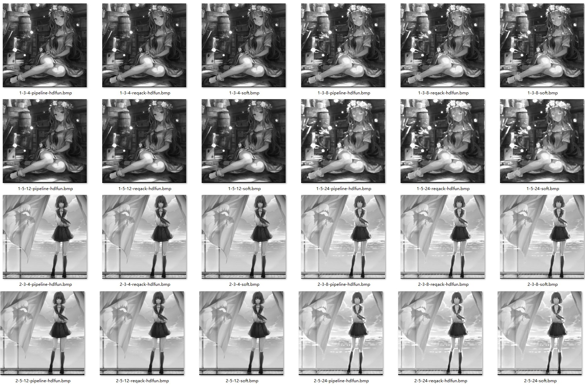  
图3-11-9 仿真结果，从左上依次为流水线模式下的HDL功能仿真结果，请求响应模式下的HDL功能仿真结果，软件仿真结果

  

仿真结果的清晰图像如图3-11-10、3-11-11与3-11-12，可见中值滤波器的确可以在模糊的同时保留边缘，并且窗口越大越模糊，而极值滤波器将会损失更多细节，但能够让边缘更加明晰。  

  
图3-11-10 3x3窗口的中值滤波结果

  

  
图3-11-11 5x5窗口的中值滤波结果

  

  
图3-11-12 3x3窗口的极值滤波结果

  

### 3.11.5 资源和时序

最终实现与窗口大小关系很大，此处只对色彩位宽为8，窗口大小为3和5时的情况进行分析，根据Vivado生成的报表，主要资源耗费如表3-11-3。

<table border="1" cellspacing="0">
<tr>
<th>窗口大小</th>
<th>Slice LUTs*</th>
<th>Slice Registers</th>
</tr>
<tr>
<td>3x3</td>
<td>405</td>
<td>876</td>
</tr>
<tr>
<td>5x5</td>
<td>2971</td>
<td>4462</td>
</tr>
</table>
表3-11-3 主要资源耗费

 

同时根据时序报告，3x3窗口下最大的Data Path Delay(数据路径延迟)为2.700ns，即：  

>FMax = 370.37MHz  

即说明，RF核在流水线模式下，理论上在处理1080p全高清图像时可以达到178帧。 

5x5窗口下最大的Data Path Delay(数据路径延迟)为2.908ns，即：  

>FMax = 343.87MHz  

即说明，RF核在流水线模式下，理论上在处理1080p全高清图像时可以达到165帧。  
这个差异是第二次求和的元素个数造成的，3x3为两个，5x5为四个。 
由于数据路径延迟和应用的最终约束设置强相关，所以仅供参考。

### 3.11.6 分析与结论

PSNR如表3-11-5。  

<table border="1" cellspacing="0">
<tr>
<th>1-3-4</th>
<th>1-3-8</th>
<th>1-5-12</th>
<th>1-5-24</th>
<th>2-3-4</th>
<th>2-3-8</th>
<th>2-5-12</th>
<th>2-5-24</th>
<th>Total</th>
</tr>
<tr>
<td>1000000.00</td>
<td>1000000.00</td>
<td>1000000.00</td>
<td>1000000.00</td>
<td>1000000.00</td>
<td>1000000.00</td>
<td>1000000.00</td>
<td>1000000.00</td>
<td>1000000.00</td>
</tr>
</table>
表3-11-5 PSNR

PSNR均值为最大值，RF核与软件等效，同时可以达到不错的FMax，设计成功。

## 3.12 局部滤波器-局部阈值化

局部阈值化有别于全局阈值化，它并非利用一个全局的阈值作用于整张图像，而是对每一个单独的像素都使用一个单独的阈值，这属于自适应二值化的一种[3]这个阈值通常来源于局部滤波器的输出。不同局部滤波器给出的阈值会产生非常不同的效果，而无论是哪一种阈值，最终的目的都是给出一个比较清晰而明确的边缘，通常这个效果比较容易达到，所以局部阈值化是一个不错的边缘检测子，本节将会说明如何实现一个局部阈值化的IP核。

### 3.12.1 原理

局部阈值化大致与全局阈值化相同，唯一不同的是其阈值并非静态而是随着像素的输入而变化的。对于流水线模式，这个动态的变换有两种处理方式，要么要求外部提供的像素和该像素对应的阈值是同步的，要么将同步做到模块的内部，内建缓存进行同步。考虑到对用户的便利性，本模块选择了第二种模式，提供额外的配置参数来确定缓存级数，并且由额外的使能信号来确定输出值。如图3-12-1，buffer是缓冲器，ConOut是输出计数器的输出值，当像素数据输入使能时计数器开始计数，直到阈值数据输入使能计数停止，并由当前的ConOut确定选择Buffer中的哪一个数据与输入的阈值进行比较，之后流水化输出。  

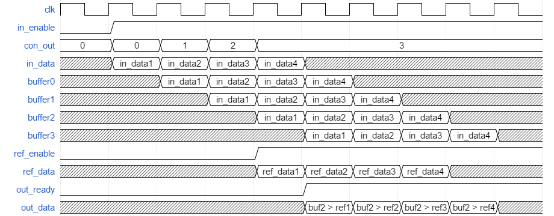  
图3-12-1 内建缓存流水线

  

### 3.12.2 设计

根据原理可知，ThresholdLocal核(以下简称THL核)还需要有一个用于确定从像素数据有效到阈值数据有效的最大周期的配置参数max\_delay，一个阈值数据输入端口ref\_data，阈值数据使能端口ref\_enable，故一个THL核需要的配置参数和端口如表3-12-1与表3-12-2。  

<table border="1" cellspacing="0">
<tr>
<th>名字</th>
<th>类型</th>
<th>范围</th>
<th>默认值</th>
<th>说明</th>
</tr>
<tr>
<td>work_mode</td>
<td>无符号</td>
<td>0为流水线模式，1为请求响应模式</td>
<td>0</td>
<td>工作模式</td>
</tr>
<tr>
<td>in_window_width</td>
<td>无符号</td>
<td>1 - 15</td>
<td>1</td>
<td>如果输入像素以窗口中心的形式输入，则是窗口宽度，否则为1。</td>
</tr>
<tr>
<td>color_width</td>
<td>无符号</td>
<td>1 - 12</td>
<td>8</td>
<td>色彩位宽。</td>
</tr>
<tr>
<td>max_delay</td>
<td>无符号</td>
<td>取决于可能的延迟</td>
<td>8</td>
<td>像素使能到阈值使能之间可能的最大延迟周期。</td>
</tr>
<tr>
<td>max_delay_bits</td>
<td>无符号</td>
<td>取决于延迟周期</td>
<td>4</td>
<td>延迟周期的位宽。</td>
</tr>
</table>
表3-12-1 配置参数

  
 

<table border="1" cellspacing="0">
<tr>
<th>名字</th>
<th>端口</th>
<th>类型</th>
<th>范围</th>
<th>默认值</th>
<th>说明</th>
</tr>
<tr>
<td>clk</td>
<td>输入</td>
<td>无符号</td>
<td>无</td>
<td>无</td>
<td>Clock.</td>
</tr>
<tr>
<td>rst_n</td>
<td>输入</td>
<td>无符号</td>
<td>无</td>
<td>无</td>
<td>复位，低有效。</td>
</tr>
<tr>
<td>in_enable</td>
<td>输入</td>
<td>无符号</td>
<td>无</td>
<td>无</td>
<td>输入数据使能，在流水线模式下，它是另一个复位信号，在请求响应模式下，只有在它有效的时候in_data才会被真正地改变。</td>
</tr>
<tr>
<td>in_data</td>
<td>输入</td>
<td>无符号</td>
<td>color_width * in_window_width * in_window_width - 1 : 0</td>
<td>无</td>
<td>输入数据，必须和in_enable同步输入。</td>
</tr>
<tr>
<td>ref_enable</td>
<td>输入</td>
<td>无符号</td>
<td>无</td>
<td>无</td>
<td>阈值数据使能。</td>
</tr>
<tr>
<td>ref_data</td>
<td>输入</td>
<td>无符号</td>
<td>color_width - 1 : 0</td>
<td>无</td>
<td>阈值数据，必须和ref_enable同步输入。</td>
</tr>
<tr>
<td>out_ready</td>
<td>output</td>
<td>无符号</td>
<td>无</td>
<td>无</td>
<td>输出数据有效，在两种模式下，这个信号都会在out_data可以被读取的时候有效。</td>
</tr>
<tr>
<td>out_data</td>
<td>output</td>
<td>无符号</td>
<td>color_width - 1 : 0</td>
<td>无</td>
<td>输出数据，将会和out_ready同步输出。</td>
</tr>
</table>
表3-12-2 端口

  

### 3.12.3 实现

根据3.12.2的设计便可以实现一个THL核，流水线模式和请求响应模式实现如下。  

#### 3.12.3.1 流水线模式

保证地址和数据同步流水化输出，在复位时二者皆输出为0，实现如下：  
in_enable或rst_n为低时，系统复位，输出无效；否则阈值使能后1个周期第一个结果被输出，并且每一个clk的上升沿都会送入一个窗口进行处理，第一个输出有效之后，每一个周期都将送出一个结果，波形如图3-12-2。  

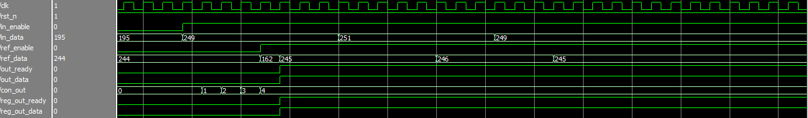  
图3-12-2 流水线模式时序

  

#### 3.12.3.2 请求响应模式

基本与3.12.3.1一致，但只有in\_enable的上升沿时才会有窗口被输入，波形如图3-12-3。  

  
图3-12-3 请求响应模式时序

  

#### 3.12.3.3 IP核GUI

完成功能后对THL核进行了封装，封装如图3-12-4。  

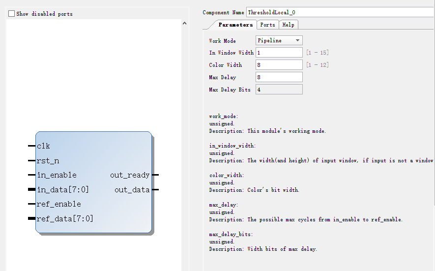  
图3-12-4 THL核的GUI

  

### 3.12.4 仿真

THL核只对灰度图有意义，我选取了两张灰度图像仿真源，分别测试了3x3和5x5窗口、均值滤波和中值滤波作为阈值来源的情况，原始图像如图3-12-5。

 
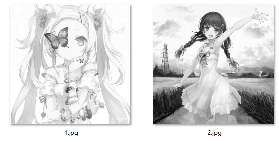  
图3-12-5 原始测试图像

  

使用HDL功能仿真和软件仿真的结果进行PSNR的计算，仿真结果如图3-12-6所示。  

  
图3-12-6 仿真结果，从左上依次为流水线模式下的HDL功能仿真结果，请求响应模式下的HDL功能仿真结果，软件仿真结果

  

仿真结果的清晰图像如图3-12-7与3-12-8，并且同样用软件仿真进行了大窗口的测试，结果如图3-12-9。可见无论是哪一种阈值来源，对边缘的保留都比3.4中基本的阈值化算法的效果要好，同时中值滤波作为阈值来源时边缘保留的更好，但不如均值滤波干净，而均值滤波的干净是以牺牲某些细节换来的，但对于突出主体的应用很有效。同时，窗口并非越大越好，也并非越小越好，应当根据需求适当选取。  

  
图3-12-7 均值滤波来源阈值，左侧为3x3窗口，右侧为5x5窗口

  

  
图3-12-8 中值滤波来源阈值，左侧为3x3窗口，右侧为5x5窗口

  

  
图3-12-9 11x11的窗口滤波来源阈值，左侧为均值滤波，右侧为中值滤波

  

### 3.12.5 资源和时序

最终实现与窗口大小关系很大，此处只对色彩位宽为8，最大延迟为8的状况分析，根据Vivado生成的报表，主要资源耗费如表3-12-3。

<table border="1" cellspacing="0">
<tr>
<th>Slice LUTs*</th>
<th>Slice Registers</th>
</tr>
<tr>
<td>39</td>
<td>70</td>
</tr>
</table>
表3-12-3 主要资源耗费

 

同时根据时序报告，最大的Data Path Delay(数据路径延迟)为3.187ns，即：  

>FMax = 313.77MHz  

即说明，THL核在流水线模式下，理论上在处理1080p全高清图像时可以达到151帧。  
由于数据路径延迟和应用的最终约束设置强相关，所以仅供参考。

### 3.12.6 分析与结论

PSNR如表3-12-5。  

<table border="1" cellspacing="0">
<tr>
<th>1-3-mean</th>
<th>1-3-mid</th>
<th>1-5-mean</th>
<th>1-5-mid</th>
<th>2-3-mean</th>
<th>2-3-mid</th>
<th>2-5-mean</th>
<th>2-5-mid</th>
<th>Total</th>
</tr>
<tr>
<td>1000000.00</td>
<td>1000000.00</td>
<td>1000000.00</td>
<td>1000000.00</td>
<td>1000000.00</td>
<td>1000000.00</td>
<td>1000000.00</td>
<td>1000000.00</td>
<td>1000000.00</td>
</tr>
</table>
表3-12-5 PSNR

PSNR均值为最大值，THL核与软件等效，同时可以达到不错的FMax，设计成功。

## 3.13 局部滤波器-二值形态学滤波

形态学滤波器是很常用的一种局部滤波器，顾名思义，它针对图像的形态进行操作，关注的是“形状”。形态学滤波一般分为腐蚀和膨胀，而在其之上又可以叠加为开运算和闭运算，它对二值图像、灰度图像均有效，但二者实现的方式不同，一般最常用的是二值形态学滤波，针对灰度的本质上是极大值和极小值排序滤波器，暂时不再赘述。形态学滤波常用于图像细化、骨架提取等[21,22,23,24]，可以作为图像识别的一种基本的预处理操作。本节将会说明FPGA的形态学滤波模块实现。

### 3.13.1 原理

二值形态学滤波的操作单元与其他局部滤波器一致，都是包含了某一个中心像素点及其邻域的窗口，但比起其他操作，它还有一个作为参照的“模板”，并根据模板和窗口的运算来得到输出。所有的二值图像都可以分为主体像素和背景像素，一般以1为主体像素，0为背景像素，这样最基本的基本的二值形态学操作-腐蚀和膨胀便可以定义为式3-13-1和3-13-2，其中I为输入，T为模板，可见腐蚀是一种收缩的变换，它将窗口与模版进行对比，如果模板中每一个主体像素都落在窗口内，则此时窗口的中心像素置1，否则为0；而膨胀则是一个扩张的变换，只要模板中的任一主体像素落在窗口内，则中心像素置1。腐蚀和膨胀的原理示意如图3-13-1，空心的点表示0，否则表示1。  

$$Q=\bigwedge_{i,j \in T}I[x + i, y + j]$\ \ \ \ \ \ \ \ (3-13-1)$$
  

$$Q=\bigvee_{i,j \in T}I[x - i, y - j]\ \ \ \ \ \ \ \ (3-13-2)$$
  

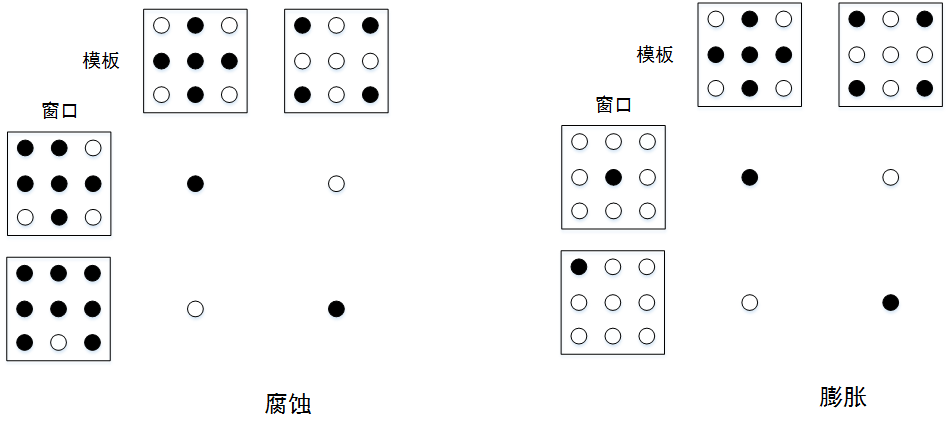  
图3-13-1 腐蚀膨胀原理

  

腐蚀和膨胀还可以结合成开运算(先腐蚀后膨胀)和闭运算(先膨胀再腐蚀)，这可以利用两个基本操作的级联来完成。  
在FPGA中，腐蚀膨胀可以由基本的逻辑运算来完成，并且可以用同一种结构完成[3]，如图3-13-2所示，深色的方块代表窗口，浅色的代表模板，mode用于控制腐蚀和膨胀的模式，0为腐蚀，1为膨胀，Q为输出。如此，服饰和膨胀的逻辑运算形式便可以表示为式3-13-3，Q为输出，I为输入，T为模板，size为窗口宽度。可知，每一个像素点需要进行一次异或运算、一次非运算和一次或运算，之后所有的像素总共要进行NxN次的与运算，考虑FMax，所以选择和3.10一样的分级运算来完成。  

$$Q=mode \oplus \bigwedge_{i,j = 0}^{size}I[i,j]\oplus{mode}\vee{\overline{T[i,j]}}\ \ \ \ \ \ \ \ (3-13-3)$$
  

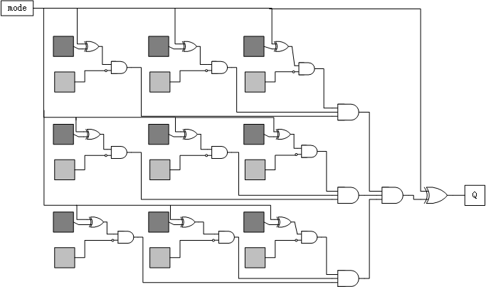  
图3-13-2 腐蚀膨胀逻辑结构

  

### 3.13.2 设计

根据原理可知，ErosionDilationBin核(以下简称EDB核)还需要一个用于确定与运算级数的配置参数，以及在腐蚀模式和膨胀模式之间选择的端口，还有一个用于输入模板的端口，故一个EDB核需要的配置参数和端口如表3-13-1与表3-13-2。  

<table border="1" cellspacing="0">
<tr>
<th>名字</th>
<th>类型</th>
<th>范围</th>
<th>默认值</th>
<th>说明</th>
</tr>
<tr>
<td>work_mode</td>
<td>无符号</td>
<td>0为流水线模式，1为请求响应模式</td>
<td>0</td>
<td>工作模式</td>
</tr>
<tr>
<td>window_width</td>
<td>无符号</td>
<td>2 - 15</td>
<td>1</td>
<td>窗口宽度和高度。</td>
</tr>
<tr>
<td>pipe_stage</td>
<td>无符号</td>
<td>取决于窗口的宽度，为log2(window_width^2)</td>
<td>3</td>
<td>流水线级数。</td>
</tr>
</table>
表3-13-1 配置参数

  
 

<table border="1" cellspacing="0">
<tr>
<th>名字</th>
<th>端口</th>
<th>类型</th>
<th>范围</th>
<th>默认值</th>
<th>说明</th>
</tr>
<tr>
<td>clk</td>
<td>输入</td>
<td>无符号</td>
<td>无</td>
<td>无</td>
<td>Clock.</td>
</tr>
<tr>
<td>rst_n</td>
<td>输入</td>
<td>无符号</td>
<td>无</td>
<td>无</td>
<td>复位，低有效。</td>
</tr>
<tr>
<td>mode</td>
<td>输入</td>
<td>无符号</td>
<td>0为腐蚀，1为膨胀。</td>
<td>无</td>
<td>操作模式。</td>
</tr>
<tr>
<td>template</td>
<td>输入</td>
<td>无符号</td>
<td>window_width * window_width - 1 : 0</td>
<td>无</td>
<td>用于操作的模板。</td>
</tr>
<tr>
<td>in_enable</td>
<td>输入</td>
<td>无符号</td>
<td>无</td>
<td>无</td>
<td>输入数据使能，在流水线模式下，它是另一个复位信号，在请求响应模式下，只有在它有效的时候in_data才会被真正地改变。</td>
</tr>
<tr>
<td>in_data</td>
<td>输入</td>
<td>无符号</td>
<td>color_width * in_window_width * in_window_width - 1 : 0</td>
<td>无</td>
<td>输入数据，必须和in_enable同步输入。</td>
</tr>
<tr>
<td>out_ready</td>
<td>output</td>
<td>无符号</td>
<td>无</td>
<td>无</td>
<td>输出数据有效，在两种模式下，这个信号都会在out_data可以被读取的时候有效。</td>
</tr>
<tr>
<td>out_data</td>
<td>output</td>
<td>无符号</td>
<td>color_width - 1 : 0</td>
<td>无</td>
<td>输出数据，将会和out_ready同步输出。</td>
</tr>
</table>
表3-13-2 端口

  

### 3.13.3 实现

根据3.13.2的设计便可以实现一个EDB核，流水线模式和请求响应模式实现如下。  

#### 3.13.3.1 流水线模式

输入使能后pipe\_stage个周期第一个结果被输出，开始流水化工作，波形如图3-13-3。  

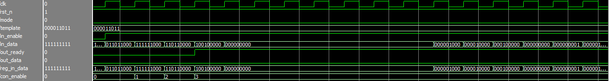  
图3-13-3 流水线模式时序

  

#### 3.13.3.2 请求响应模式

基本与3.13.3.1一致，但只有in\_enable的上升沿时才会有窗口被输入，波形如图3-13-4。  

  
图3-13-4 请求响应模式时序

  

#### 3.13.3.3 IP核GUI

完成功能后对EDB核进行了封装，封装如图3-13-5。  

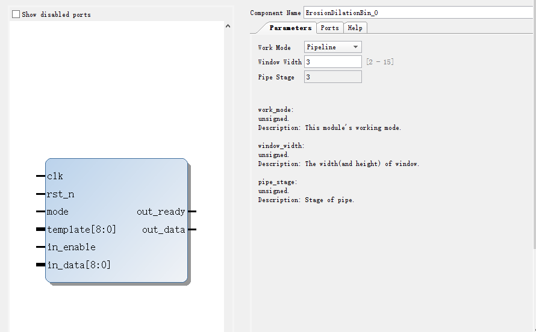  
图3-13-5 EDB核的GUI

  

### 3.13.4 仿真

EDB核只对二值图像有意义，我选取了两张二值图像作为仿真源，分别测试了对腐蚀和膨胀操作配置了两套模版，原始图像如图3-13-6。

 
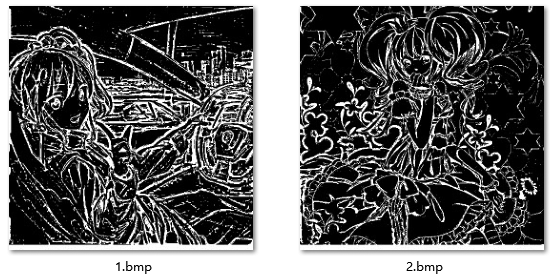  
图3-13-6 原始测试图像

  

使用HDL功能仿真和软件仿真的结果进行PSNR的计算，仿真结果如图3-13-7所示。  

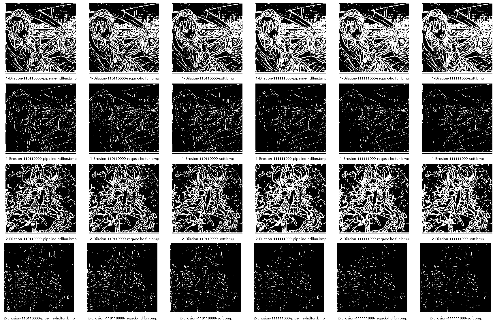  
图3-13-7 仿真结果，从左上依次为流水线模式下的HDL功能仿真结果，请求响应模式下的HDL功能仿真结果，软件仿真结果

  

仿真结果的清晰图像如图3-13-8，可见膨胀的确有扩张的功能，腐蚀的确有收缩细化的功能。同时也对开运算和闭运算做了实验，结果如图3-13-9所示，开运算可以将一些原本断续的线条“打开”，使图像零散化，而闭运算则是将线条闭合，使图像连续化。  

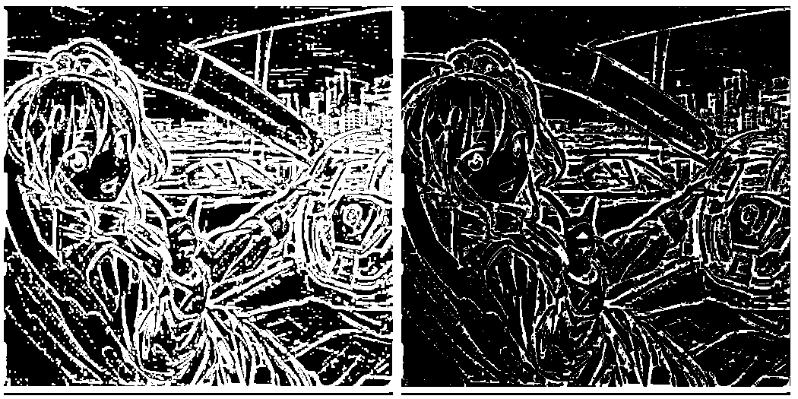  
图3-13-8 部分仿真结果，左侧为膨胀，右侧为腐蚀

  

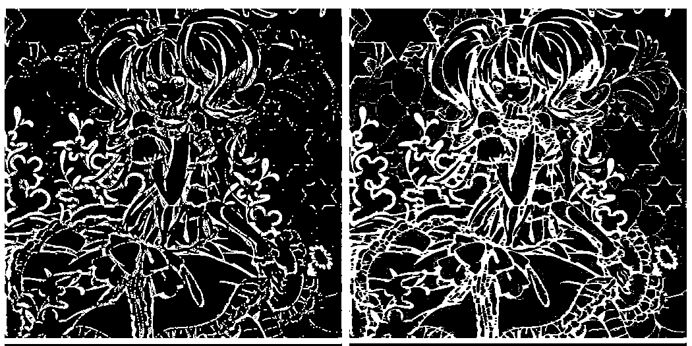  
图3-13-9 开闭运算结果，左侧为开运算，右侧为闭运算

  

### 3.13.5 资源和时序

最终实现与窗口大小关系很大，此处只对窗口为3x3的状况分析，根据Vivado生成的报表，主要资源耗费如表3-13-3。

<table border="1" cellspacing="0">
<tr>
<th>Slice LUTs*</th>
<th>Slice Registers</th>
</tr>
<tr>
<td>12</td>
<td>9</td>
</tr>
</table>
表3-13-3 主要资源耗费

 

同时根据时序报告，最大的Data Path Delay(数据路径延迟)为2.529ns，即：  

>FMax = 395.41MHz  

即说明，EDB核在流水线模式下，理论上在处理1080p全高清图像时可以达到190帧。  
由于数据路径延迟和应用的最终约束设置强相关，所以仅供参考。

### 3.13.6 分析与结论

PSNR如表3-13-5。  

<table border="1" cellspacing="0">
<tr>
<th>1-Dilation-110110000</th>
<th>1-Dilation-111111000</th>
<th>1-Erosion-110110000</th>
<th>1-Erosion-111111000</th>
<th>2-Dilation-110110000</th>
<th>2-Dilation-111111000</th>
<th>2-Erosion-110110000</th>
<th>2-Erosion-111111000</th>
<th>Total</th>
</tr>
<tr>
<td>1000000.00</td>
<td>1000000.00</td>
<td>1000000.00</td>
<td>1000000.00</td>
<td>1000000.00</td>
<td>1000000.00</td>
<td>1000000.00</td>
<td>1000000.00</td>
<td>1000000.00</td>
</tr>
</table>
表3-13-5 PSNR

PSNR均值为最大值，EDB核与软件等效，同时可以达到不错的FMax，设计成功。

## 3.14 局部滤波器-二值模板匹配

二值模板匹配也可以看做是一种形态学操作，比起腐蚀膨胀它的目的更为极端和明确，如果一个窗口与模板完全一致，则保留中心像素，否则消除。这种效果适用于一些细化算法[21,24]，比如在某些迭代算法中作为最后迭代结束的一个参照。本节将会说明一个二值模板匹配模块的实现。

### 3.14.1 原理

二值模板匹配的基本原理很简单，如式3-14-1所示，如果窗口和模板完全一致，则中心像素保留，否则置0，效果如图3-14-1。  

$$Q=\bigwedge_{i,j \in T}I[x + i, y + j]$\ \ \ \ \ \ \ \ (3-14-1)$$
  

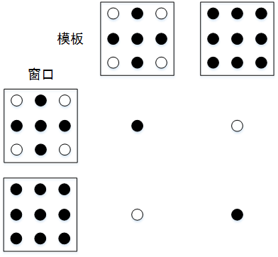  
图3-14-1 模板匹配效果

  

### 3.14.2 设计

根据原理可知，MatchTemplateBin核(以下简称MTB核)需要的配置参数和端口如表3-14-1与表3-14-2。  

<table border="1" cellspacing="0">
<tr>
<th>名字</th>
<th>类型</th>
<th>范围</th>
<th>默认值</th>
<th>说明</th>
</tr>
<tr>
<td>work_mode</td>
<td>无符号</td>
<td>0为流水线模式，1为请求响应模式</td>
<td>0</td>
<td>工作模式</td>
</tr>
<tr>
<td>window_width</td>
<td>无符号</td>
<td>2 - 15</td>
<td>1</td>
<td>窗口宽度和高度。</td>
</tr>
</table>
表3-14-1 配置参数

  
 

<table border="1" cellspacing="0">
<tr>
<th>名字</th>
<th>端口</th>
<th>类型</th>
<th>范围</th>
<th>默认值</th>
<th>说明</th>
</tr>
<tr>
<td>clk</td>
<td>输入</td>
<td>无符号</td>
<td>无</td>
<td>无</td>
<td>Clock.</td>
</tr>
<tr>
<td>rst_n</td>
<td>输入</td>
<td>无符号</td>
<td>无</td>
<td>无</td>
<td>复位，低有效。</td>
</tr>
<tr>
<td>template</td>
<td>输入</td>
<td>无符号</td>
<td>window_width * window_width - 1 : 0</td>
<td>无</td>
<td>用于操作的模板。</td>
</tr>
<tr>
<td>in_enable</td>
<td>输入</td>
<td>无符号</td>
<td>无</td>
<td>无</td>
<td>输入数据使能，在流水线模式下，它是另一个复位信号，在请求响应模式下，只有在它有效的时候in_data才会被真正地改变。</td>
</tr>
<tr>
<td>in_data</td>
<td>输入</td>
<td>无符号</td>
<td>color_width * in_window_width * in_window_width - 1 : 0</td>
<td>无</td>
<td>输入数据，必须和in_enable同步输入。</td>
</tr>
<tr>
<td>out_ready</td>
<td>output</td>
<td>无符号</td>
<td>无</td>
<td>无</td>
<td>输出数据有效，在两种模式下，这个信号都会在out_data可以被读取的时候有效。</td>
</tr>
<tr>
<td>out_data</td>
<td>output</td>
<td>无符号</td>
<td>color_width - 1 : 0</td>
<td>无</td>
<td>输出数据，将会和out_ready同步输出。</td>
</tr>
</table>
表3-14-2 端口

  

### 3.14.3 实现

根据3.14.2的设计便可以实现一个MTB核，流水线模式和请求响应模式实现如下。  

#### 3.14.3.1 流水线模式

输入使能后1个周期第一个结果被输出，开始流水化工作，波形如图3-14-2。  

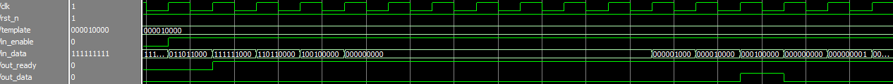  
图3-14-2 流水线模式时序

  

#### 3.14.3.2 请求响应模式

基本与3.14.3.1一致，但只有in\_enable的上升沿时才会有窗口被输入，波形如图3-14-3。  

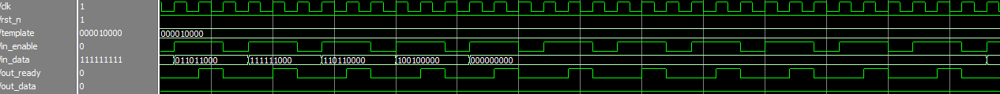  
图3-14-3 请求响应模式时序

  

#### 3.14.3.3 IP核GUI

完成功能后对MTB核进行了封装，封装如图3-14-4。  

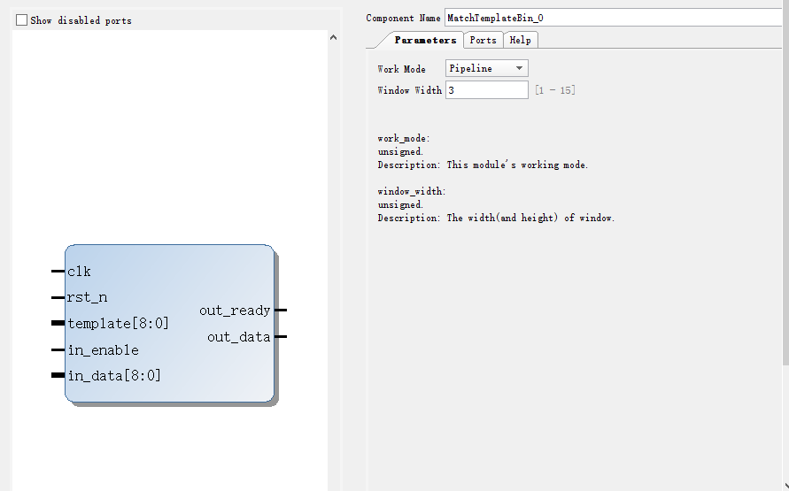  
图3-14-4 MTB核的GUI

  

### 3.14.4 仿真

MTB核只对二值图像有意义，我选取了两张二值图像闭运算的二值图像作为仿真源，分别测试了两套模版，原始图像如图3-14-5。

 
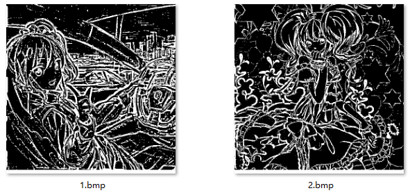  
图3-14-5 原始测试图像

  

使用HDL功能仿真和软件仿真的结果进行PSNR的计算，仿真结果如图3-14-6所示。  

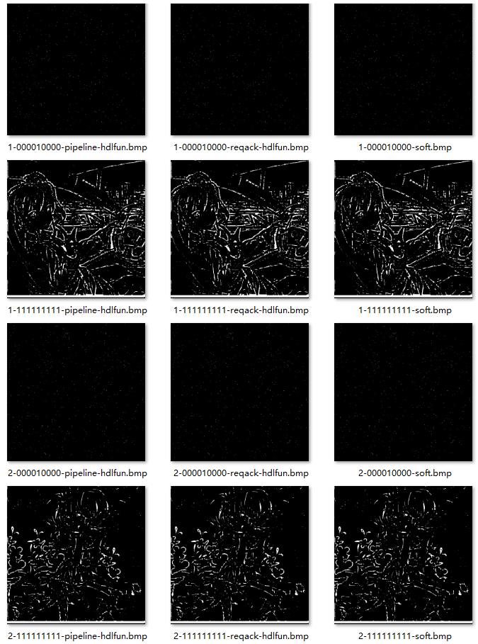  
图3-14-6 仿真结果，左侧为流水线模式下的HDL功能仿真结果，中间为请求响应模式下的HDL功能仿真结果，右侧为软件仿真结果

  

仿真结果的清晰图像如图3-14-8，可见模板匹配在适当的情况下的确可以满足一些效果。  

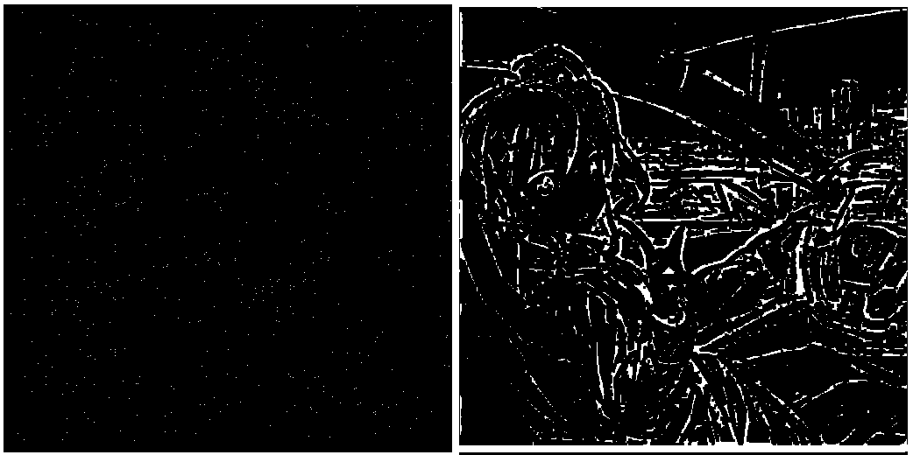  
图3-14-7 部分仿真结果，左侧为模板为000010000，右侧为111111111

  

### 3.14.5 资源和时序

最终实现与窗口大小关系很大，此处只对窗口为3x3的状况分析，根据Vivado生成的报表，主要资源耗费如表3-14-3。

<table border="1" cellspacing="0">
<tr>
<th>Slice LUTs*</th>
<th>Slice Registers</th>
</tr>
<tr>
<td>5</td>
<td>2</td>
</tr>
</table>
表3-14-3 主要资源耗费

 

同时根据时序报告，最大的Data Path Delay(数据路径延迟)为2.199ns，即：  

>FMax = 454.75MHz  

即说明，MTB核在流水线模式下，理论上在处理1080p全高清图像时可以达到219帧。  
由于数据路径延迟和应用的最终约束设置强相关，所以仅供参考。

### 3.14.6 分析与结论

PSNR如表3-14-5。  

<table border="1" cellspacing="0">
<tr>
<th>1-000010000</th>
<th>1-111111111</th>
<th>2-000010000</th>
<th>2-111111111</th>
<th>Total</th>
</tr>
<tr>
<td>1000000.00</td>
<td>1000000.00</td>
<td>1000000.00</td>
<td>1000000.00</td>
<td>1000000.00</td>
</tr>
</table>
表3-14-5 PSNR

PSNR均值为最大值，MTB核与软件等效，同时可以达到很高的FMax，设计成功。

## 3.15 生成器-帧控制2

和前面的帧控制器不同，这里的帧控制器主要为几何变换服务。几何变换操作的基本要素不是像素的色彩信息，而是它们的坐标信息，所以需要提供一个以坐标为输入的帧控制器，让几何变换模块可以控制帧缓存。本节将介绍如何实现一个以坐标为输入的帧控制器。

### 3.15.1 原理

与3.2一致，此处的帧控制器也是以改变RAM地址和控制使能信号来实现的，但地址的来源不是模块内部的计数器，而是外部输入的坐标，所以需要一个部分将坐标转换为地址，如式3-15-1所示，x为横坐标，y为纵坐标，width为图像宽度，address为输出地址，可见这实际上是一次乘法运算和一次加法运算的结合，所以需要用到乘法器。同时考虑到加法实际上可以看做最多12位的加法，所以可以不用专用加法器，交给综合器自行处理。  

$$address=width * y + x\ \ \ \ \ \ \ \ (3-15-1)$$
  

### 3.15.2 设计

根据原理可知，FrameController2核(以下简称FR2核)需要一个乘法器，所以需要的配置参数、端口和子模块如表3-15-1、表3-15-2和表3-15-3。  

<table border="1" cellspacing="0">
<tr>
<th>名字</th>
<th>类型</th>
<th>范围</th>
<th>默认值</th>
<th>说明</th>
</tr>
<tr>
<td>work_mode</td>
<td>无符号</td>
<td>0为流水线模式，1为请求响应模式</td>
<td>0</td>
<td>模块的工作模式。</td>
</tr>
<tr>
<td>wr_mode</td>
<td>无符号</td>
<td>0为写，1为读。</td>
<td>0</td>
<td>模块的读写模式。</td>
</tr>
<tr>
<td>data_width</td>
<td>无符号</td>
<td>1 - 12</td>
<td>8</td>
<td>数据位宽。</td>
</tr>
<tr>
<td>im_width</td>
<td>无符号</td>
<td>1 - 4096</td>
<td>320</td>
<td>图像宽度。</td>
</tr>
<tr>
<td>im_height</td>
<td>无符号</td>
<td>1 - 4096</td>
<td>240</td>
<td>图像高度。</td>
</tr>
<tr>
<td>im_width_bits</td>
<td>无符号</td>
<td>取决于图像宽度</td>
<td>9</td>
<td>图像宽度的位宽。</td>
</tr>
<tr>
<td>addr_width</td>
<td>无符号</td>
<td>取决于图像的宽度和高度。</td>
<td>17</td>
<td>存储帧缓存的RAM的地址位宽。</td>
</tr>
<tr>
<td>ram_read_latency</td>
<td>无符号</td>
<td>0 - 15，取决于RAM。</td>
<td>2</td>
<td>RAM的读延迟，在Xilin器件中，典型为2。</td>
</tr>
<tr>
<td>mul_delay</td>
<td>无符号</td>
<td>乘法器延迟。</td>
<td>3</td>
<td>乘法器的延迟，取决于配置。</td>
</tr>
</table>
表3-15-1 配置参数

  
 

<table border="1" cellspacing="0">
<tr>
<th>名字</th>
<th>端口</th>
<th>类型</th>
<th>范围</th>
<th>默认值</th>
<th>说明</th>
</tr>
<tr>
<td>clk</td>
<td>输入</td>
<td>无符号</td>
<td>无</td>
<td>无</td>
<td>Clock.</td>
</tr>
<tr>
<td>rst_n</td>
<td>输入</td>
<td>无符号</td>
<td>无</td>
<td>无</td>
<td>复位，低有效。</td>
</tr>
<tr>
<td>in_count_x</td>
<td>input</td>
<td>无符号</td>
<td>im_width_bits - 1 : 0</td>
<td>无</td>
<td>图像宽度计数输入。</td>
</tr>
<tr>
<td>in_count_y</td>
<td>input</td>
<td>无符号</td>
<td>im_width_bits - 1 : 0</td>
<td>无</td>
<td>图像高度输入计数。</td>
</tr>
<tr>
<td>in_enable</td>
<td>输入</td>
<td>无符号</td>
<td>无</td>
<td>无</td>
<td>输入数据使能，在流水线模式下，它是另一个复位信号，在请求响应模式下，只有在它有效的时候in_data才会被真正地改变。</td>
</tr>
<tr>
<td>in_data</td>
<td>输入</td>
<td>无符号</td>
<td>color_width * in_window_width * in_window_width - 1 : 0</td>
<td>无</td>
<td>输入数据，必须和in_enable同步输入。</td>
</tr>
<tr>
<td>out_ready</td>
<td>output</td>
<td>无符号</td>
<td>无</td>
<td>无</td>
<td>输出数据有效，在两种模式下，这个信号都会在out_data可以被读取的时候有效。</td>
</tr>
<tr>
<td>out_data</td>
<td>output</td>
<td>无符号</td>
<td>color_width - 1 : 0</td>
<td>无</td>
<td>输出数据，将会和out_ready同步输出。</td>
</tr>
<tr>
<td>ram_addr</td>
<td>output</td>
<td>无符号</td>
<td>addr_width - 1 : 0</td>
<td>无</td>
<td>输出到RAM的地址。</td>
</tr>
</table>
表3-15-2 端口

  

<table border="1" cellspacing="0">
<tr>
<th>名字</th>
<th>类型</th>
<th>说明</th>
</tr>
<tr>
<td>Mul</td>
<td>Multiplier12x12FR2</td>
<td>12位无符号数和12位无符号数的乘法器，用于得出帧地址。你可以自己配置乘法器，随后改变配置参数中的延迟。你不能改变端口的配置！</td>
</tr>
</table>
表3-15-3 子模块

### 3.15.3 实现

根据3.15.2的设计便可以实现一个FR2核，流水线模式和请求响应模式实现如下。  

#### 3.15.3.1 流水线模式写入

输入使能后乘法器延迟+1个周期第一个结果被输出，开始流水化工作，波形如图3-15-1。  

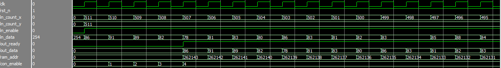  
图3-15-1 流水线模式时序

  

#### 3.15.3.2 流水线模式读取

输入使能后乘法器延迟+2个周期第一个结果被输出，开始流水化工作，波形如图3-15-2。  

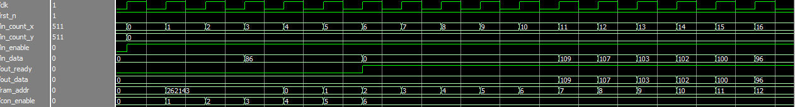  
图3-15-1 流水线模式时序

  

#### 3.15.3.3 请求响应模式写入

基本与3.15.3.1一致，但只有in\_enable的上升沿时才会有计数值和数据被输入，波形如图3-15-3。  

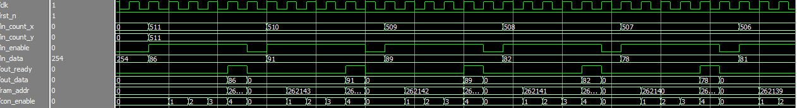  
图3-15-3 请求响应模式时序

  

#### 3.15.3.4 请求响应模式读取

基本与3.15.3.2一致，但只有in\_enable的上升沿时才会有计数值和数据被输入，波形如图3-15-4。  

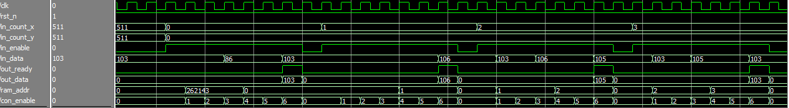  
图3-15-4 请求响应模式时序

  

#### 3.15.3.3 IP核GUI

完成功能后对FR2核进行了封装，封装如图3-15-5。  

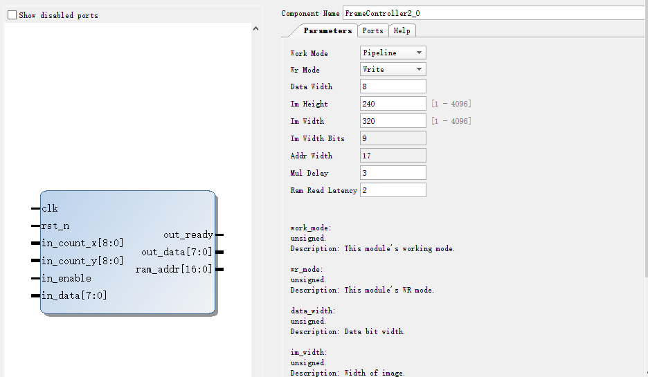  
图3-15-5 FR2核的GUI

  

### 3.15.4 仿真

FR2核没有软件仿真，将原始图像作为比较源进行PSNR测试，仿真结果如图3-15-6所示。  

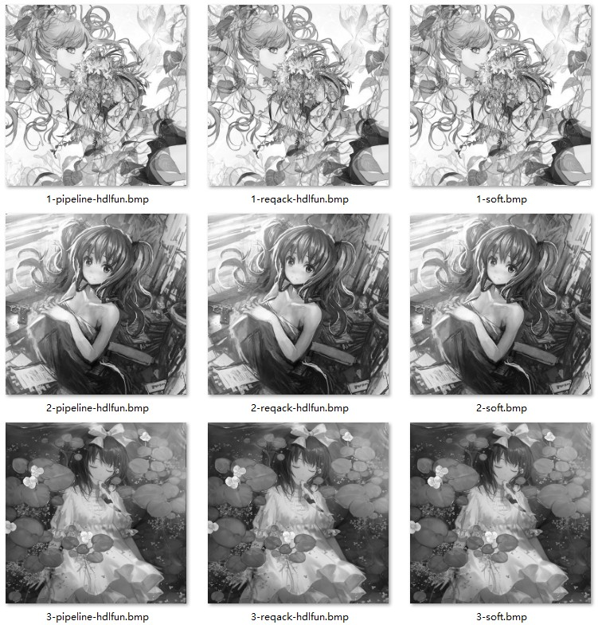  
图3-15-6 仿真结果，左侧为流水线模式下的HDL功能仿真结果，中间为请求响应模式下的HDL功能仿真结果，右侧为软件仿真结果

  

### 3.15.5 资源和时序

最终实现与乘法器配置和数据位宽有关，这里只分析使用DSP并且数据位宽为8的状况，根据Vivado生成的报表，主要资源耗费如表3-15-4。

<table border="1" cellspacing="0">
<tr>
<th>Slice LUTs*</th>
<th>Slice Registers</th>
<th>DSP</th>
</tr>
<tr>
<td>38</td>
<td>64</td>
<td>1</td>
</tr>
</table>
表3-15-4 主要资源耗费

 

同时根据时序报告，最大的Data Path Delay(数据路径延迟)为2.485ns，即：  

>FMax = 402.41MHz  

即说明，FR2核在流水线模式下，理论上在处理1080p全高清图像时可以达到194帧。  
由于数据路径延迟和应用的最终约束设置强相关，所以仅供参考。

### 3.15.6 分析与结论

PSNR如表3-15-5。  

<table border="1" cellspacing="0">
<tr>
<th>1</th>
<th>2</th>
<th>3</th>
<th>Total</th>
</tr>
<tr>
<td>1000000.00</td>
<td>1000000.00</td>
<td>1000000.00</td>
<td>1000000.00</td>
</tr>
</table>
表3-15-5 PSNR

PSNR均值为最大值，FR2核与软件等效，同时可以达到很高的FMax，设计成功。

## 3.16 几何变换-裁剪

几何变换的基本操作单元是像素的坐标，它保留色彩信息，对坐标进行变换。几何变换有两种大方向的分类，分别是前向映射和逆向映射[3]，对于FPGA而言，前向映射实现需要的资源较少，但是往往难度较高，但只能满足一部分简单的变换。裁剪操作可以用前向映射实现，它保留图像的一个区域的色彩信息，将其他部分的色彩置为背景，本节将说明如何实现一个裁剪模块。

### 3.16.1 原理

前向映射将原图像的像素坐标作为自变量，以某个变换函数得出目标图像的像素坐标，裁剪变换的变换函数如式3-16-1，Q为输出，I为输入，x和y为原图像坐标，t、b、l、r为四个边界，从某种角度来看，它实际上一种非线性滤波器，保留输入坐标的同时变换输出色彩。  

$$Q=\begin{cases} I[x,y] && x \in [l, r], y \in [t, b]  \\0 & & Others \ \end{cases}.\ \ \ \ \ \ \ \ (3-16-1)$$
  

所以，实现一个裁剪模块实际上是要通过给定的边界信息来确定可以输出的一个区域，然后根据是否在这个区域内来确定输出。  

### 3.16.2 设计

根据原理可知，Crop核(以下简称CP核)需要进行区域判断，而判断是根据四次比较(上下左右)来完成的，故需要四个端口来输入四方的边界值，随后在模块内部进行并行比较，最后全部取与即可得到是否在区域内的信息。同时由于坐标被作为了基本的操作元素，所以输出中也应当包含坐标值。故其需要的配置参数与端口如表3-16-1和表3-16-2。  

<table border="1" cellspacing="0">
<tr>
<th>名字</th>
<th>类型</th>
<th>范围</th>
<th>默认值</th>
<th>说明</th>
</tr>
<tr>
<td>work_mode</td>
<td>无符号</td>
<td>0为流水线模式，1为请求响应模式</td>
<td>0</td>
<td>模块的工作模式。</td>
</tr>
<tr>
<td>data_width</td>
<td>无符号</td>
<td>1 - 12</td>
<td>8</td>
<td>数据位宽。</td>
</tr>
<tr>
<td>im_width</td>
<td>无符号</td>
<td>1 - 4096</td>
<td>320</td>
<td>图像宽度。</td>
</tr>
<tr>
<td>im_height</td>
<td>无符号</td>
<td>1 - 4096</td>
<td>240</td>
<td>图像高度。</td>
</tr>
<tr>
<td>im_width_bits</td>
<td>无符号</td>
<td>取决于图像宽度</td>
<td>9</td>
<td>图像宽度的位宽。</td>
</tr>
</table>
表3-16-1 配置参数

  
 

<table border="1" cellspacing="0">
<tr>
<th>名字</th>
<th>端口</th>
<th>类型</th>
<th>范围</th>
<th>默认值</th>
<th>说明</th>
</tr>
<tr>
<td>clk</td>
<td>输入</td>
<td>无符号</td>
<td>无</td>
<td>无</td>
<td>Clock.</td>
</tr>
<tr>
<td>rst_n</td>
<td>输入</td>
<td>无符号</td>
<td>无</td>
<td>无</td>
<td>复位，低有效。</td>
</tr>
<tr>
<td>top</td>
<td>input</td>
<td>无符号</td>
<td>取决于图像的高度，0 - im_height-1</td>
<td>无</td>
<td>裁剪区域的上边界。</td>
</tr>
<tr>
<td>bottom</td>
<td>input</td>
<td>无符号</td>
<td>取决于图像的高度，0 - im_height-1</td>
<td>无</td>
<td>裁剪区域的下边界。</td>
</tr>
<tr>
<td>left</td>
<td>input</td>
<td>无符号</td>
<td>取决于图像的高度，0 - im_widtht-1</td>
<td>无</td>
<td>裁剪区域的左边界。</td>
</tr>
<tr>
<td>right</td>
<td>input</td>
<td>无符号</td>
<td>取决于图像的高度，0 - im_widtht-1</td>
<td>无</td>
<td>裁剪区域的右边界。</td>
</tr>
<tr>
<td>in_count_x</td>
<td>input</td>
<td>无符号</td>
<td>im_width_bits - 1 : 0</td>
<td>无</td>
<td>图像横向坐标输入。</td>
</tr>
<tr>
<td>in_count_y</td>
<td>input</td>
<td>无符号</td>
<td>im_width_bits - 1 : 0</td>
<td>无</td>
<td>图像纵向坐标输入。</td>
</tr>
<tr>
<td>in_enable</td>
<td>输入</td>
<td>无符号</td>
<td>无</td>
<td>无</td>
<td>输入数据使能，在流水线模式下，它是另一个复位信号，在请求响应模式下，只有在它有效的时候in_data才会被真正地改变。</td>
</tr>
<tr>
<td>in_data</td>
<td>输入</td>
<td>无符号</td>
<td>color_width * in_window_width * in_window_width - 1 : 0</td>
<td>无</td>
<td>输入数据，必须和in_enable同步输入。</td>
</tr>
<tr>
<td>out_ready</td>
<td>output</td>
<td>无符号</td>
<td>无</td>
<td>无</td>
<td>输出数据有效，在两种模式下，这个信号都会在out_data可以被读取的时候有效。</td>
</tr>
<tr>
<td>out_data</td>
<td>output</td>
<td>无符号</td>
<td>color_width - 1 : 0</td>
<td>无</td>
<td>输出数据，将会和out_ready同步输出。</td>
</tr>
<tr>
<td>out_count_x</td>
<td>input</td>
<td>无符号</td>
<td>im_width_bits - 1 : 0</td>
<td>无</td>
<td>图像横向坐标输出。</td>
</tr>
<tr>
<td>out_count_y</td>
<td>input</td>
<td>无符号</td>
<td>im_width_bits - 1 : 0</td>
<td>无</td>
<td>图像纵向坐标输出。</td>
</tr>
</table>
表3-16-2 端口

  

### 3.16.3 实现

根据3.16.2的设计便可以实现一个CP核，流水线模式和请求响应模式实现如下。  

#### 3.16.3.1 流水线模式

输入使能后1个周期第一个结果被输出，开始流水化工作，波形如图3-16-1。  

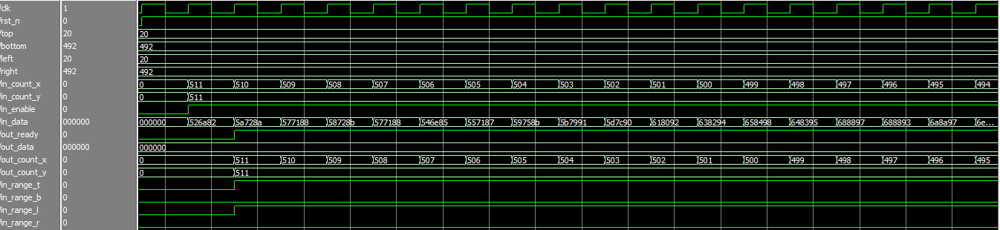  
图3-16-1 流水线模式时序

  

#### 3.16.3.2 请求响应模式读取

基本同3.16.3.1，但只有在in\_enable上升沿时输入才会被改变，波形如图3-16-2。  

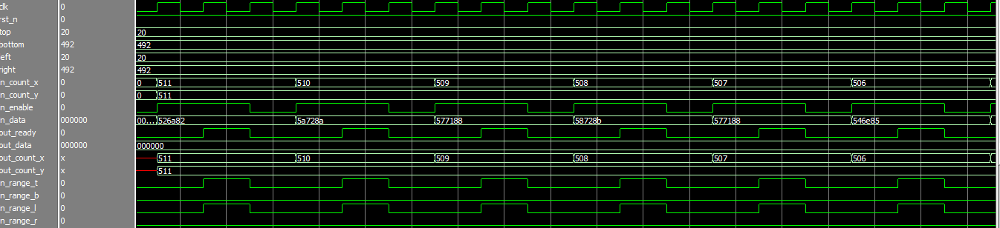  
图3-16-1 流水线模式时序

  

#### 3.16.3.3 IP核GUI

完成功能后对CP核进行了封装，封装如图3-16-3。  

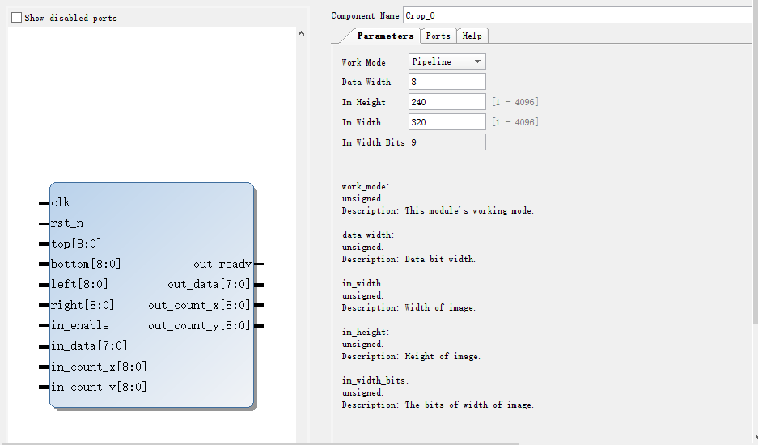  
图3-16-3 CP核的GUI

  

### 3.16.4 仿真

CP核的变换与色彩空间无关，所以适合所有色彩的变换，但综合考虑测试的必要性和测试平台的编写复杂度，只对RGB图像和灰度图像进行测试，我选择了一张图像的RGB和灰度模式进行测试，原始图像如图3-16-4。

  
图3-16-4 仿真原始图像

  

仿真参数如表3-16-3所示。  

<table border="1" cellspacing="0">
<tr>
<th>Top</th>
<th>Bottom</th>
<th>Left</th>
<th>Right</th>
</tr>
<tr>
<td>20</td>
<td>492</td>
<td>20</td>
<td>492</td>
</tr>
<tr>
<td>100</td>
<td>402</td>
<td>200</td>
<td>302</td>
</tr>
</table>
表3-16-3 仿真参数

仿真并进行PSNR测试，仿真结果如图3-16-5所示。  

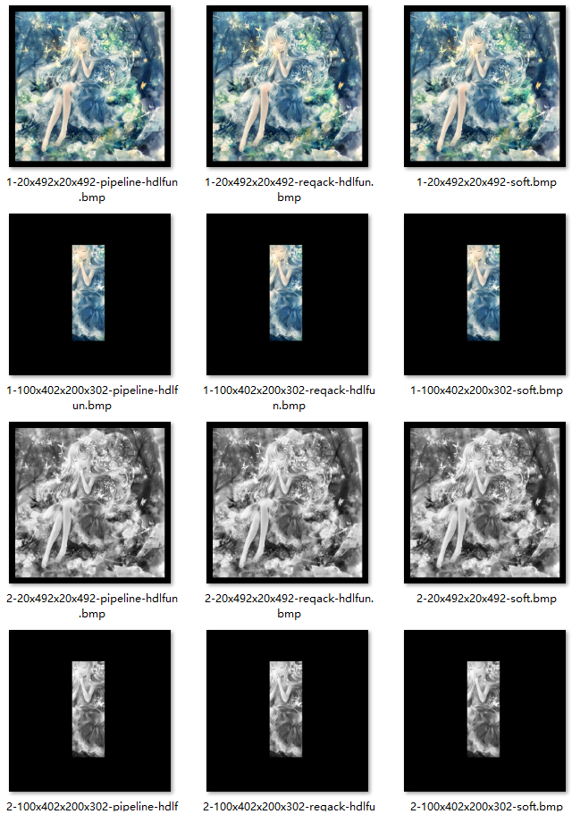  
图3-16-5 仿真结果，左侧为流水线模式下的HDL功能仿真结果，中间为请求响应模式下的HDL功能仿真结果，右侧为软件仿真结果

  

### 3.16.5 资源和时序

最终实现与图像大小和数据位宽有关，这里只分析大小为512x512个数据位宽为8时的状况，根据Vivado生成的报表，主要资源耗费如表3-16-4。

<table border="1" cellspacing="0">
<tr>
<th>Slice LUTs*</th>
<th>Slice Registers</th>
</tr>
<tr>
<td>29</td>
<td>5</td>
</tr>
</table>
表3-16-4 主要资源耗费

同时根据时序报告，最大的Data Path Delay(数据路径延迟)为2.113ns，即：  

>FMax = 473.26MHz  

即说明，CP核在流水线模式下，理论上在处理1080p全高清图像时可以达到228帧。  
由于数据路径延迟和应用的最终约束设置强相关，所以仅供参考。

### 3.16.6 分析与结论

PSNR如表3-16-5。  

<table border="1" cellspacing="0">
<tr>
<th>1-100x402x200x302</th>
<th>1-20x492x20x492</th>
<th>2-100x402x200x302</th>
<th>2-20x492x20x492</th>
<th>Total</th>
</tr>
<tr>
<td>1000000.00</td>
<td>1000000.00</td>
<td>1000000.00</td>
<td>1000000.00</td>
<td>1000000.00</td>
</tr>
</table>
表3-16-5 PSNR

PSNR均值为最大值，CP核与软件等效，同时可以达到很高的FMax，设计成功。

## 3.17 几何变换-镜像

镜像的目的是将图像进行翻转，与色彩反转类似，不过它变换的是坐标。镜像可以用前向映射实现，同时由于输出坐标必然落在原先的图像区域内，所以不用进行区域判断，属于比较简单的几何变换，本节将说明如何实现一个镜像的IP核。

### 3.17.1 原理

镜像有两种模式——水平镜像和垂直镜像，它的原理如式3-17-1所示，Q为输出，I为输入，x和y为输入像素坐标，$x_t$和$y_t$为输出像素坐标，width和height为图像宽度和高度。可见镜像的本质是将输入坐标和图像的宽度和高度做减法以得到输出坐标，同时由于减法的结果必然小于被减数，故这实际上是单纯的无符号数的减法。  

$$\begin{cases}Q[x_t,y_t] = I[x,y]  \\x_t = width - 1 - x && x \in[0, width)\\ y_t = height - 1 - y && y \in[0, height)\ \end{cases}.\ \ \ \ \ \ \ \ (3-17-1)$$
  

实际应用中会出现三种情况——水平镜像、垂直镜像和全镜像，所以需要一个模式选择来确定模块的工作方式，同时由于图像宽高的位宽均被限定到12位之内，所以只需要一个周期的流水便可以满足FMax。  

### 3.17.2 设计

根据原理可知，Mirror核(以下简称MR核)需要若干次并行减法操作，同时需要根据模式来确定减法操作的次数，所以需要一个mode端口来确定工作的模式。故其需要的配置参数与端口如表3-17-1和表3-17-2。  

<table border="1" cellspacing="0">
<tr>
<th>名字</th>
<th>类型</th>
<th>范围</th>
<th>默认值</th>
<th>说明</th>
</tr>
<tr>
<td>work_mode</td>
<td>无符号</td>
<td>0为流水线模式，1为请求响应模式</td>
<td>0</td>
<td>模块的工作模式。</td>
</tr>
<tr>
<td>data_width</td>
<td>无符号</td>
<td>1 - 12</td>
<td>8</td>
<td>数据位宽。</td>
</tr>
<tr>
<td>im_width</td>
<td>无符号</td>
<td>1 - 4096</td>
<td>320</td>
<td>图像宽度。</td>
</tr>
<tr>
<td>im_height</td>
<td>无符号</td>
<td>1 - 4096</td>
<td>240</td>
<td>图像高度。</td>
</tr>
<tr>
<td>im_width_bits</td>
<td>无符号</td>
<td>取决于图像宽度</td>
<td>9</td>
<td>图像宽度的位宽。</td>
</tr>
</table>
表3-17-1 配置参数

  
 

<table border="1" cellspacing="0">
<tr>
<th>名字</th>
<th>端口</th>
<th>类型</th>
<th>范围</th>
<th>默认值</th>
<th>说明</th>
</tr>
<tr>
<td>clk</td>
<td>输入</td>
<td>无符号</td>
<td>无</td>
<td>无</td>
<td>Clock.</td>
</tr>
<tr>
<td>rst_n</td>
<td>输入</td>
<td>无符号</td>
<td>无</td>
<td>无</td>
<td>复位，低有效。</td>
</tr>
<tr>
<td>mode</td>
<td>input</td>
<td>无符号</td>
<td>0为水平镜像，1为垂直镜像，2和3为全镜像</td>
<td>无</td>
<td>工作模式。</td>
</tr>
<tr>
<td>in_count_x</td>
<td>input</td>
<td>无符号</td>
<td>im_width_bits - 1 : 0</td>
<td>无</td>
<td>图像横向坐标输入。</td>
</tr>
<tr>
<td>in_count_y</td>
<td>input</td>
<td>无符号</td>
<td>im_width_bits - 1 : 0</td>
<td>无</td>
<td>图像纵向坐标输入。</td>
</tr>
<tr>
<td>in_enable</td>
<td>输入</td>
<td>无符号</td>
<td>无</td>
<td>无</td>
<td>输入数据使能，在流水线模式下，它是另一个复位信号，在请求响应模式下，只有在它有效的时候in_data才会被真正地改变。</td>
</tr>
<tr>
<td>in_data</td>
<td>输入</td>
<td>无符号</td>
<td>color_width * in_window_width * in_window_width - 1 : 0</td>
<td>无</td>
<td>输入数据，必须和in_enable同步输入。</td>
</tr>
<tr>
<td>out_ready</td>
<td>output</td>
<td>无符号</td>
<td>无</td>
<td>无</td>
<td>输出数据有效，在两种模式下，这个信号都会在out_data可以被读取的时候有效。</td>
</tr>
<tr>
<td>out_data</td>
<td>output</td>
<td>无符号</td>
<td>color_width - 1 : 0</td>
<td>无</td>
<td>输出数据，将会和out_ready同步输出。</td>
</tr>
<tr>
<td>out_count_x</td>
<td>input</td>
<td>无符号</td>
<td>im_width_bits - 1 : 0</td>
<td>无</td>
<td>图像横向坐标输出。</td>
</tr>
<tr>
<td>out_count_y</td>
<td>input</td>
<td>无符号</td>
<td>im_width_bits - 1 : 0</td>
<td>无</td>
<td>图像纵向坐标输出。</td>
</tr>
</table>
表3-17-2 端口

  

### 3.17.3 实现

根据3.17.2的设计便可以实现一个MR核，流水线模式和请求响应模式实现如下。  

#### 3.17.3.1 流水线模式

输入使能后1个周期第一个结果被输出，开始流水化工作，波形如图3-17-1。  

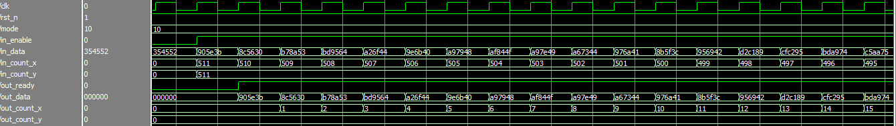  
图3-17-1 流水线模式时序

  

#### 3.17.3.2 请求响应模式读取

基本同3.17.3.1，但只有在in\_enable上升沿时输入才会被改变，波形如图3-17-2。  

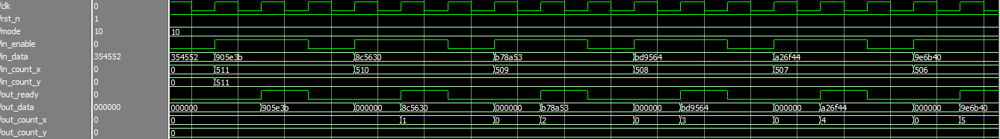  
图3-17-1 流水线模式时序

  

#### 3.17.3.3 IP核GUI

完成功能后对MR核进行了封装，封装如图3-17-3。  

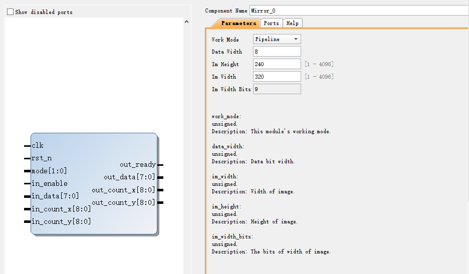  
图3-17-3 MR核的GUI

  

### 3.17.4 仿真

只对RGB图像和灰度图像进行测试，我选择了一张图像的RGB和灰度模式进行三种模式的测试，原始图像如图3-17-4。

  
图3-17-4 仿真原始图像

  

仿真并进行PSNR测试，仿真结果如图3-17-5所示。  

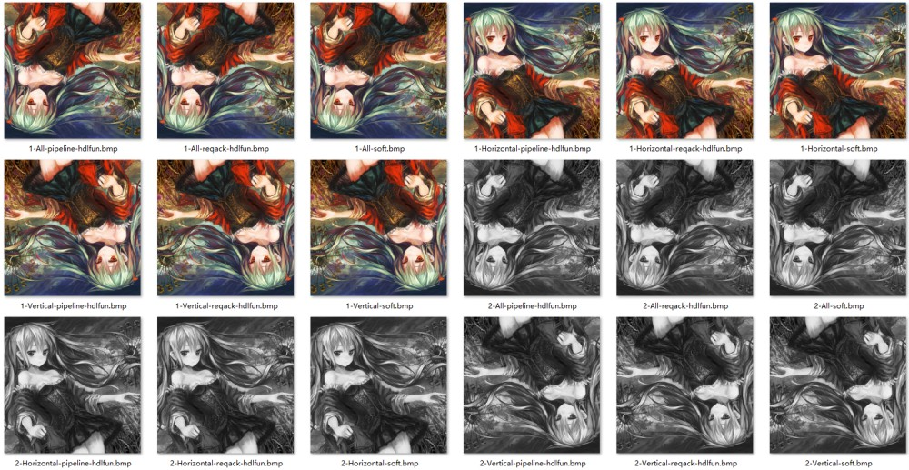  
图3-17-5 仿真结果，从左上角分别为流水线模式下的HDL功能仿真结果，请求响应模式下的HDL功能仿真结果，软件仿真结果

  

### 3.17.5 资源和时序

最终实现与图像大小和数据位宽有关，这里只分析大小为512x512个数据位宽为8时的状况，根据Vivado生成的报表，主要资源耗费如表3-17-3。

<table border="1" cellspacing="0">
<tr>
<th>Slice LUTs*</th>
<th>Slice Registers</th>
</tr>
<tr>
<td>11</td>
<td>27</td>
</tr>
</table>
表3-17-3 主要资源耗费

同时根据时序报告，最大的Data Path Delay(数据路径延迟)为1.941ns，即：  

>FMax = 515.19MHz  

即说明，MR核在流水线模式下，理论上在处理1080p全高清图像时可以达到248帧。  
由于数据路径延迟和应用的最终约束设置强相关，所以仅供参考。

### 3.17.6 分析与结论

PSNR如表3-17-4。  

<table border="1" cellspacing="0">
<tr>
<th>1-All</th>
<th>1-Horizontal</th>
<th>1-Vertical</th>
<th>2-All</th>
<th>2-Horizontal</th>
<th>2-Vertical</th>
<th>Total</th>
</tr>
<tr>
<td>1000000.00</td>
<td>1000000.00</td>
<td>1000000.00</td>
<td>1000000.00</td>
<td>1000000.00</td>
<td>1000000.00</td>
<td>1000000.00</td>
</tr>
</table>
表3-17-4 PSNR

PSNR均值为最大值，MR核与软件等效，同时可以达到很高的FMax，设计成功。

## 3.18 几何变换-平移

平移是仿射变换的一种特例[25]，仿射变换本质上是一个以输入坐标为自变量的线性函数，将在后面的章节详细介绍。平移变换每一个方向的变换只与该方向的输入坐标和偏移量有关，它将图像按照输入的偏移量向着水平和垂直两个方向进行移动，偏移量可正可负，所以会涉及越界的问题。大部分的仿射变换用前向映射实现都会比较复杂，但平移变换是一个例外，可以用特殊方法处理，本节将会介绍如何实现一个平移的模块。

### 3.18.1 原理

平移变换的基本原理如式3-18-1，Q为输出，I为输入，x和y为输入像素坐标，$x_t$和$y_t$为输出像素坐标，xoffset和yoffset分别为两个方向的偏移量，w和h为图像的宽和高，可见其实现依赖于两次加法操作，由于偏移量可正可负，所以是有符号的加法操作，所以必须考虑到加法操作的结果大于图像最大边界或小于0的状况。  

$$\begin{cases}Q[x_t,y_t] = I[x,y]  \\x_t = x + xoffset && x \in[0, w)\\ y_t = y + yoffset && y \in[0, h)\ \end{cases}.\ \ \ \ \ \ \ \ (3-18-1)$$
  

由于平移变换的特殊性，故可以在加法得到的输出坐标越界时进行适当的加法或者减法操作，让输出坐标重新落到图像范围内，同时由于此时的像素是越界的，所以像素色彩置为背景，改进后的算法如式3-18-2、3-18-3、3-18-4和3-18-5，$sum_x$和$sum_y$分别为第一次加法的输出坐标。  

$$\begin{cases}sum_x = x + xoffset && x \in[0, w)\\ sum_y = y + yoffset && y \in[0, h)\ \end{cases}.\ \ \ \ \ \ \ \ (3-18-2)$$
  

$$x_t=\begin{cases} sum_x && sum_x \in[0, w) \\sum_x + w  && sum_x < 0\\sum_x - w  && sum_x >= w \ \end{cases}.\ \ \ \ \ \ \ \ (3-18-3)$$
  

$$y_t=\begin{cases} sum_y && sum_y \in[0, h) \\sum_y + h  && sum_y < 0\\sum_y - h  && sum_y >= h \ \end{cases}.\ \ \ \ \ \ \ \ (3-18-4)$$
  

$$Q[x_t,y_t]=\begin{cases} I[x,y] && sum_x \in [0, w],sum_y \in[0, h) \\0  && Others\ \end{cases}.\ \ \ \ \ \ \ \ (3-18-5)$$
  

所以平移变换需要分两个阶段完成，第一个阶段用两次并行加法分别计算两个原生输出坐标，第二次则用四次并行加法得出假定越界后的输出，同时根据第一个周期得到的原生输出坐标判断输出点是否在边界之内，随后根据边界信息来确定选择原生输出坐标还是假定越界后的坐标进行最终的输出，这是一个二级流水线。  

### 3.18.2 设计

根据原理可知，Pan核(以下简称Pan核)需要两级流水线，若干次并行有符号加法操作和比较操作，同时需要两个端口来确定输出偏移量。故其需要的配置参数与端口如表3-18-1和表3-18-2。  

<table border="1" cellspacing="0">
<tr>
<th>名字</th>
<th>类型</th>
<th>范围</th>
<th>默认值</th>
<th>说明</th>
</tr>
<tr>
<td>work_mode</td>
<td>无符号</td>
<td>0为流水线模式，1为请求响应模式</td>
<td>0</td>
<td>模块的工作模式。</td>
</tr>
<tr>
<td>data_width</td>
<td>无符号</td>
<td>1 - 12</td>
<td>8</td>
<td>数据位宽。</td>
</tr>
<tr>
<td>im_width</td>
<td>无符号</td>
<td>1 - 4096</td>
<td>320</td>
<td>图像宽度。</td>
</tr>
<tr>
<td>im_height</td>
<td>无符号</td>
<td>1 - 4096</td>
<td>240</td>
<td>图像高度。</td>
</tr>
<tr>
<td>im_width_bits</td>
<td>无符号</td>
<td>取决于图像宽度</td>
<td>9</td>
<td>图像宽度的位宽。</td>
</tr>
</table>
表3-18-1 配置参数

  
 

<table border="1" cellspacing="0">
<tr>
<th>名字</th>
<th>端口</th>
<th>类型</th>
<th>范围</th>
<th>默认值</th>
<th>说明</th>
</tr>
<tr>
<td>clk</td>
<td>输入</td>
<td>无符号</td>
<td>无</td>
<td>无</td>
<td>Clock.</td>
</tr>
<tr>
<td>rst_n</td>
<td>输入</td>
<td>无符号</td>
<td>无</td>
<td>无</td>
<td>复位，低有效。</td>
</tr>
<tr>
<td>offset_x</td>
<td>input</td>
<td>有符号</td>
<td>如果是正数，则必须是原码，否则为补码。</td>
<td>无</td>
<td>横向偏移量。</td>
</tr>
<tr>
<td>offset_y</td>
<td>input</td>
<td>有符号</td>
<td>如果是正数，则必须是原码，否则为补码。</td>
<td>无</td>
<td>纵向偏移量。</td>
</tr>
<tr>
<td>in_count_x</td>
<td>input</td>
<td>无符号</td>
<td>im_width_bits - 1 : 0</td>
<td>无</td>
<td>图像横向坐标输入。</td>
</tr>
<tr>
<td>in_count_y</td>
<td>input</td>
<td>无符号</td>
<td>im_width_bits - 1 : 0</td>
<td>无</td>
<td>图像纵向坐标输入。</td>
</tr>
<tr>
<td>in_enable</td>
<td>输入</td>
<td>无符号</td>
<td>无</td>
<td>无</td>
<td>输入数据使能，在流水线模式下，它是另一个复位信号，在请求响应模式下，只有在它有效的时候in_data才会被真正地改变。</td>
</tr>
<tr>
<td>in_data</td>
<td>输入</td>
<td>无符号</td>
<td>color_width * in_window_width * in_window_width - 1 : 0</td>
<td>无</td>
<td>输入数据，必须和in_enable同步输入。</td>
</tr>
<tr>
<td>out_ready</td>
<td>output</td>
<td>无符号</td>
<td>无</td>
<td>无</td>
<td>输出数据有效，在两种模式下，这个信号都会在out_data可以被读取的时候有效。</td>
</tr>
<tr>
<td>out_data</td>
<td>output</td>
<td>无符号</td>
<td>color_width - 1 : 0</td>
<td>无</td>
<td>输出数据，将会和out_ready同步输出。</td>
</tr>
<tr>
<td>out_count_x</td>
<td>input</td>
<td>无符号</td>
<td>im_width_bits - 1 : 0</td>
<td>无</td>
<td>图像横向坐标输出。</td>
</tr>
<tr>
<td>out_count_y</td>
<td>input</td>
<td>无符号</td>
<td>im_width_bits - 1 : 0</td>
<td>无</td>
<td>图像纵向坐标输出。</td>
</tr>
</table>
表3-18-2 端口

  

### 3.18.3 实现

根据3.18.2的设计便可以实现一个Pan核，流水线模式和请求响应模式实现如下。  

#### 3.18.3.1 流水线模式

输入使能后2个周期第一个结果被输出，开始流水化工作，波形如图3-18-1。  

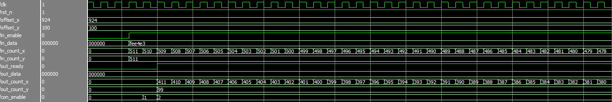  
图3-18-1 流水线模式时序

  

#### 3.18.3.2 请求响应模式读取

基本同3.18.3.1，但只有在in\_enable上升沿时输入才会被改变，波形如图3-18-2。  

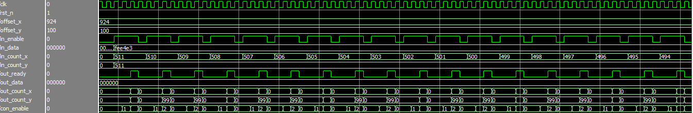  
图3-18-1 流水线模式时序

  

#### 3.18.3.3 IP核GUI

完成功能后对Pan核进行了封装，封装如图3-18-3。  

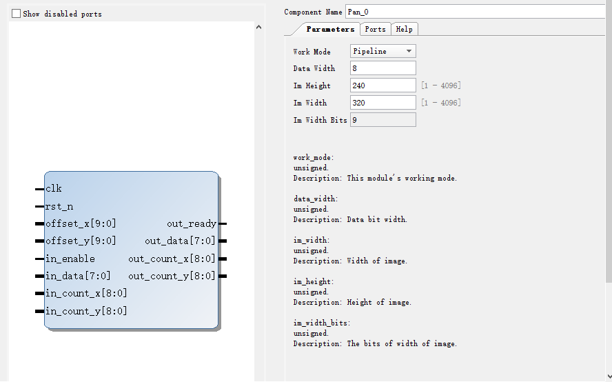  
图3-18-3 Pan核的GUI

  

### 3.18.4 仿真

只对RGB图像和灰度图像进行测试，我选择了一张图像的RGB和灰度模式进行两套参数的测试，原始图像如图3-18-4。

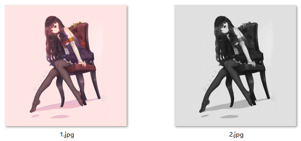  
图3-18-4 仿真原始图像

  

仿真参数如表3-16-3所示。  

<table border="1" cellspacing="0">
<tr>
<th>xoffset</th>
<th>yoffset</th>
</tr>
<tr>
<td>-100</td>
<td>100</td>
</tr>
<tr>
<td>200</td>
<td>-50</td>
</tr>
</table>
表3-16-3 仿真参数

仿真并进行PSNR测试，仿真结果如图3-18-5所示。  

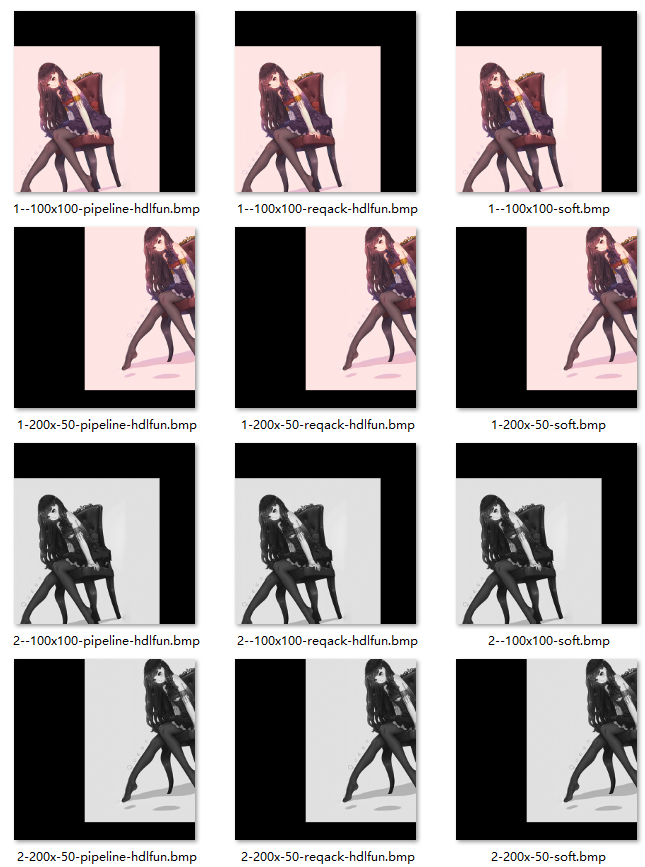  
图3-18-5 仿真结果，左侧为流水线模式下的HDL功能仿真结果，中间为请求响应模式下的HDL功能仿真结果，右侧为软件仿真结果

  

### 3.18.5 资源和时序

最终实现与图像大小和数据位宽有关，这里只分析大小为512x512个数据位宽为8时的状况，根据Vivado生成的报表，主要资源耗费如表3-18-4。

<table border="1" cellspacing="0">
<tr>
<th>Slice LUTs*</th>
<th>Slice Registers</th>
</tr>
<tr>
<td>55</td>
<td>71</td>
</tr>
</table>
表3-18-4 主要资源耗费

同时根据时序报告，最大的Data Path Delay(数据路径延迟)为3.153ns，即：  

>FMax = 317.15MHz  

即说明，Pan核在流水线模式下，理论上在处理1080p全高清图像时可以达到152帧。  
由于数据路径延迟和应用的最终约束设置强相关，所以仅供参考。

### 3.18.6 分析与结论

PSNR如表3-18-5。  

<table border="1" cellspacing="0">
<tr>
<th>1--100x100</th>
<th>1-200x-50</th>
<th>2--100x100</th>
<th>2-200x-50</th>
<th>Total</th>
</tr>
<tr>
<td>1000000.00</td>
<td>1000000.00</td>
<td>1000000.00</td>
<td>1000000.00</td>
<td>1000000.00</td>
</tr>
</table>
表3-18-5 PSNR

PSNR均值为最大值，Pan核与软件等效，同时可以达到不错的FMax，设计成功。

## 3.19 几何变换-缩放

缩放同样是仿射变换的一种特例，它接受水平和垂直两个方向的缩放值，将图像进行伸缩，缩放用前向映射实现会出现一个问题，就是在缩放值大于1的时候可能会出现空隙[3]。这是由于在前向映射下，并非原图像的每一个像素都可以映射为目标图像的像素，在软件上这可以通过一些插值方法来实现，但对于FPGA而言同样的实现需要用更为复杂的逻辑，故此处暂且采用逆向映射，这实际上采用了最近邻插值算法。本节将会说明如何用FPGA实现缩放的模块。

### 3.19.1 原理

缩放变换的基本原理如式3-19-1，Q为输出，I为输入，x和y为输入像素坐标，$x_t$和$y_t$为输出像素坐标，xscale和yscale分别为两个方向的缩放比例，w和h为图像的宽和高，这是前向映射的一般定义，但对于逆向映射而言，应该对此式进行调整，变换为3-19-2的形式，$x_t$和$y_t$称为自己变换的输出坐标，x和y则通过$x_t$和$y_t$除以各自缩放比例得出，随后根据x和y得到需要输出的原图像像素，进行输出。  

$$\begin{cases}Q[x_t,y_t] = I[x,y]  \\x_t = x * xscale && x \in[0, w)\\ y_t = y * yscale && y \in[0, h)\ \end{cases}.\ \ \ \ \ \ \ \ (3-19-1)$$
  

$$\begin{cases}I[x,y] = Q[x_t,y_t]  \\x = x_t / xscale && x_t \in[0, w)\\ y = y_t / yscale && y_t \in[0, h)\ \end{cases}.\ \ \ \ \ \ \ \ (3-19-2)$$
  

可见，这实际上是先得出需要输出的像素坐标，然后反向映射到原图像的像素坐标，最后查找到原图像的像素值进行输出。所以前面章节的方式不再适用，必须采用新的设计。考虑到输出坐标的生成依赖于外界没有意义，所以选用内部的计数器进行目标图像坐标的生成。最终采用的方案为，首先将原图像存入帧缓存，根据计数器生成的坐标进行两次并行乘法得到原图像对应的坐标，并联合3.15中的帧控制器，查找得到需要输出的像素值，同时进行边界判定，当求得的原图像的坐标超出了图像的范围，则输出为背景像素，算法如式3-19-3。

$$Q[x_t,y_t] = \begin{cases}I[x,y] && (x,y)\in I  \\0  && (x,y) \notin I\ \end{cases}.\ \ \ \ \ \ \ \ (3-19-3)$$
  

由于本库采用的是定点数乘法，所以需要一个确定的小数位来保证精度，经过实验和DSP资源的考虑(一个DSP48最多实现12x25的乘法)，最终采用拥有6位整数和18位小数的定点数，即缩放比例的范围为[0, 64)。同时由于涉及小数乘法，所以需要选择一个舍入方式，几何变换对于舍入方式是敏感的，为了符合最邻近插值的定义，几何变换中所有模块的舍入方式均为就近舍入，故需要一个舍入核来完成舍入操作，考虑到缩放变换中的乘法为无符号乘法，故舍入核设计比较简单，例如对于一个12bits.12bits的定点数，舍入原理如式3-19-4，其中Q为输出，$I_r$为输入的整数部分，$I_{d1}$为输入的小数部分第一位，第一位为1，则I的小数部分必然大于0.5，否则小于。  

$$Q = \begin{cases}I_r && I_{d1} = 0  \\I_r + 1 && I_{d1} = 1\ \end{cases}.\ \ \ \ \ \ \ \ (3-19-4)$$
  

### 3.19.2 设计

根据原理可知，Scale核(以下简称SCL核)需要两次乘法，两次舍入操作，并且需要和基于行列计数的帧控制器进行合作。故其需要的配置参数与端口如表3-19-1和表3-19-2。  

<table border="1" cellspacing="0">
<tr>
<th>名字</th>
<th>类型</th>
<th>范围</th>
<th>默认值</th>
<th>说明</th>
</tr>
<tr>
<td>work_mode</td>
<td>无符号</td>
<td>0为流水线模式，1为请求响应模式</td>
<td>0</td>
<td>模块的工作模式。</td>
</tr>
<tr>
<td>data_width</td>
<td>无符号</td>
<td>1 - 12</td>
<td>8</td>
<td>数据位宽。</td>
</tr>
<tr>
<td>im_width</td>
<td>无符号</td>
<td>1 - 4096</td>
<td>320</td>
<td>图像宽度。</td>
</tr>
<tr>
<td>im_height</td>
<td>无符号</td>
<td>1 - 4096</td>
<td>240</td>
<td>图像高度。</td>
</tr>
<tr>
<td>im_width_bits</td>
<td>无符号</td>
<td>取决于图像宽度</td>
<td>9</td>
<td>图像宽度的位宽。</td>
</tr>
<tr>
<td>mul_delay</td>
<td>无符号</td>
<td>取决于乘法器配置，1-14</td>
<td>3</td>
<td>乘法器延迟。</td>
</tr>
<tr>
<td>ram_RL</td>
<td>无符号</td>
<td>取决于帧控制器</td>
<td>7</td>
<td>帧控制器输出延迟。</td>
</tr>
</table>
表3-19-1 配置参数

  
 

<table border="1" cellspacing="0">
<tr>
<th>名字</th>
<th>端口</th>
<th>类型</th>
<th>范围</th>
<th>默认值</th>
<th>说明</th>
</tr>
<tr>
<td>clk</td>
<td>输入</td>
<td>无符号</td>
<td>无</td>
<td>无</td>
<td>Clock.</td>
</tr>
<tr>
<td>rst_n</td>
<td>输入</td>
<td>无符号</td>
<td>无</td>
<td>无</td>
<td>复位，低有效。</td>
</tr>
<tr>
<td>scale_x</td>
<td>input</td>
<td>无符号</td>
<td>定点数，6bits.18bits</td>
<td>无</td>
<td>横向缩放比例，必须是正确缩放比例的倒数。</td>
</tr>
<tr>
<td>scale_y</td>
<td>input</td>
<td>无符号</td>
<td>定点数，6bits.18bits</td>
<td>无</td>
<td>纵向缩放比例，必须是正确缩放比例的倒数。</td>
</tr>
<tr>
<td>in_enable</td>
<td>输入</td>
<td>无符号</td>
<td>无</td>
<td>无</td>
<td>输入数据使能，在流水线模式下，它是另一个复位信号，在请求响应模式下，只有在它有效的时候in_data才会被真正地改变。</td>
</tr>
<tr>
<td>frame_in_ready</td>
<td>输入</td>
<td>无符号</td>
<td>无</td>
<td>无</td>
<td>连接到帧控制器的out_ready。</td>
</tr>
<tr>
<td>frame_in_data</td>
<td>输入</td>
<td>无符号</td>
<td>data_width - 1 : 0</td>
<td>无</td>
<td>连接到帧控制器的out_data。</td>
</tr>
<tr>
<td>frame_enable</td>
<td>output</td>
<td>无符号</td>
<td>无</td>
<td>无</td>
<td>连接到帧控制器的in_enable。</td>
</tr>
<tr>
<td>frame_out_count_x</td>
<td>output</td>
<td>无符号</td>
<td>im_width_bits - 1 : 0</td>
<td>无</td>
<td>连接到帧控制器的in_count_x。</td>
</tr>
<tr>
<td>out_count_y</td>
<td>output</td>
<td>无符号</td>
<td>im_width_bits - 1 : 0</td>
<td>无</td>
<td>连接到帧控制器的in_count_y。</td>
</tr>
<tr>
<td>out_ready</td>
<td>output</td>
<td>无符号</td>
<td>无</td>
<td>无</td>
<td>输出数据有效，在两种模式下，这个信号都会在out_data可以被读取的时候有效。</td>
</tr>
<tr>
<td>out_data</td>
<td>output</td>
<td>无符号</td>
<td>color_width - 1 : 0</td>
<td>无</td>
<td>输出数据，将会和out_ready同步输出。</td>
</tr>
</table>
表3-19-2 端口

  

  
 

<table border="1" cellspacing="0">
<tr>
<th>名字</th>
<th>类型</th>
<th>说明</th>
</tr>
<tr>
<td>MulX</td>
<td>Multiplier12x24SCL</td>
<td>12位无符号数和24位无符号数的乘法器，被用于定点数的乘法。你可以自己配置这个乘法器，然后更改"mul_delay"，但所有的乘法器必须拥有相同的流水线级数，并且不能更改端口的配置！</td>
</tr>
<tr>
<td>MulY</td>
<td>Multiplier12x24SCL</td>
<td>12位无符号数和24位无符号数的乘法器，被用于定点数的乘法。你可以自己配置这个乘法器，然后更改"mul_delay"，但所有的乘法器必须拥有相同的流水线级数，并且不能更改端口的配置！</td>
</tr>
<tr>
<td>FRUX</td>
<td>FixedRoundUnsigned</td>
<td>用于无符号浮点数的舍入。</td>
</tr>
<tr>
<td>FRUY</td>
<td>FixedRoundUnsigned</td>
<td>用于无符号浮点数的舍入。</td>
</tr>
</table>
表3-3-3 子模块

### 3.19.3 实现

根据3.19.2的设计便可以实现一个SCL核，流水线模式和请求响应模式实现如下。  

#### 3.19.3.1 流水线模式

输入使能后首先计数器工作，随后计算原图像的坐标，随后根据算出的坐标得到边界，同时将坐标输出到帧控制器，在帧控制器的输出使能后1个周期第一个结果被输出，开始流水化工作，波形如图3-19-1。  

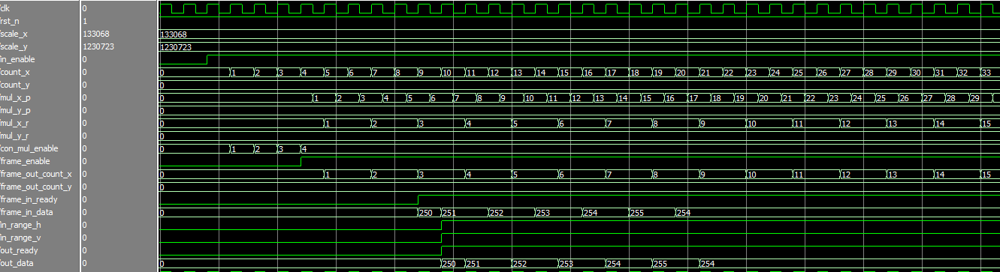  
图3-19-1 流水线模式时序

  

#### 3.19.3.2 请求响应模式读取

基本同3.19.3.1，但只有在in\_enable上升沿时计数器才会加1才会被改变，波形如图3-19-2。  

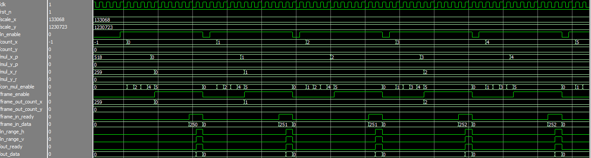  
图3-19-1 流水线模式时序

  

#### 3.19.3.3 IP核GUI

完成功能后对SCL核进行了封装，封装如图3-19-3。  

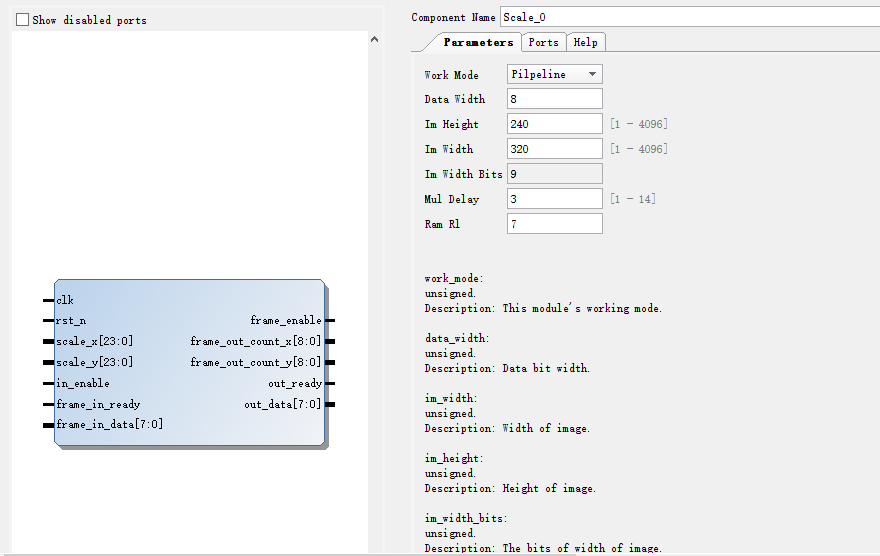  
图3-19-3 SCL核的GUI

  

### 3.19.4 仿真

只对RGB图像和灰度图像进行测试，考虑到仿真设计模块比较多，出于仿真压力，我选择了一张图像的灰度模式进行三套参数的测试，原始图像如图3-19-4。

  
图3-19-4 仿真原始图像

  

仿真参数如表3-16-4所示，选择原则是可以被二进制表示和不可以被表示的值都包含。  

<table border="1" cellspacing="0">
<tr>
<th>xscale</th>
<th>yscale</th>
</tr>
<tr>
<td>1.97</td>
<td>0.213</td>
</tr>
<tr>
<td>0.391</td>
<td>2.17</td>
</tr>
<tr>
<td>0.4</td>
<td>0.4</td>
</tr>
</table>
表3-16-4 仿真参数

仿真并进行PSNR测试，仿真结果如图3-19-5所示。  

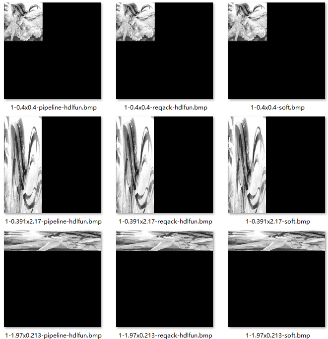  
图3-19-5 仿真结果，左侧为流水线模式下的HDL功能仿真结果，中间为请求响应模式下的HDL功能仿真结果，右侧为软件仿真结果

  

### 3.19.5 资源和时序

最终实现与图像大小和数据位宽有关，这里只分析大小为512x512和数据位宽为8时的状况，根据Vivado生成的报表，主要资源耗费如表3-19-5。

<table border="1" cellspacing="0">
<tr>
<th>Slice LUTs*</th>
<th>Slice Registers</th>
<th>DSP</th>
</tr>
<tr>
<td>77</td>
<td>69</td>
<td>2</td>
</tr>
</table>
表3-19-5 主要资源耗费

同时根据时序报告，最大的Data Path Delay(数据路径延迟)为3.372ns，即：  

>FMax = 296.55MHz  

即说明，Scale核在流水线模式下，理论上在处理1080p全高清图像时可以达到143帧。  
由于数据路径延迟和应用的最终约束设置强相关，所以仅供参考。

### 3.19.6 分析与结论

PSNR如表3-19-6。  

<table border="1" cellspacing="0">
<tr>
<th>1-0.391x2.17</th>
<th>1-0.4x0.4</th>
<th>1-1.97x0.213</th>
<th>Total</th>
</tr>
<tr>
<td>1000000.00</td>
<td>1000000.00</td>
<td>1000000.00</td>
<td>1000000.00</td>
</tr>
</table>
表3-19-6 PSNR

PSNR均值为最大值，可见在测试范围内，SCL核与软件等效，同时可以达到不错的FMax，设计成功。

## 3.20 几何变换-错切

错切也是仿射变换的一种特例，它接受水平和垂直两个方向的错切系数，将图像进行扭变，它同样适合进行逆向映射。错切常用于图像校正操作，同时也可以作为旋转变换的中间变换[26]。本节将会说明如何用FPGA实现错切的模块。

### 3.20.1 原理

错切变换的前向映射基本原理如式3-20-1，其中xsh和ysh为两个方向的错切系数。对于逆向映射应该对此式进行调整，变换为3-20-2的形式，$xsh_t$和$ysh_t$为逆向映射系数，没有使用前向映射的逆变换是考虑到错切本身意义模糊，如果采用逆变换会导致算法复杂度大大增加却无法得到理想的效果，所以直接根据前向映射的形式得出了逆向映射。  

$$\begin{cases}Q[x_t,y_t] = I[x,y]  \\x_t = x * xsh + y\\ y_t = y * ysh + x\\x_t \in[0, w) ,y_t \in[0, h)\ \end{cases}.\ \ \ \ \ \ \ \ (3-20-1)$$
  

$$\begin{cases}I[x,y] = Q[x_t,y_t]  \\x = x_t * xsh_t + y_t\\ y = y_t * ysh_t + x_t\\x_t \in[0, w) ,y_t \in[0, h)\ \end{cases}.\ \ \ \ \ \ \ \ (3-20-2)$$
  

输出同样要进行边界判定，这和3.19中基本一致。同时由于涉及到定点数乘法，所以需要确定小数位，考虑到错切系数是有符号的定点数，所以此模块需要乘法器来实现一个无符号数(坐标)和与有符号定点数(错切系数)的乘法，最终确定了在3.19中设计的基础上加上一位符号位来保证精度，即错切系数的范围为(-64,64)。此模块同样涉及到舍入问题，并且是有符号数的舍入问题，故可以采用3.1中论述的FR核来完成舍入，舍入的原理如式3-20-3，$I_s$为符号位，首先判断输入的正负，随后根据正负来确定如何舍入。  

$$Q = \begin{cases}I_r && I_{d1} = 0  \\I_r + 1 && I_{d1} = 1,\  I_s=0\\I_r - 1 && I_{d1} = 1,\ I_s=1\ \end{cases}.\ \ \ \ \ \ \ \ (3-20-3)$$
  

同时考虑到舍入核输出的数值将会进行一次加法，所以输出的位数越少越好，故此处设计了一个可选的输出位宽和一个溢出标志，同时在模块内部进行一次比较，来告知外部此次输入的值是否出现了溢出，溢出规则如式3-20-4，Orig为转换后的原码，Of为溢出标志，fp为定点位，resw为指定的输出位宽，numw为原始数据位宽，即在需求位数之外、被截取的高位数值不为0时则判定为溢出，最终只要把这个溢出标志加入到边界判定中即可。

$$Of = \begin{cases}0 && Orig[numw - 1 : resw] = 0  \\1 && Others\ \end{cases}.\ \ \ \ \ \ \ \ (3-20-4)$$
  

### 3.20.2 设计

根据原理可知，Shear核(以下简称SHR核)需要两次符号乘法、两次符号舍入操作和两次符号加法，并且需要和基于行列计数的帧控制器进行合作。故其需要的配置参数与端口如表3-20-1和表3-20-2。  

<table border="1" cellspacing="0">
<tr>
<th>名字</th>
<th>类型</th>
<th>范围</th>
<th>默认值</th>
<th>说明</th>
</tr>
<tr>
<td>work_mode</td>
<td>无符号</td>
<td>0为流水线模式，1为请求响应模式</td>
<td>0</td>
<td>模块的工作模式。</td>
</tr>
<tr>
<td>data_width</td>
<td>无符号</td>
<td>1 - 12</td>
<td>8</td>
<td>数据位宽。</td>
</tr>
<tr>
<td>im_width</td>
<td>无符号</td>
<td>1 - 4096</td>
<td>320</td>
<td>图像宽度。</td>
</tr>
<tr>
<td>im_height</td>
<td>无符号</td>
<td>1 - 4096</td>
<td>240</td>
<td>图像高度。</td>
</tr>
<tr>
<td>im_width_bits</td>
<td>无符号</td>
<td>取决于图像宽度</td>
<td>9</td>
<td>图像宽度的位宽。</td>
</tr>
<tr>
<td>mul_delay</td>
<td>无符号</td>
<td>取决于乘法器配置，1-14</td>
<td>3</td>
<td>乘法器延迟。</td>
</tr>
<tr>
<td>ram_RL</td>
<td>无符号</td>
<td>取决于帧控制器</td>
<td>7</td>
<td>帧控制器输出延迟。</td>
</tr>
</table>
表3-20-1 配置参数

  
 

<table border="1" cellspacing="0">
<tr>
<th>名字</th>
<th>端口</th>
<th>类型</th>
<th>范围</th>
<th>默认值</th>
<th>说明</th>
</tr>
<tr>
<td>clk</td>
<td>输入</td>
<td>无符号</td>
<td>无</td>
<td>无</td>
<td>Clock.</td>
</tr>
<tr>
<td>rst_n</td>
<td>输入</td>
<td>无符号</td>
<td>无</td>
<td>无</td>
<td>复位，低有效。</td>
</tr>
<tr>
<td>sh_u</td>
<td>input</td>
<td>有符号</td>
<td>定点数，1flag+6bits.18bits</td>
<td>无</td>
<td>横向错切系数。</td>
</tr>
<tr>
<td>sh_v</td>
<td>input</td>
<td>有符号</td>
<td>定点数，1flag+6bits.18bits</td>
<td>无</td>
<td>纵向错切系数。</td>
</tr>
<tr>
<td>in_enable</td>
<td>输入</td>
<td>无符号</td>
<td>无</td>
<td>无</td>
<td>输入数据使能，在流水线模式下，它是另一个复位信号，在请求响应模式下，只有在它有效的时候in_data才会被真正地改变。</td>
</tr>
<tr>
<td>frame_in_ready</td>
<td>输入</td>
<td>无符号</td>
<td>无</td>
<td>无</td>
<td>连接到帧控制器的out_ready。</td>
</tr>
<tr>
<td>frame_in_data</td>
<td>输入</td>
<td>无符号</td>
<td>data_width - 1 : 0</td>
<td>无</td>
<td>连接到帧控制器的out_data。</td>
</tr>
<tr>
<td>frame_enable</td>
<td>output</td>
<td>无符号</td>
<td>无</td>
<td>无</td>
<td>连接到帧控制器的in_enable。</td>
</tr>
<tr>
<td>frame_out_count_x</td>
<td>output</td>
<td>无符号</td>
<td>im_width_bits - 1 : 0</td>
<td>无</td>
<td>连接到帧控制器的in_count_x。</td>
</tr>
<tr>
<td>out_count_y</td>
<td>output</td>
<td>无符号</td>
<td>im_width_bits - 1 : 0</td>
<td>无</td>
<td>连接到帧控制器的in_count_y。</td>
</tr>
<tr>
<td>out_ready</td>
<td>output</td>
<td>无符号</td>
<td>无</td>
<td>无</td>
<td>输出数据有效，在两种模式下，这个信号都会在out_data可以被读取的时候有效。</td>
</tr>
<tr>
<td>out_data</td>
<td>output</td>
<td>无符号</td>
<td>color_width - 1 : 0</td>
<td>无</td>
<td>输出数据，将会和out_ready同步输出。</td>
</tr>
</table>
表3-20-2 端口

  

  
 

<table border="1" cellspacing="0">
<tr>
<th>名字</th>
<th>类型</th>
<th>说明</th>
</tr>
<tr>
<td>MulU</td>
<td>Multiplier12x25SSHR</td>
<td>12位无符号数和25位有符号数的乘法器，被用于定点数的乘法。你可以自己配置这个乘法器，然后更改"mul_delay"，但所有的乘法器必须拥有相同的流水线级数，并且不能更改端口的配置！</td>
</tr>
<tr>
<td>MulV</td>
<td>Multiplier12x25SSHR</td>
<td>12位无符号数和25位有符号数的乘法器，被用于定点数的乘法。你可以自己配置这个乘法器，然后更改"mul_delay"，但所有的乘法器必须拥有相同的流水线级数，并且不能更改端口的配置！</td>
</tr>
<tr>
<td>FRSU</td>
<td>FixedRoundSigned</td>
<td>用于有符号浮点数的舍入。</td>
</tr>
<tr>
<td>FRSV</td>
<td>FixedRoundSigned</td>
<td>用于有符号浮点数的舍入。</td>
</tr>
</table>
表3-3-3 子模块

### 3.20.3 实现

根据3.20.2的设计便可以实现一个SHR核，流水线模式和请求响应模式实现如下。  

#### 3.20.3.1 流水线模式

在帧控制器的输出使能后1个周期第一个结果被输出，开始流水化工作，波形如图3-20-1。  

  
图3-20-1 流水线模式时序

  

#### 3.20.3.2 请求响应模式读取

基本同3.20.3.1，但只有在in\_enable上升沿时计数器才会加1才会被改变，波形如图3-20-2。  

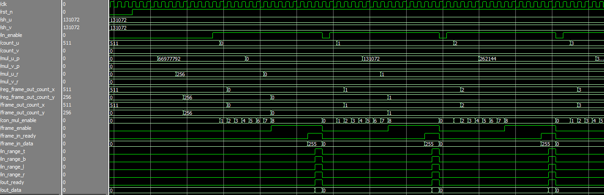  
图3-20-1 流水线模式时序

  

#### 3.20.3.3 IP核GUI

完成功能后对SHR核进行了封装，封装如图3-20-3。  

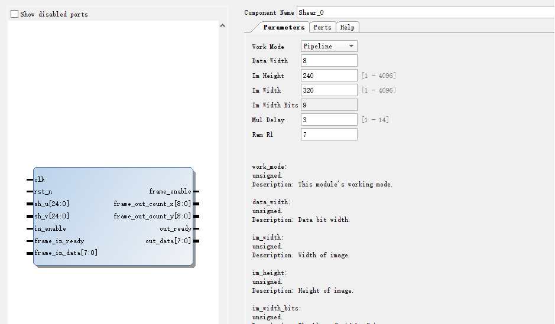  
图3-20-3 SHR核的GUI

  

### 3.20.4 仿真

只对RGB图像和灰度图像进行测试，考虑到仿真设计模块比较多，出于仿真压力，我选择了一张图像的灰度模式进行三套参数的测试，原始图像如图3-20-4。

  
图3-20-4 仿真原始图像

  

仿真参数如表3-16-4所示，选择原则是可以被二进制表示和不可以被表示的值都包含。  

<table border="1" cellspacing="0">
<tr>
<th>ush</th>
<th>vsh</th>
</tr>
<tr>
<td>0.5</td>
<td>0.5</td>
</tr>
<tr>
<td>-1.671</td>
<td>0.539</td>
</tr>
<tr>
<td>0.824</td>
<td>-1.793</td>
</tr>
</table>
表3-16-4 仿真参数

仿真并进行PSNR测试，仿真结果如图3-20-5所示。  

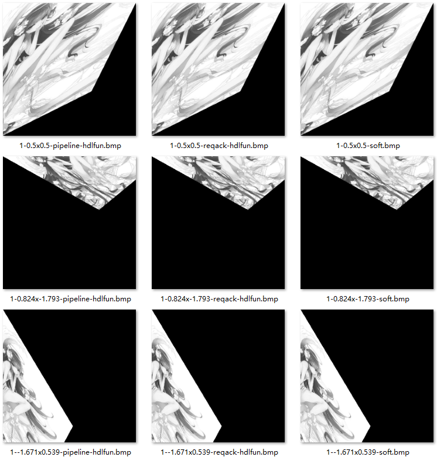  
图3-20-5 仿真结果，左侧为流水线模式下的HDL功能仿真结果，中间为请求响应模式下的HDL功能仿真结果，右侧为软件仿真结果

  

### 3.20.5 资源和时序

最终实现与图像大小和数据位宽有关，这里只分析大小为512x512和数据位宽为8时的状况，根据Vivado生成的报表，主要资源耗费如表3-20-5。

<table border="1" cellspacing="0">
<tr>
<th>Slice LUTs*</th>
<th>Slice Registers</th>
<th>DSP</th>
</tr>
<tr>
<td>212</td>
<td>166</td>
<td>2</td>
</tr>
</table>
表3-20-5 主要资源耗费

同时根据时序报告，最大的Data Path Delay(数据路径延迟)为4.103ns，即：  

>FMax = 243.72MHz  

即说明，Shear核在流水线模式下，理论上在处理1080p全高清图像时可以达到117帧。  
此FMax低于期望值，分析得知延迟主要来源于舍入核，有符号的舍入操作会涉及原码和补码转换，在此应用中每个周期会有一次35位的加法，如果将加法拆分会得到更好的FMax，但考虑时间此处暂时不做优化。  
由于数据路径延迟和应用的最终约束设置强相关，所以仅供参考。

### 3.20.6 分析与结论

PSNR如表3-20-6。  

<table border="1" cellspacing="0">
<tr>
<th>1--1.671x0.539</th>
<th>1-0.5x0.5</th>
<th>1-0.824x-1.793</th>
<th>Total</th>
</tr>
<tr>
<td>52.36</td>
<td>52.38</td>
<td>1000000.00</td>
<td>333368.25</td>
</tr>
</table>
表3-20-6 PSNR

PSNR对于某些参数为最大值，对于一些不是，但均为50以上，可见在测试范围内，SHR核可以满足处理需求，设计成功。

## 3.21 几何变换-旋转

旋转同样是仿射变换的一种特例，它接受一个角度，将图像绕着某个中心进行转动，适合逆向映射。旋转的实现有多种，比如两次错切的旋转[26]、直接坐标变换[27]等，中心点的选取方式也有许多，但对于FPGA采用图像的几何中心较为合适。。本节将会说明如何用FPGA实现旋转的模块。

### 3.21.1 原理

此设计中旋转的前向映射基本原理如式3-21-1，其中angle为旋转角度,$x_c$和$y_c$分别为图像中心横纵坐标。对于逆向映射应该对此式进行调整，变换为3-21-2的形式，可见旋转操作比较复杂，不仅涉及多次符号乘法、符号加法，还涉及到三角函数的计算。  

$$\begin{cases}Q[x_t,y_t] = I[x,y]  \\x_t = xc + (x - xc) * cos(a) - (y - yc)*sin(a)\\ y_t = yc + (x - xc) * sin(a) + (y - yc)*cos(a)\\x \in[0, w) ,y \in[0, h)\ \end{cases}.\ \ \ \ \ \ \ \ (3-21-1)$$
  

$$\begin{cases}I[x,y] = Q[x_t,y_t]  \\x = (x_t - xc) * cos(a) + (y_t - yc) * sin(a) + xc\\ y = (-x_t + xc) * sin(a) + (y_t - yc) * cos(a) + yc\\x_t \in[0, w) ,y_t \in[0, h)\ \end{cases}.\ \ \ \ \ \ \ \ (3-21-2)$$
  

首先要考虑三角函数的计算，如3.1中所述，FPGA中的特殊函数计算需要用查找表来实现，所以需要编写一个脚本来生成查找表，同时由于三角函数的值可能为负数，并且verilog中符号系统是补码系统，所以需要生成的是角度和此角度下三角函数值的补码。由于正弦和余弦的值域为[-1, 1]，同时一般用于变换的角度为[0,359]，所以综合考虑，最终选择将角度划分为360个点，使用1位符号位、1位整数位和18位的小数位的数据来表示函数值，这其中的难点在于如何将一个浮点数转换为20位的定点数补码，实现函数如下。  

    :::python
      def format(num):
        r, d = format(num, 'f').split('.')
        r = '0' + r[0] if len(r) == 1 else '1' + r[1]
        d = float('0.' + d)
        res = ''
        for i in xrange(18):
            d = d * 2
            res += '1' if d >= 1 else '0'
            d = d - 1 if d >= 1 else d
        res = r[1] + res
        if r[0] == '1':
            if eval(res) == 0:
                res = '0'
            else:
                res = bin(2 ** 19 - eval('0b' + res))[2:]
            for i in xrange(19 - len(res)):
                res = '0' + res
        res = r[0] + res
        if res == '10000000000000000000':
            res = '00000000000000000000'
        return res

旋转变换同样需要符号舍入，但整数位只有1位，所以没有溢出风险，可以将其简化，仅仅裁剪输出即可。  

### 3.21.2 设计

根据原理可知，Rotate核(以下简称RTT核)需要四次符号乘法、四次符号舍入操作和四次符号加法，并且需要和基于行列计数的帧控制器进行合作。故其需要的配置参数与端口如表3-21-1和表3-21-2。  

<table border="1" cellspacing="0">
<tr>
<th>名字</th>
<th>类型</th>
<th>范围</th>
<th>默认值</th>
<th>说明</th>
</tr>
<tr>
<td>work_mode</td>
<td>无符号</td>
<td>0为流水线模式，1为请求响应模式</td>
<td>0</td>
<td>模块的工作模式。</td>
</tr>
<tr>
<td>data_width</td>
<td>无符号</td>
<td>1 - 12</td>
<td>8</td>
<td>数据位宽。</td>
</tr>
<tr>
<td>im_width</td>
<td>无符号</td>
<td>1 - 4096</td>
<td>320</td>
<td>图像宽度。</td>
</tr>
<tr>
<td>im_height</td>
<td>无符号</td>
<td>1 - 4096</td>
<td>240</td>
<td>图像高度。</td>
</tr>
<tr>
<td>im_width_bits</td>
<td>无符号</td>
<td>取决于图像宽度</td>
<td>9</td>
<td>图像宽度的位宽。</td>
</tr>
<tr>
<td>mul_delay</td>
<td>无符号</td>
<td>取决于乘法器配置，1-14</td>
<td>3</td>
<td>乘法器延迟。</td>
</tr>
<tr>
<td>ram_RL</td>
<td>无符号</td>
<td>取决于帧控制器</td>
<td>7</td>
<td>帧控制器输出延迟。</td>
</tr>
</table>
表3-21-1 配置参数

  
 

<table border="1" cellspacing="0">
<tr>
<th>名字</th>
<th>端口</th>
<th>类型</th>
<th>范围</th>
<th>默认值</th>
<th>说明</th>
</tr>
<tr>
<td>clk</td>
<td>输入</td>
<td>无符号</td>
<td>无</td>
<td>无</td>
<td>Clock.</td>
</tr>
<tr>
<td>rst_n</td>
<td>输入</td>
<td>无符号</td>
<td>无</td>
<td>无</td>
<td>复位，低有效。</td>
</tr>
<tr>
<td>angle</td>
<td>input</td>
<td>无符号</td>
<td>0 - 359</td>
<td>无</td>
<td>旋转角度。</td>
</tr>
<tr>
<td>in_enable</td>
<td>输入</td>
<td>无符号</td>
<td>无</td>
<td>无</td>
<td>输入数据使能，在流水线模式下，它是另一个复位信号，在请求响应模式下，只有在它有效的时候in_data才会被真正地改变。</td>
</tr>
<tr>
<td>frame_in_ready</td>
<td>输入</td>
<td>无符号</td>
<td>无</td>
<td>无</td>
<td>连接到帧控制器的out_ready。</td>
</tr>
<tr>
<td>frame_in_data</td>
<td>输入</td>
<td>无符号</td>
<td>data_width - 1 : 0</td>
<td>无</td>
<td>连接到帧控制器的out_data。</td>
</tr>
<tr>
<td>frame_enable</td>
<td>output</td>
<td>无符号</td>
<td>无</td>
<td>无</td>
<td>连接到帧控制器的in_enable。</td>
</tr>
<tr>
<td>frame_out_count_x</td>
<td>output</td>
<td>无符号</td>
<td>im_width_bits - 1 : 0</td>
<td>无</td>
<td>连接到帧控制器的in_count_x。</td>
</tr>
<tr>
<td>out_count_y</td>
<td>output</td>
<td>无符号</td>
<td>im_width_bits - 1 : 0</td>
<td>无</td>
<td>连接到帧控制器的in_count_y。</td>
</tr>
<tr>
<td>out_ready</td>
<td>output</td>
<td>无符号</td>
<td>无</td>
<td>无</td>
<td>输出数据有效，在两种模式下，这个信号都会在out_data可以被读取的时候有效。</td>
</tr>
<tr>
<td>out_data</td>
<td>output</td>
<td>无符号</td>
<td>color_width - 1 : 0</td>
<td>无</td>
<td>输出数据，将会和out_ready同步输出。</td>
</tr>
</table>
表3-21-2 端口

  

  
 

<table border="1" cellspacing="0">
<tr>
<th>名字</th>
<th>类型</th>
<th>说明</th>
</tr>
<tr>
<td>Sin</td>
<td>SinLUT</td>
<td>获取角度的正弦。</td>
</tr>
<tr>
<td>Cos</td>
<td>CosLUT</td>
<td>获取角度的余弦。</td>
</tr>
<tr>
<td>MulX1</td>
<td>Multiplier13Sx20SRTT</td>
<td>13位有符号数和20位有符号数的乘法器，被用于定点数的乘法。你可以自己配置这个乘法器，然后更改"mul_delay"，但所有的乘法器必须拥有相同的流水线级数，并且不能更改端口的配置！</td>
</tr>
<tr>
<td>MulX2</td>
<td>Multiplier13Sx20SRTT</td>
<td>13位有符号数和20位有符号数的乘法器，被用于定点数的乘法。你可以自己配置这个乘法器，然后更改"mul_delay"，但所有的乘法器必须拥有相同的流水线级数，并且不能更改端口的配置！</td>
</tr>
<tr>
<td>MulY1</td>
<td>Multiplier13Sx20SRTT</td>
<td>13位有符号数和20位有符号数的乘法器，被用于定点数的乘法。你可以自己配置这个乘法器，然后更改"mul_delay"，但所有的乘法器必须拥有相同的流水线级数，并且不能更改端口的配置！</td>
</tr>
<tr>
<td>MulY2</td>
<td>Multiplier13Sx20SRTT</td>
<td>13位有符号数和20位有符号数的乘法器，被用于定点数的乘法。你可以自己配置这个乘法器，然后更改"mul_delay"，但所有的乘法器必须拥有相同的流水线级数，并且不能更改端口的配置！</td>
</tr>
<tr>
<td>FRSX1</td>
<td>FixedRoundSigned</td>
<td>用于有符号浮点数的舍入。</td>
</tr>
<tr>
<td>FRSX2</td>
<td>FixedRoundSigned</td>
<td>用于有符号浮点数的舍入。</td>
</tr>
<tr>
<td>FRSY1</td>
<td>FixedRoundSigned</td>
<td>用于有符号浮点数的舍入。</td>
</tr>
<tr>
<td>FRSY2</td>
<td>FixedRoundSigned</td>
<td>用于有符号浮点数的舍入。</td>
</tr>
</table>
表3-3-3 子模块

### 3.21.3 实现

根据3.21.2的设计便可以实现一个RTT核，流水线模式和请求响应模式实现如下。  

#### 3.21.3.1 流水线模式

在帧控制器的输出使能后1个周期第一个结果被输出，开始流水化工作，波形如图3-21-1。  

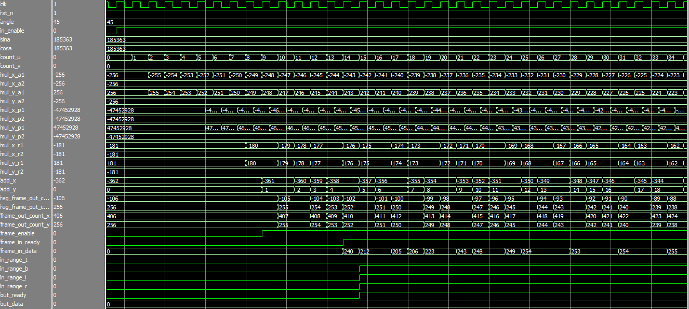  
图3-21-1 流水线模式时序

  

#### 3.21.3.2 请求响应模式读取

基本同3.21.3.1，但只有在in\_enable上升沿时计数器才会加1才会被改变，波形如图3-21-2。  

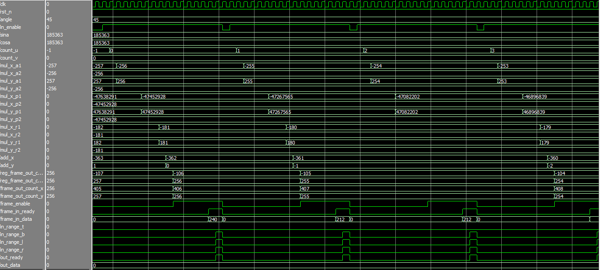  
图3-21-1 流水线模式时序

  

#### 3.21.3.3 IP核GUI

完成功能后对RTT核进行了封装，封装如图3-21-3。  

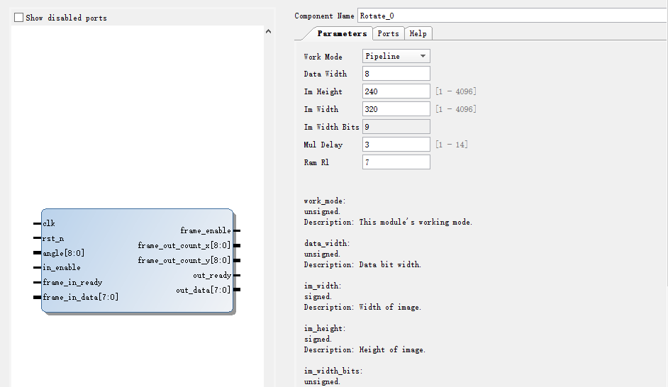  
图3-21-3 RTT核的GUI

  

### 3.21.4 仿真

只对RGB图像和灰度图像进行测试，考虑到仿真设计模块比较多，出于仿真压力，我选择了一张图像的灰度模式进行三套参数的测试，原始图像如图3-21-4。

  
图3-21-4 仿真原始图像

  

仿真参数如表3-16-4所示，选择原则是可以被二进制表示和不可以被表示的值都包含。  

<table border="1" cellspacing="0">
<tr>
<th>angle</th>
</tr>
<tr>
<td>45</td>
</tr>
<tr>
<td>131</td>
</tr>
<tr>
<td>270</td>
</tr>
</table>
表3-16-4 仿真参数

仿真并进行PSNR测试，仿真结果如图3-21-5所示。  

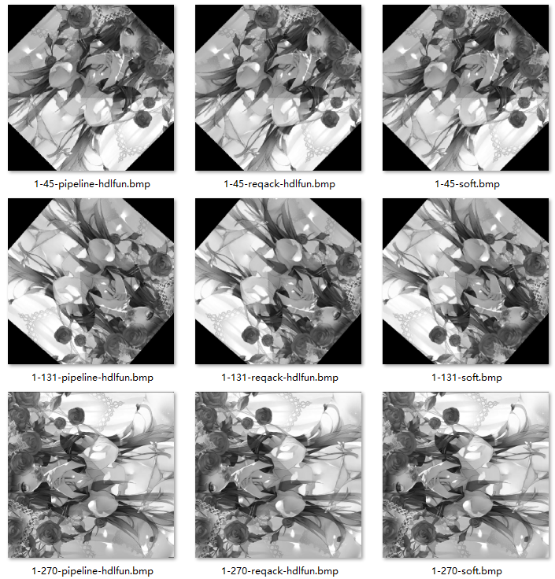  
图3-21-5 仿真结果，左侧为流水线模式下的HDL功能仿真结果，中间为请求响应模式下的HDL功能仿真结果，右侧为软件仿真结果

  

### 3.21.5 资源和时序

最终实现与图像大小和数据位宽有关，这里只分析大小为512x512和数据位宽为8时的状况，根据Vivado生成的报表，主要资源耗费如表3-21-5。

<table border="1" cellspacing="0">
<tr>
<th>Slice LUTs*</th>
<th>Slice Registers</th>
<th>DSP</th>
</tr>
<tr>
<td>543</td>
<td>245</td>
<td>4</td>
</tr>
</table>
表3-21-5 主要资源耗费

同时根据时序报告，最大的Data Path Delay(数据路径延迟)为4.414ns，即：  

>FMax = 226.55MHz  

即说明，Rotate核在流水线模式下，理论上在处理1080p全高清图像时可以达到109帧。  
与3.20相同，此FMax低于期望值，也来自于舍入核的加法，考虑时间此处暂时不做优化。  
由于数据路径延迟和应用的最终约束设置强相关，所以仅供参考。

### 3.21.6 分析与结论

PSNR如表3-21-6。  

<table border="1" cellspacing="0">
<tr>
<th>1-131</th>
<th>1-270</th>
<th>1-45</th>
<th>Total</th>
</tr>
<tr>
<td>1000000.00</td>
<td>54.89</td>
<td>1000000.00</td>
<td>666684.96</td>
</tr>
</table>
表3-21-6 PSNR

PSNR对于某些参数为最大值，对于一些不是，最终误差来自于符号乘法和查找表自身的误差，但PSNR均为50以上，可见在测试范围内，RTT核可以满足处理需求，设计成功。

# 参考文献

[1] 詹姆斯.格雷克.信息简史[M].高博译.北京:人民邮电出版社,2013:12.  
[2] E.H.贡布里希.艺术与错觉[M]杨成凯,李本正,范景中译.南宁:广西美术出版社,2012:3.  
[3] Donald G.Bailey.基于FPGA的嵌入式图像处理系统设计[M].原魁,何文浩,肖晗译.北京:电子工业出版社,2013.  
[4] U.Meyer-Basese.数字信号处理的FPGA实现(第3版)[M].刘凌译.北京:清华大学出版社,2011:3.  
[5] Free Software Foundation, Inc. GNU LESSER GENERAL PUBLIC LICENSE Version 2.1[EB/OL]. February 1999.  
[6] IEEE Standard Hardware Description Language Based on the Verilog(R) Hardware Description Language," IEEE Std 1364-1995 , vol., no., pp.1,688, Oct. 14 1996  
doi: 10.1109/IEEESTD.2006.99495  
[7] IEEE Standard Verilog Hardware Description Language," IEEE Std 1364-2001 , vol., no., pp.0_1,856, 2001  
doi: 10.1109/IEEESTD.2006.99495  
[8] Xilinx, Vivado Design Suite, Creating and Packaging Custom IP, UG1118 (v2014.3)[EB/OL]. October 8, 2014  
[9] Xilinx, Xilinx 7 Series FPGAs Embedded Memory Advantages, WP377 (v1.1) [EB/OL]. February 17, 2012  
[10] Xilinx,7 Series FPGAs Memory Resources, User Guide, UG473 (v1.11) [EB/OL]. November 12, 2014  
[11] Xilinx, Vivado Design Suite, Block Memory Generator v8.2, LogiCORE IP Product Guide, PG058 [EB/OL]. April 1, 2015 
[12] ITU-R, Recommendation ITU-R BT.601-7, Studio encoding parameters of digital television for standard 4:3 and wide-screen 16:9 aspect ratios [EB/OL]. 03/2011  
[13] Xilinx, Vivado Design Suite, LogiCORE IP Multiplier v12.0, Product Guide, PG108 [EB/OL]. April 2, 2014  
[14] Xilinx, Vivado Design Suite, FIFO Generator v12.0, Product Guide, PG057 [EB/OL]. October 1 , 2014  
[15] Rafael C. Gonzales, Richard E. Woods.数字图像处理(第三版)[M].阮秋琦,阮宇智等译.北京:电子工业出版社,2011.6  
[16] 关新平,赵立兴,唐英干等.图像去噪混合滤波方法[J].中国图象图形学报,2005,10(3):332-337.DOI:10.3969/j.issn.1006-8961.2005.03.013.)
[17] 达文姣,任志国,王龙平等.静态链表上排序算法的研究[J].自动化与仪器仪表,2011,(2):12-14.DOI:10.3969/j.issn.1001-9227.2011.02.006.  
[18] 李新春,赵璐.基于中值滤波算法滤波器的FPGA实现[J].计算机系统应用,2011,20(9):82-85,72.DOI:10.3969/j.issn.1003-3254.2011.09.018.  
[19] 师廷伟,金长江.基于FPGA的并行全比较排序算法[J].数字技术与应用,2013,(10):126-127.  
[20] 李飞飞,刘伟宁,王艳华等.改进的中值滤波算法及其FPGA快速实现[J].计算机工程,2009,35(14):175-177.DOI:10.3969/j.issn.1000-3428.2009.14.061.  
[21] 施启乐,王从军,黄树槐等.数学形态学图像细化算法在RE中的应用研究[J].华中科技大学学报(自然科学版),2004,32(7):37-39.DOI:10.3321/j.issn:1671-4512.2004.07.013.  
[22] 王怀群.二值图象的细化[J].无锡轻工大学学报,2001,20(3):315-318.DOI:10.3321/j.issn:1673-1689.2001.03.021.  
[23] 李娜. 基于FPGA的图像实时检测系统识别系统设计[D].长春理工大学,2013.  
[24] 曹玉龙. 线划图像的细化算法研究[D].长安大学,2011.  
[25] 王金辉,陈冰,王建庄等.实时图像仿射变换系统的研究与实现[J].机械与电子,2012,(2):59-62.DOI:10.3969/j.issn.1001-2257.2012.02.016.  
[26] 陈芳.一种基于错切原理的图像旋转方法[J].淮阴师范学院学报（自然科学版）,2004,3(4):319-322.DOI:10.3969/j.issn.1671-6876.2004.04.016.  
[27] 王金辉.实时图像旋转系统的研究与FPGA实现[D].华中科技大学,2012.  

# 致谢

**支持**  

东南大学，仪器科学与工程学院  
Xilinx上海  

**开源工具**  
WaveDrom user group, wavedrom  
Alexis Metaireau and contributors, Pelican 3.5.0  

**仿真图像**  

[月岡月穂-ゆらゆら](http://www.pixiv.net/member_illust.php?mode=medium&illust_id=43409888)  
[LM7-oxford eleKtricity](http://www.pixiv.net/member_illust.php?mode=medium&illust_id=27556337)  
[cotta-池](http://www.pixiv.net/member_illust.php?mode=medium&illust_id=45293430)  
[041-尾翼](http://www.pixiv.net/member_illust.php?mode=medium&illust_id=39383610)  
[月岡月穂-星を呑む](http://www.pixiv.net/member_illust.php?mode=medium&illust_id=43935854)  
[LM7-xxxまとめ](http://www.pixiv.net/member_illust.php?mode=manga&illust_id=47960736)  
[H2SO4-蝶](http://www.pixiv.net/member_illust.php?mode=medium&illust_id=10599535)  
[パセリ-Favour](http://www.pixiv.net/member_illust.php?mode=medium&illust_id=28762438)  
[LM7-sn](http://www.pixiv.net/member_illust.php?mode=medium&illust_id=31000682)  
[LM7-NL](http://www.pixiv.net/member_illust.php?mode=medium&illust_id=29330221)  
[パセリ-Fallen](http://www.pixiv.net/member_illust.php?mode=medium&illust_id=24442630)  
[パセリ-絵描き見習い](http://www.pixiv.net/member_illust.php?mode=medium&illust_id=23103608)  
[パセリ-COMITIA100](http://www.pixiv.net/member_illust.php?mode=medium&illust_id=26503317)  
[おにねこ-クロス.ホエン](http://www.pixiv.net/member_illust.php?mode=medium&illust_id=39186698)  
[月岡月穂-春爛漫](http://www.pixiv.net/member_illust.php?mode=medium&illust_id=49171367)  
[LM7-.410](http://www.pixiv.net/member_illust.php?mode=medium&illust_id=27054426)  
[色原みたび-夏空間](http://www.pixiv.net/member_illust.php?mode=medium&illust_id=28580798)  
[H2SO4-蝶](http://www.pixiv.net/member_illust.php?mode=medium&illust_id=10599535)  
[パセリ-Favour](http://www.pixiv.net/member_illust.php?mode=medium&illust_id=28762438)  
[LM7-ｱｲｶﾂ](http://www.pixiv.net/member_illust.php?mode=medium&illust_id=46169977)  
[ぜろきち-Blue star](http://www.pixiv.net/member_illust.php?mode=medium&illust_id=10884473)  
[おにねこ-メカニック・ロンド](http://www.pixiv.net/member_illust.php?mode=medium&illust_id=35231457)  
[LM7-nk](http://www.pixiv.net/member_illust.php?mode=medium&illust_id=18392982)  
[方向錯亂-Queen](http://www.pixiv.net/member_illust.php?mode=medium&illust_id=49779009)  
[あきのん-[C84]こもれび](http://www.pixiv.net/member_illust.php?mode=medium&illust_id=37208606)  
[ぜろきち-白の夢](http://www.pixiv.net/member_illust.php?mode=medium&illust_id=18098777)  
[041-マツムシソウ](http://www.pixiv.net/member_illust.php?mode=medium&illust_id=49603329)  