# 色彩空间转换的可重构硬件实现
作者：F.Bensaali*,A.Amira  
英国贝尔法斯特女王大学，计算机科学院。  
接受于2004.06.27；修订版本在2005.03.25收到；在2005.03.30被接收。  

## 概要

色彩空间转换对于包括包括视频压缩在内的许多种图像处理应用而言都是十分重要的。这一操作在高度优化的解码器中的功耗比例接近于40%。这也就是说，一种能够有效实行这种转换的方法是为我们所期望的。这篇论文针对色彩空间转换的有效实行提出了两个新的结构，它们都适用于现场和编程逻辑阵列（FPGA）和VLSI的实现。这些结构都是基于分布式算法（DA）ROM累加器原理，并且已经被完成，还在Celoxica RC1000 FPGA 开发板上完成了验证。此外，它们是平台无关的，同时拥有着低延迟（八个周期）。第一个结构拥有高度的吞吐量，第二个则是完全流水化的，同时拥有一个能够将数据速率持续保持在234百万转换每秒的吞吐量。  
2005 Elsevier有限公司拥有所有权利.  
关键词：色彩空间转换；现场可编程逻辑阵列；分布式算法  

## 1. 前言

色彩是视网膜上的可见区域对于光所引起的频谱变化的一种视觉感受。由于人类的视觉系统拥有三种类型的视锥细胞，所以对于描述色彩而言，三个不同的成分是充分并且必要的[1]。  
色彩空间（也被称为色彩模式或者色彩系统）是一种我们可以用于定义、创造和构想颜色的方法。现在已经有许多色彩空间存在，并且其中的绝大多数都是以每一种颜色作为一个三维坐标系统的一个点。每种色彩空间都是为了已经定义好的应用领域而优化的[3]。其中三个最流行的色彩模式是RGB（用于色彩打印领域）。所有的色彩空间都能够由被现实摄像头、扫描仪这样的硬件所支持的RGB信息派生出来。  
在RGB色彩空间内——一个由若干RGB值表示的像素点构成的集合内，对图像进行处理并不是最高效的。为了加速许多处理过程，许多广播、视频和图像使用亮度和色差信号标准，比如YCrCb，这使得在两种制式之间必须存在一个转换机制。一些可以实现RGB到YCrCb转换的核已经能够在市面上找到，就像是Amphion Ltd[4] , CAST.Inc[5] 和 ALMA.Tech[6] 建议的那样，它们被设计为FPGA实现。另一种转换器也被提出[7]，它已经被实现在由一个带有基于FPGA的可重构功能单元的TriMedia 处理器实现的混合系统中。  
作为在贝尔法斯特皇后大学正在进行的一个课题项目的一部分——针对于图像和信号处理算法，去开发一个基于矩阵运算的硬件加速器[8-11]。本文提出了基于DA流水线，并且使用FPGA进行RGB和YCrCb色彩空间转换的、一个低成本的加速器，DA流水线是去隐藏乘法的一个乘法运算的比特级重排。这两个建议的结构都基于一些像素的串行和并行操作。  
实现和验证建议的结构的目标硬件是配有Xilinx公司XCV2000E Virtex FPGA[12,13]的Celoxica
RC1000 PCI开发板。本文其他部分的组成如下：第二节给出了从RGB到YCrCb的一个综述，第三节和第四节则是两种结构所涉及的数学背景和描述。硬件实现的结果和分析则是被列于第五和第六节。最终的结束语在第六节被给出。  

## 2. 色彩空间转换：一个综述

在前言中许多色彩模式都被提到了，每一种都倾向于支持一种特定的任务或者解决某个针对性的问题。下面被描述的是两种被选择于我们研究的对象，它们被用于许多图像处理应用中。  

### 2.1. RGB色彩空间

RGB色彩空间是一种简单和健壮的色彩定义形式。RGB使用三个数字部分去描述一种色彩。这种色彩空间能够被认为是一种三维空间坐标系统，坐标系的每个轴对应色彩的每一种成分，R或者红色，G或者绿色，B或者蓝色。RGB是一种适用于电脑显示的色彩空间，它的对应非常接近于人类眼睛的行为[1]。RGB也是一种加色系统，三种基本的色彩“红”、“绿”、“蓝”被叠加在一起去组成期望的色彩。对于真彩色，每个像素的红绿蓝三个部分都需要八位的位宽。总体来看，大概需要16百万（2^24）可能的颜色，而每个部分的范围都在0-255之间，当每个部分都是0的时候为黑，都为255的时候为白[1]。在本文其他的部分，被伽马校正过的RBG值被标记为R'G'B'。  

### 2.2. Y'CrCb色彩空间

T'CrCb色彩空间是TUV色彩空间的一种偏移和缩放，它基于亮度和色度，这对应于明度和色彩。在R'G'B'色彩空间内就是分离到亮度部分（Y'）和两个色度部分（Cr和Cb）。Y'被定义在范围16-235内，Cb和Cr的范围则是16-240[1,2]。  

### 2.3. 从R'G'B'转换到Y'CrCb

分解一个R'G'B'色彩空间的图像到亮度图像以及两个色度图像是许多商业应用中最常用的方法[14,15]，比如人脸检测，以及JPEG和MPEG图像标准[16-18]。  
估算来讲，从R'G'B'合成转换到Y'CrCb合成的功耗占据了高度优化解码器的40%[16]。加速这个操作对于整个运算的加速将会十分有用。将一个R'G'B'色彩空间的颜色转换到Y'CrCb色彩空间会用到以下等式：  
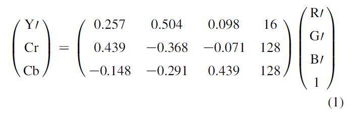  
随后其反变换可以从以下等式得出：  
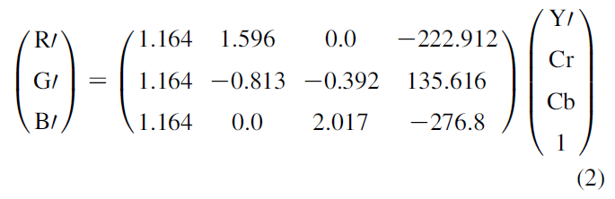  

## 3. 基于串行处理方法的结构

### 3.1 数学背景

自从色彩空间转换可以被表述为一个矩阵向量（MV）操作，一种基于DA的新算法在本节中本提出。  
DA，分布式算术运算而不是将它们分组相乘。常规的DA被称为基于ROM的DA，通过分解内积的可见输入变量到比特级，去生成预处理的数据。基于ROM的DA使用一个查找表去存储预处理数据，这种方法能够在一个VLSI实现中使得芯片面积被完全和有效的使用。基于DA的ROM方法的优势在于它的实现效率。基本的需求是一个ROM序列、加法、减法和对于输入数据序列的移位操作[19]。一个DA用法的例子可以在这些参考文献中被找到[19-21]。  
考虑以下等式的矩阵向量积：  
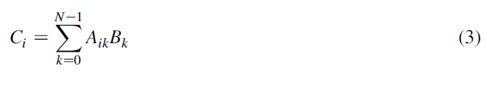  
公式中的{Aik}'s是一个Lbits的常量，{Bk}'s则是被写在一个无符号二进制数表达式，如式中所见。  
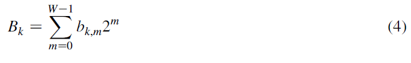  
式中bk,l表示Bk的第m位，0或者1，W表示每个像素的颜色分量解析度的位宽。  
将（4）带入（3）：  
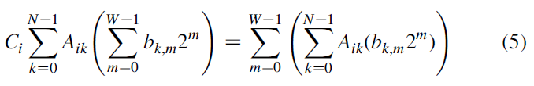  
定义：  
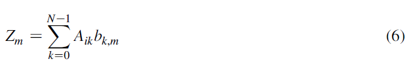  
从而Ci可以用一下公式计算：  
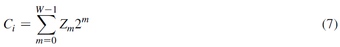  
这种想法的可行性来自于到元素Zm依赖于k.m并且仅仅有2^N个可能的值，这保证了一个ROM是有可能对它们进行预处理和存储操作的。ROM的内容不同且依赖于一个静态的系数矩阵A。这些中间结果在W个时钟周期被积累，并且生成Ci系数矩阵。  

### 3.2 个案研究：在R'G'B和Y'CrCb之间转换

CSC核利用以下数学公式去将一个空间转换为另一个：  
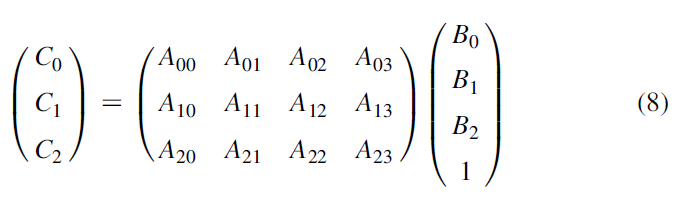  
公式中的Ci（0≤i≤2），Bi（0≤i≤3）顺序地表示输入和输出色彩组成。由于所有的组成部分都拥有0-255这个范围，只需要八位的位宽便可以满足要求。在我们的应用中（N=4且W=8），Ci能够被以下公式计算出来：  
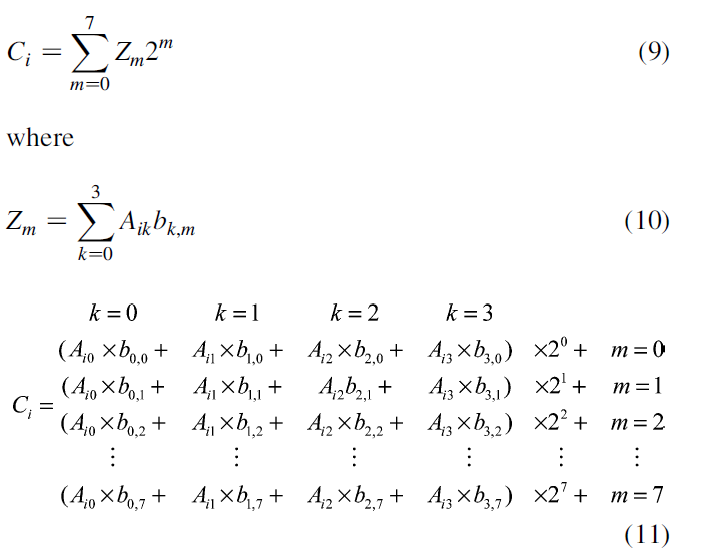  
需要三个位宽为2^N=2^4=16的ROM（一个被用于每一个A矩阵的行）去存储预处理2^4个可能的部分乘积值。由于B向量的最后一个元素等于1：  
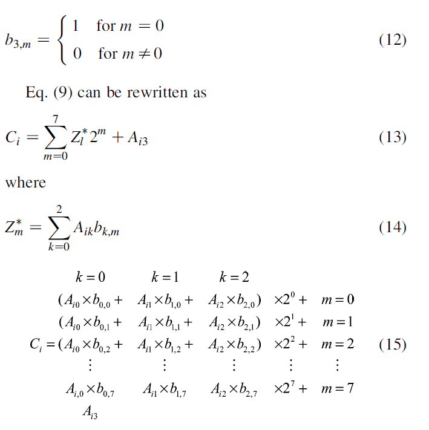  
这是一个非常有价值的行为，它使得ROM的大小被削减到了2^3，表q给出了每个ROM的内容：  
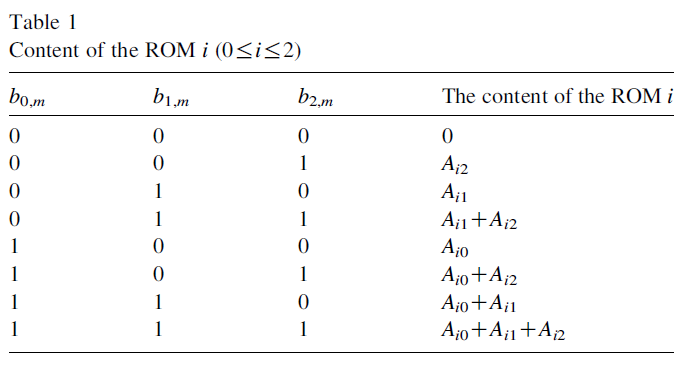  

### 3.3 建议的结构

由于我们的目标是实现一个可以执行两个不同色彩空间转换（R'G'B'与Y'CrCb），所以需要六个ROM（每个转换需要三个），图表2和3给展示了建议的核的引脚和内部结构：  
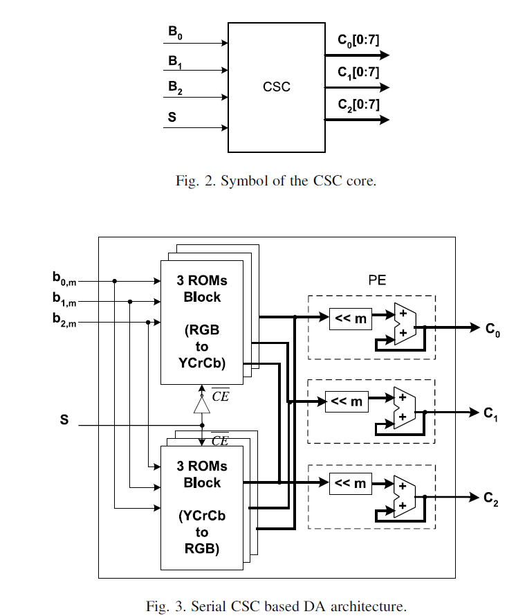  
引脚的解释在表2中：  
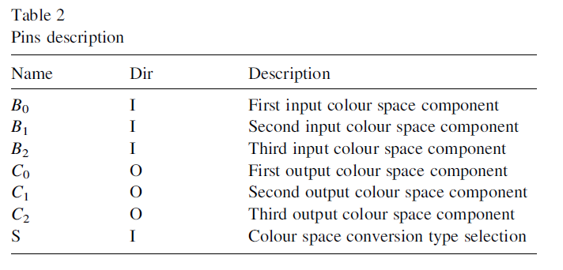  
建议的结构有三个独立的运算单元（PEs）和两个存储器块构成。每个PE包括一个并行累加器（ACC）和一个右向移位寄存器，每个存储器块由三个大小为2^3的ROM构成（见图表4）。ROM的内容是不同且依赖于系数矩阵A的，A的系数则依赖于转换类型。  
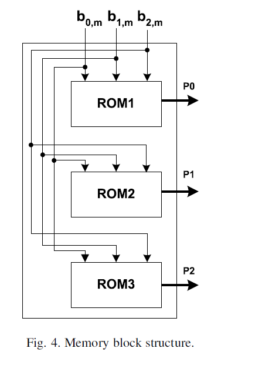  
我们的结构是可扩展的，这十分有价值，例如，如果我们想执行n转换，我们只需要添加每一次3xn个ROM，保证能够存储转换技术矩阵即可，而PEs则是不用更改的。在被建议的结构中，一个NxM的图像在设置输入为R'G'B后，每八个周期便可以被转换完毕，这是一个由新的像素构成的集合（为了逆变换的Y'CrCb）见图表5。  
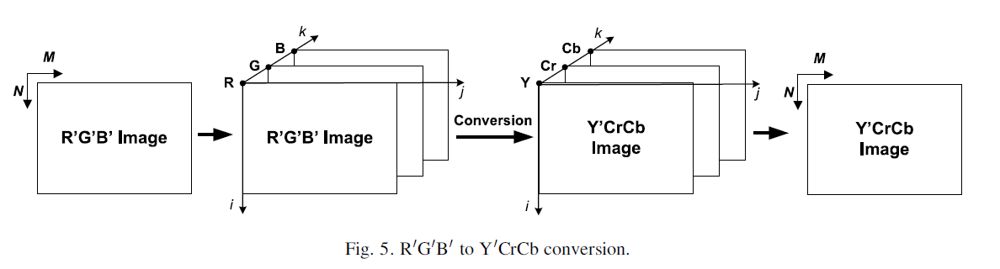  

## 4. 基于并行处理方法的结构

### 4.1 数学背景

考虑一个NxM的图像（N:图像高度，M:图像宽度）。  
使用bijk来表示每一个像素（0≤i≤N-1,0≤j≤M-1,0≤k≤2），如下：  
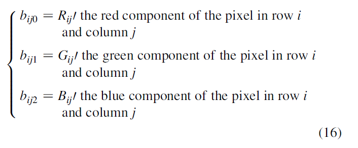  
图像可以用一下数学公式被转换：  
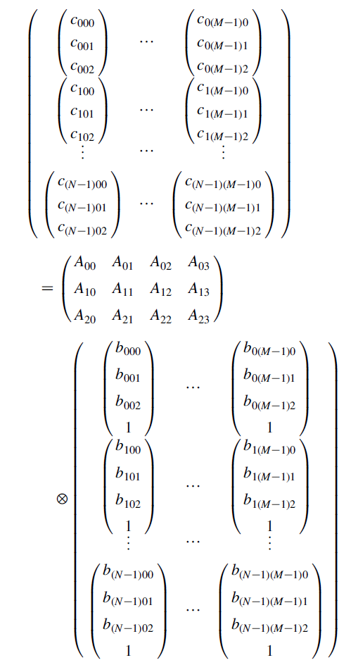  
公式中的符号被做了以下定义：  
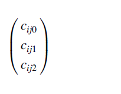  
这是以下乘积的结果：  
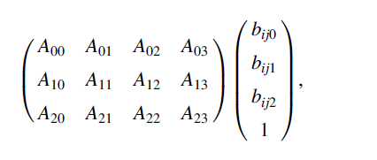  
其中cijk表示输出图像的色彩空间构成，同时：  
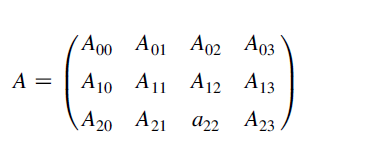  
这表示了等式(1)和(2)的常数矩阵之一。  
cijk元素（输出图像的色彩空间构成）能够被下面的等式所计算：  
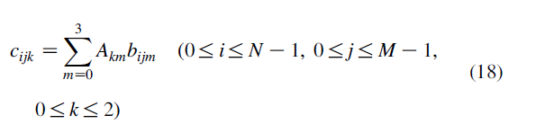  
其中{Akm}'s是Lbits的常数，而{bijm}'s被写在一个无符号二进制数表达式，如式中所见：  
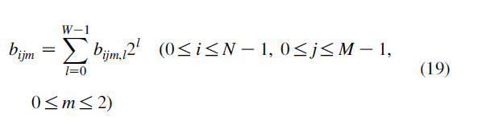  
在章节4.1中使用同样的过程，等式(16)能够被重写为：  
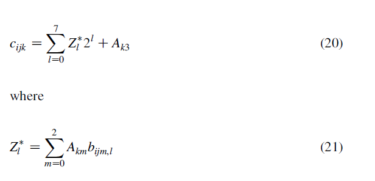  
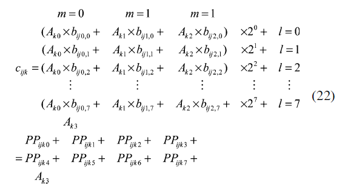  
和第一种建议的结构一样，ROM的内容不同且依赖于系数矩阵A，A矩阵依赖于转换类型。  

### 4.2 建议的结构

等式（18）能够部署到建议的结构中，就像是图表6所表现的一样：  
  
这个结构由八个完全一样的PEns（0≤n≤7）构成。每个PEn都包括三个并行有符号加法器，三个n位右移寄存器和一个ROM块，就像是图标4所述的结构那样。值得注意的是，这个结构拥有一个W的延迟和速率为1的吞吐量。整幅图像的转换能够在（延迟+（NM）吞吐量）=8+（NM）个时钟周期完成。在如图表7的标准算法下，转换可以在（3x4xNxM）个时钟周期完成，(3x4)是静态矩阵A的大小。  
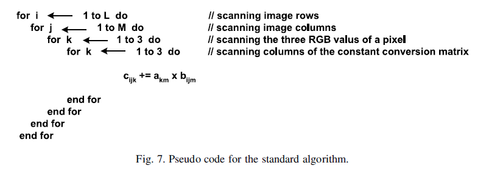  
图表8表明了建议结构的功能分析图。  
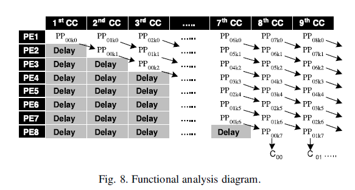  

## 5. 硬件实现

两种建议的结构都是基于DA技术的，并且已经在Celoxica RC1000-PP FPGA开发板上被实现和验证了。RC1000-PP开发板惯用配备了Virtex-E2000 FPGA 芯片（bg560封装，速度等级为6）的PCI标准总线卡。表3和表4顺序给出了一些用于R'G'B'到Y'CrCb的转换或者从Y'CrCb到R'G'B'的转换的ROM的内容：  
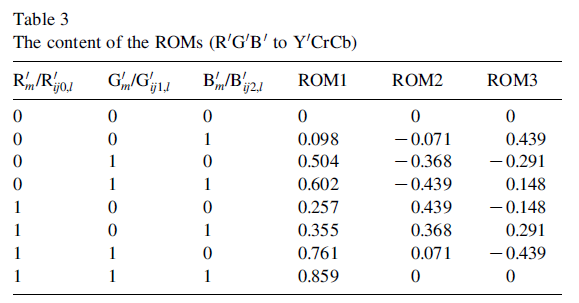  
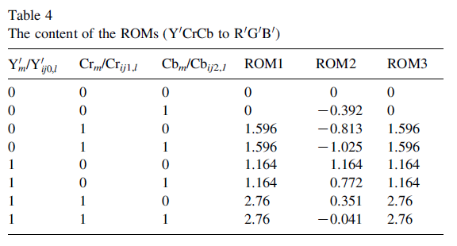  
第二种被建议的结构能够使用以下方法去做反向变换（从Y'CrCb到R'G'B'）：  

+ 复制用于第一种结构的、使用同样的实现方法的ROM（带有一个可以让用户选择适当的方式的选择器）。  
+ 预先设置ROM的，这取决于所期望的转换。  

预处理的部分乘积被存储在使用13位定点表示法（8位数据位和5位功能位）的ROM内，改结构中使用了13位运算。打磨输入的输出软件hetwo结构被提出为一个使用8位数据并且对输出结果进行舍入。如果余数十进制大于等于0.5则舍入，结果将会加1。这意味着这个条件的验证从属于另一种运算方法。一个更加有效的舍入方法是给结果加上0.5，并且截断十进制值。这个技术已经被应用于我们所建议的结构中。每个PE的ACC（用于串行结构）和每第一个加法器（用于并行结构）的初始值被设置为（Ai3+0.5），0≤i≤2。MACs和并行带符号加法器已经被实现在了Xilinxs CoreGen单元，它们包含着许多有效的设计，同时还可以节省的编程时间[22]。移位寄存器和ROM出初始化已经由VHDL实现。所有的设计部件都已经被Handel-C连接到了一起。Handel-C是一个一个支持并行、拥有灵活数据大小、可以被以高级语言的形式编写，并且可以直接描述FPGA的类C语言[23]。

## 6. 结果和分析

为了与现有的基于FPGA的CSC进行更加客观公正的比较，我们引入了XCV50E-8 FPGA设备作为载体。表5为本文提出的结构与其他方法[4-6]在占用空间与运行速度上的比较。
通过多方位应用考察，与现有应用相比，本文提出的方法在RGB-YCrCb转换的表现上有着显著的提升[4-6]，具体表现在占用空间与最大运行时钟频率上，而表中第二个结构在转换速率上的表现大大超出现有方法。   
需要指出的是，用来比较的现有方法与本文提出方法采用了相同的输入位数与输出位数。
此外，我们还进行了基于软件的测试，该测试使用2.0 GHz英特尔奔腾4处理器，1 GB SDR RAM，在Borland C++ V6.0版本上进行。  
表6为文中第二种DA架构下硬件/软件实现的比较，以RMS误差 – 利用两种方法中数据的差值:  
  
以及运算时间为参考标准。表6显示了针对两幅不同图像（狒狒 (512 x 512)以及青椒 (256 x 256)）的测试结果。结果显示，FPGA下的图像转换速度更快，且误差更小（通过两种方法的差值求得）。  
  

## 7. 结论

在RGB空间，每个像素都有一组RGB值的情况下进行图像处理并非最有效率的方法。为了加快处理速度，很多直播、视频以及图像标准采用了辉度与色差信号，如YCrCb，这使得格式转换成为必要步骤。RGB-YCrCb转换需要极大的运算量，而本文展示了一个新颖、可扩展、高效的基于DA原理的架构。实际运行结果也证实了该架构的高效性。本文还从占用空间以及最大运行频率的角度评估了该方法的表现，实测可知，与现存其他系统相比，本文提出的系统能够利用更小的空间、进行更高频的运算。

## 引用

[1] B. Payette, Color space converter: R0G0B0 to Y0CrCb, Xilinx
Aplication Note, XAPP637, V1.0, September, 2002.  
[2] C. Poynton, A Technical Introduction to Digital Video, Wiley, New
York, 1996.  
[3] R.C. Gonzalez, R.E. Woods, Digital Image Processing, second ed.,
Prentice-Hall, Englewood Cliffs, NJ, 2002.  
[4] Data sheet (www.amphion.com), Color Space Converters, Amphion
semiconductor Ltd, DS6400 V1.1, April, 2002.  
[5] Application Note (www.cast-inc.com), CSC Color Space Converter,
CAST Inc., April, 2002.  
[6] Datasheet (www.alma-tech.com), High Performance Color Space
Converter, ALMA Technologies, May 2002.  
[7] M. Sima, S. Vassiliadis, S.D. Cotofana, J.T.J. van Eijndhoven, Color
space conversion for MPEG decoding on FPGA-augmented TriMedia
processor The 14th IEEE International Conference on Applicationspecific
Systems, Architectures, and Processors (ASAP’03), Netherlands,
June (2003) pp. 250–259.  
[8] F. Bensaali, A. Amira, Design and efficient FPGA implementation of
an RGB to YCrCb color space converter using distributed arithmetic,
Proceedings of the International Conference on Field Programmable
Logic (FPL), Lecture Notes in Computer Science, to be published by
Springer, August, 2004.  
[9] A. Amira, A Custom Coprocessor for Matrix Algorithm, PhD thesis,
Queen’s University of Belfast, 2001.  
[10] F. Bensaali, A. Amira, I.S. Uzun, A. Ahmedsaid, An FPGA
implementation of 3D affine transformations The 10th IEEE
International Conference on Electronics, Circuits and Systems
(ICECS’03), Sharjah, UAE, December (2003).  
[11] F. Bensaali, A. Amira, I.S. Uzun, A. Ahmedsaid, Efficient
implementation of large parallel matrix product for DOTs The
International Conference on Computer, Communication and Control
Technologies (CCCT’03), Florida, USA, July (2003).  
[12] Datasheet, (www.celoxica.com), RC1000 Reconfigurable hardware
development platform, Celocixa Ltd, 2001.  
[13] URL:www.xilinx.com.  
[14] A. Albiol, L. Torres, E.J. Delp, An unsupervised color image
segmentation algorithm for face detection applications Proceedings of
the International Conference on Image Processing, October vol. 2
(2001) pp. 681–684.  
[15] P. Kuchi, P. Gabbur, P.S. Bhat, S. David, Human face detection and
tracking using skin color modelling and connected component
operators, The IETE Journal of Research, Special issue on Visual
Media Processing May (2002).  
[16] M. Bartkowiak, Optimisations of color transformation for real time
video decoding Digital Signal Processing for Multimedia Communications
and Services, EURASIP ECMCS 2001, Budapest, September
(2001).  
[17] J.L. Mitchell, W.B. Pennebaker, MPEG Video Compression Standard,
Chapman and Hall, London, 1996.  
[18] J. Bracamonte, P. Standelmann, M. Ansorge, F. Pellandini, A
multiplierless implementation scheme for the JPEG image coding
algorithm IEEE Nordic Signal Processing Symposium, Kolmarden,
Sweden, June 13–15 (2000).  
[19] A. Amira, An FPGA based parameterisable system for discrete Hartley
transforms implementation Proceedings of the International Conference
on Image Processing (ICIP), Barcelona, Spain, September (2003).  
[20] H. Ohlsson, L. Wanhammer, Maximally fast numerically equivalent
state-space recursive digital filters using distributed arithmetic
Proceedings of the IEEE Symposium in Nordic Signal Processing
(NORSIG2000), Kolmarden, Sweden, June (2000) pp. 295–298.  
[21] O. Gustafsson, L. Wanhammar, Implementation of a digital
beamformer in an FPGA using distributed arithmetic Proceedings of
the IEEE Symposium in Nordic Signal Processing (NORSIG2000)
Kolmarden, Sweden, June (2000) pp. 295–298.  
[22] Application Note, Xilinx CoreGen, Handel-C, AN 58 v1.0, 2001.  
[23] Manual, (www.celoxica.com) Handel-C Language Reference
Manual, Celocixa Ltd, 2003.  